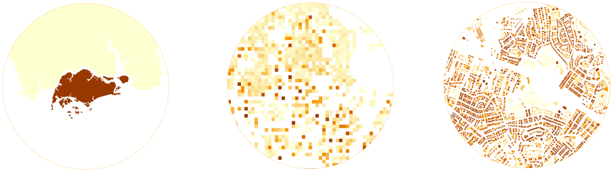
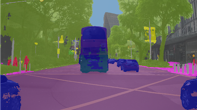

+++
# About widget.
widget = "blank"  # See https://sourcethemes.com/academic/docs/page-builder/
headless = false  # This file represents a page section.
active = true  # Activate this widget? true/false
weight = 20  # Order that this section will appear in.

title = "About the Urban Analytics Lab"
#subtitle = "Subtitle"
[design]
  # Choose how many columns the section has. Valid values: 1 or 2.
  columns = "1"
+++

We are a multidisciplinary research group focusing on urban data management and analysis, geographic data science, and 3D city modelling at the [National University of Singapore (NUS)](http://www.nus.edu.sg), a leading global university centred in Asia.

Our mission is to leverage and make sense of big geospatial data at different scales for urban applications and catalyse the development of spatial data infrastructures and digital twins in the realm of smart cities and the built environment.
We are particularly interested in the interface of emerging urban datasets such as street-level imagery, dynamic/sensor data, and 3D city models with the state of the art of artificial intelligence to solve contemporary urban challenges and provide a strong foundation to advance urban informatics.
Crowdsourcing plays an important role in our research, as we follow and aspire to contribute to vibrant developments in Volunteered Geographic Information (VGI).

The research group was established in 2019 by its director Dr {}, Assistant Professor at the [NUS College of Design and Engineering](https://www.cde.nus.edu.sg) and the [NUS Business School](https://bschool.nus.edu.sg).

We are involved in several international collaborations such as the [International Society for Photogrammetry and Remote Sensing (ISPRS)](https://www.isprs.org) and the [Open Geospatial Consortium (OGC)](https://www.opengeospatial.org).
Within NUS, we collaborate primarily with three sister labs: the [Building and Urban Data Science (BUDS) Lab](https://www.budslab.org), the [Integrated Data, Energy Analysis + Simulation (IDEAS) Lab](https://ideaslab.io), and the [Urban Climate Design Lab (UCDL)](https://www.sde.nus.edu.sg/arch/ucdl/), forming a constellation of research groups with complementary activities operating at converging scales.

You are welcome to follow our work through <a itemprop="sameAs" href="http://twitter.com/urbanalyticslab" target="_blank" rel="noopener"><i class="fab fa-twitter"></i> Twitter</a>, <a itemprop="sameAs" href="https://www.linkedin.com/company/urban-analytics-lab/" target="_blank" rel="noopener"><i class="fab fa-linkedin"></i> LinkedIn</a>, <a href="post/">blog</a>, and <a href="../publication/">papers</a>.

The full list of our interests and key words: Geographical Information Science (GIS), geospatial machine learning, geographic data science, spatial data infrastructure (SDI), 3D city modelling / 3D GIS / digital twins, 3D urban analytics, street view imagery, spatial data quality and standardisation (CityJSON, CityGML), thermography, Volunteered geoinformation (VGI) and OpenStreetMap (OSM), Building Information modelling (BIM) 3D underground data modelling, and 3D cadastre.

