+++

widget = "blank"
headless = false  # This file represents a page section.

# ... Put Your Section Options Here (title etc.) ...
title= "Data and code"

subtitle = "Open resources from our group"
summary = "Open stuff"

[design]
  # Choose how many columns the section has. Valid values: 1 or 2.
  columns = "1"
+++ 

We publish most of our code and data openly.
We do that mostly through [our Github account](https://github.com/ualsg).

Please see below for a list of resources and projects, especially lab-grown datasets, which we are happy to share. 
On this page, we also include similar [outputs led by collaborators](#with-our-friendly-collaborators), in which we were involved.

On a related note, you may be interested in [our comprehensive survey on open-source software](https://doi.org/10.1016/j.compenvurbsys.2022.101825), published as a review paper in _Computers, Environment and Urban Systems_.

In general, all resources are released under a liberal licence, enabling you unrestricted use as long as you attribute them.
If you use the code and/or the data for presentations and publications, we kindly ask you to cite the related paper(s) and credit our work. 
We have provided guidelines to do so in each resource.

The usual caveat: while a great deal of effort has been put into each project, they are not free of errors, and we cannot be held responsible for the use of code and/or data and any issues that may arise.

Feel free to contact us for more information, report bugs and errors, or simply to inform us what are you using the data for.
We would be pleased to learn how others are using our work.
If you are interested in collaborating with us, please get in touch with the lead developer of each resource listed below.

## Urbanity

| | |
| ------------------| ------------------------------ |
| Short description: | A network-based python package to understand and model urban complexity |
| Lead developer: | {} |
| Further reading: | Please read the [paper](https://doi.org/10.1038/s42949-023-00125-w) published in npj Urban Sustainability |
| Code: | [<i class="fab fa-github"></i>  Github repo](https://github.com/winstonyym/urbanity) |
| Data: | [<i class="fa-solid fa-download"></i> Figshare](https://doi.org/10.6084/m9.figshare.22124219) |
| Main data source(s): | OpenStreetMap, Mapillary, etc. |
| Citation: | 
@article{2023_npjus_urbanity,
  author = {Yap, Winston and Stouffs, Rudi and Biljecki, Filip},
  doi = {10.1038/s42949-023-00125-w},
  journal = {npj Urban Sustainability},
  title = {{Urbanity: automated modelling and analysis of multidimensional networks in cities}},
  volume = {3},
  issue = {45},
  year = {2023}
}
|

## Predicting building characteristics using graph neural networks and street-level contexts

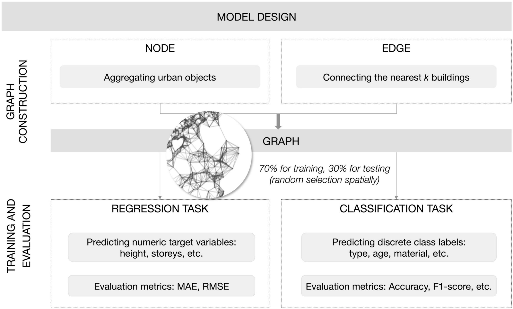

| | |
| ------------------| ------------------------------ |
| Short description: | This repo is for our paper "Predicting building characteristics using graph neural networks and street-level contexts" |
| Lead developer: | {} |
| Further reading: | Please read the [paper](https://doi.org/10.1016/j.compenvurbsys.2024.102129) published in CEUS |
| Code: | [<i class="fab fa-github"></i>  Github repo](https://github.com/binyulei/gnn-building-characteristics-prediction) |
| Citation: | 
@article{2024_ceus_gnn_building,
  author = {Lei, Binyu and Liu, Pengyuan and Milojevic-Dupont, Nikola and Biljecki, Filip},
  doi = {10.1016/j.compenvurbsys.2024.102129},
  journal = {Computers, Environment and Urban Systems},
  pages = {102129},
  title = {Predicting building characteristics at urban scale using graph neural networks and street-level context},
  volume = {111},
  year = {2024}
}
|

## Explainable spatially explicit geospatial artificial intelligence in urban analytics

| | |
| ------------------| ------------------------------ |
| Short description: | This repo is for our paper "Explainable spatially explicit geospatial artificial intelligence in urban analytics" |
| Lead developer: | {} |
| Further reading: | Please read the [paper](https://doi.org/10.1177/23998083231204689) published in EPB |
| Code: | [<i class="fab fa-github"></i>  Github repo](https://github.com/PengyuanLiu1993/XAI-Urban-Analytics) |
| Citation: | 
@article{2024_epb_xai,
  author = {Liu, Pengyuan and Yan, Zhang and Biljecki, Filip},
  doi = {10.1177/23998083231204689},
  journal = {Environment and Planning B: Urban Analytics and City Science},
  pages = {1104--1123},
  title = {{Explainable spatially explicit geospatial artificial intelligence in urban analytics}},
  volume = {51},
  issue = {5},
  year = {2024}
}
|

## Computer Vision and Graph Models to Predict Outdoor Comfort

| | |
| ------------------| ------------------------------ |
| Short description: | This repo is for our paper "Towards Human-centric Digital Twins: Leveraging Computer Vision and Graph Models to Predict Outdoor Comfort" |
| Lead developer: | {} |
| Further reading: | Please read the [paper](https://doi.org/10.1016/j.scs.2023.104480) published in SCS |
| Code: | [<i class="fab fa-github"></i>  Github repo](https://github.com/PengyuanLiu1993/GSL-sidewalk-comfort) |
| Main data source(s): | Own field survey |
| Citation: | 
@article{2023_scs_human_dt,
  author = {Liu, Pengyuan and Zhao, Tianhong and Luo, Junjie and Lei, Binyu and Frei, Mario and Miller, Clayton and Biljecki, Filip},
  doi = {10.1016/j.scs.2023.104480},
  journal = {Sustainable Cities and Society},
  pages = {104480},
  title = {{Towards Human-centric Digital Twins: Leveraging Computer Vision and Graph Models to Predict Outdoor Comfort}},
  volume = {93},
  year = {2023}
}
|

## InstantCITY - Synthesising morphologically accurate geospatial data for urban form analysis, transfer, and quality control

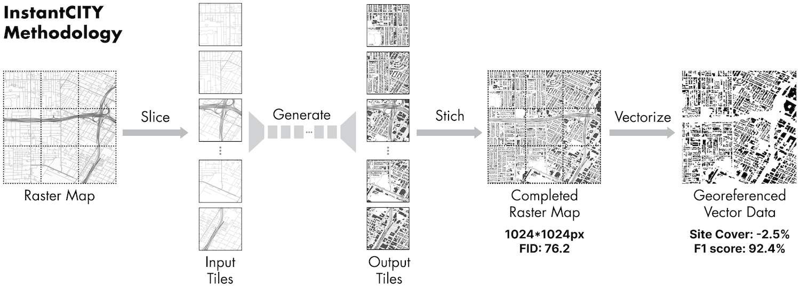

| | |
| ------------------| ------------------------------ |
| Short description: | Generating vectorised building footprint data from street networks using Generative Adversarial Networks |
| Lead developer: | {} |
| Further reading: | Please read the [paper](https://doi.org/10.1016/j.isprsjprs.2022.11.005) published in IJPRS |
| Code: | [<i class="fab fa-github"></i>  Github repo](https://github.com/ualsg/InstantCity) |
| Main data source(s): | OpenStreetMap |
| Citation: | 
@article{2023_ijprs_instantcity,
 author = {Wu, Abraham Noah and Biljecki, Filip},
 doi = {10.1016/j.isprsjprs.2022.11.005},
 journal = {ISPRS Journal of Photogrammetry and Remote Sensing},
 pages = {90-104},
 title = {InstantCITY: Synthesising morphologically accurate geospatial data for urban form analysis, transfer, and quality control},
 volume = {195},
 year = {2023}
}
|

## Water View Imagery

| | |
| ------------------| ------------------------------ |
| Short description: | On-water perspective imagery dataset for semantic segmentation of waterscapes. |
| Lead developer: | {} |
| Further reading: | Please read the [paper](https://doi.org/10.1016/j.ecolind.2022.109615) published in Ecological Indicators |
| Download: | [<i class="fab fa-github"></i> Github repo](https://github.com/ualsg/Water-View-Imagery-dataset) |
| Main data source(s): | Mapillary and manual labelling |
| Coverage: | Eight cities: Amsterdam, Bangkok, Chicago, Istanbul, Japan, London, Paris, and Venice | 
| Citation: | 
@article{2022_ei_water_view_imagery,
  author = {Luo, Junjie and Zhao, Tianhong and Cao, Lei and Biljecki, Filip},
  doi = {10.1016/j.ecolind.2022.109615},
  journal = {Ecological Indicators},
  pages = {109615},
  title = {Water View Imagery: Perception and evaluation of urban waterscapes worldwide},
  volume = {145},
  year = {2022}
}
|

## Global Urban Road Network Patterns

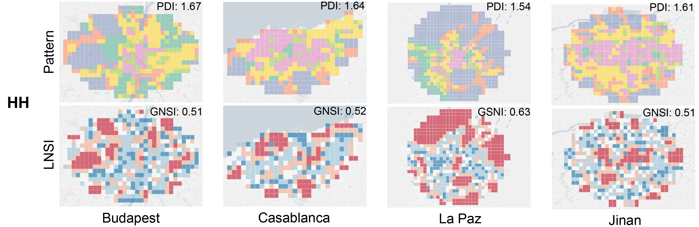

| | |
| ------------------| ------------------------------ |
| Short description: | Deep learning-based analysis of the urban morphology around the world |
| Lead developer: | {} |
| Further reading: | Please read the [paper](https://doi.org/10.1016/j.landurbplan.2023.104901) published in Landscape and Urban Planning |
| Code: | [<i class="fab fa-github"></i>  Github repo](https://github.com/ualsg/Global-road-network-patterns) |
| Main data source(s): | OpenStreetMap |
| Coverage: | 144 cities | 
| Citation: | 
@article{2024_land_urn,
  author = {Chen, Wangyang and Huang, Huiming and Liao, Shunyi and Gao, Feng and Biljecki, Filip},
  doi = {10.1016/j.landurbplan.2023.104901},
  journal = {Landscape and Urban Planning},
  title = {{Global urban road network patterns: Unveiling multiscale planning paradigms of 144 cities with a novel deep learning approach}},
  volume = {241},
  pages = {104901},
  year = {2024}
}
|

## SVIQC -- Street View Imagery Quality Checker

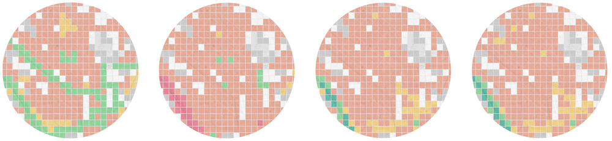

| | |
| ------------------| ------------------------------ |
| Short description: | A toolkit to examine the quality of street view imagery |
| Lead developer: | {} |
| Further reading: | Please read the [paper](https://doi.org/10.1016/j.jag.2022.103094) published in JAG |
| Code: | [<i class="fab fa-github"></i>  Github repo](https://github.com/ualsg/SVI-Quality-Checker) |
| Main data source(s): | Mapillary |
| Citation: | 
@article{2022_jag_svi_quality, 
  year = {2022}, 
  title = {{A comprehensive framework for evaluating the quality of street view imagery}}, 
  author = {Hou, Yujun and Biljecki, Filip}, 
  journal = {International Journal of Applied Earth Observation and Geoinformation}, 
  doi = {10.1016/j.jag.2022.103094}, 
  pages = {103094}, 
  volume = {115}
}
|

## Visual soundscapes

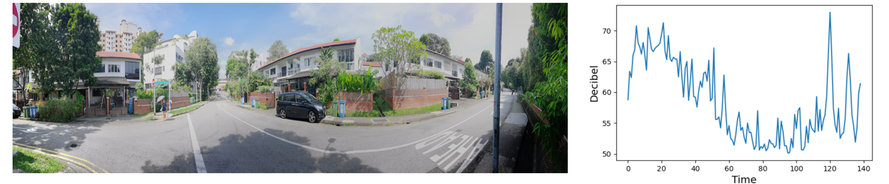

| | |
| ------------------| ------------------------------ |
| Short description: | Predicting the urban soundscape from street view imagery |
| Lead developer: | {} |
| Further reading: | Please read the [paper](https://doi.org/10.1016/j.compenvurbsys.2022.101915) published in CEUS |
| Code: | [<i class="fab fa-github"></i>  Github repo](https://github.com/ualsg/Visual-soundscapes) |
| Citation: | 
@article{2023_ceus_soundscapes,
  author = {Zhao, Tianhong and Liang, Xiucheng and Tu, Wei and Huang, Zhengdong and Biljecki, Filip},
  doi = {10.1016/j.compenvurbsys.2022.101915},
  journal = {Computers, Environment and Urban Systems},
  pages = {101915},
  title = {Sensing urban soundscapes from street view imagery},
  volume = {99},
  year = {2023}
}
|

## GBMI -- Global Building Morphology Indicators

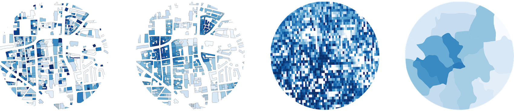

| | |
| ------------------| ------------------------------ |
| Short description: | Billions of built form metrics of selected urban areas around the world, together with a database solution to compute them |
| Lead developer: | {} |
| Formats | CSV, Shapefile, Geopackage, GeoTIFF |
| Further reading: | Please read more at our [website]() or in the [paper](https://doi.org/10.1016/j.compenvurbsys.2022.101809) published in Computers, Environment and Urban Systems |
| Download: | [Project website](/project/gbmi/) |
| Code: | The code used to generate the dataset is available in the [<i class="fab fa-github"></i>  Github repo](https://github.com/ualsg/global-building-morphology-indicators) |
| Main data source(s): | OpenStreetMap, GADM |
| Coverage: | Dozens of urban areas around the world | 
| Citation: | 
@article{2022_ceus_gbmi,
 author = {Biljecki, Filip and Chow, Yoong Shin},
 doi = {10.1016/j.compenvurbsys.2022.101809},
 journal = {Computers, Environment and Urban Systems},
 pages = {101809},
 title = {Global Building Morphology Indicators},
 volume = {95},
 year = {2022}
}
|

## Roofpedia -- solar and green roofs around the world

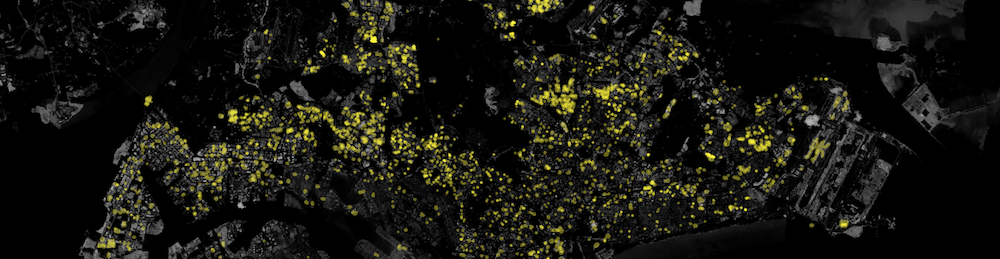

| | |
| ------------------| ------------------------------ |
| Short description: | Locations of buildings that have installed photovoltaics or greenery on their rooftops |
| Lead developer: | {} |
| Formats | GeoJSON |
| Further reading: | Please read more at our [website]() or in the [paper](https://doi.org/10.1016/j.landurbplan.2021.104167) published in Landscape and Urban Planning |
| Download: | [<i class="fab fa-github"></i> Github repo](https://github.com/ualsg/Roofpedia) |
| Code: | The code used to generate the dataset is available in the [same <i class="fab fa-github"></i>  Github repo](https://github.com/ualsg/Roofpedia) |
| Main data source(s): | Various satellite imagery, OpenStreetMap. All open data |
| Coverage: | 17 cities around the world | 
| Citation: | 
@article{roofpedia,
  author = {Abraham Noah Wu and Filip Biljecki},
  doi = {10.1016/j.landurbplan.2021.104167},
  journal = {Landscape and Urban Planning},
  pages = {104167},
  title = {Roofpedia: Automatic mapping of green and solar roofs for an open roofscape registry and evaluation of urban sustainability},
  url = {https://doi.org/10.1016/j.landurbplan.2021.104167},
  volume = {214},
  year = 2021
}
|

## Semantic Riverscapes

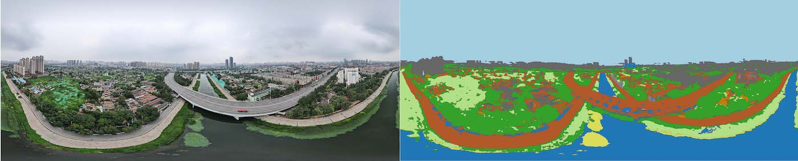

| | |
| ------------------| ------------------------------ |
| Short description: | A semantically annotated UAV oblique image dataset covering an urban river landscape |
| Lead developer: | {} |
| Further reading: | Please read the [paper](https://doi.org/10.1016/j.landurbplan.2022.104569) published in Landscape and Urban Planning |
| Download: | [<i class="fab fa-github"></i> Github repo](https://github.com/ualsg/semantic-riverscapes-dataset) |
| Main data source(s): | Own data collection (UAV) and manual labelling |
| Coverage: | Tianjin (China) | 
| Citation: | 
@article{2022_land_semantic_riverscapes, 
year = {2022}, 
title = {{Semantic Riverscapes: Perception and evaluation of linear landscapes from oblique imagery using computer vision}}, 
author = {Luo, Junjie and Zhao, Tianhong, and Cao, Lei and Biljecki, Filip}, 
journal = {Landscape and Urban Planning}, 
doi = {10.1016/j.landurbplan.2022.104569}, 
pages = {104569}, 
volume = {228}
}
|

## Classification of Urban Morphology with Deep Learning

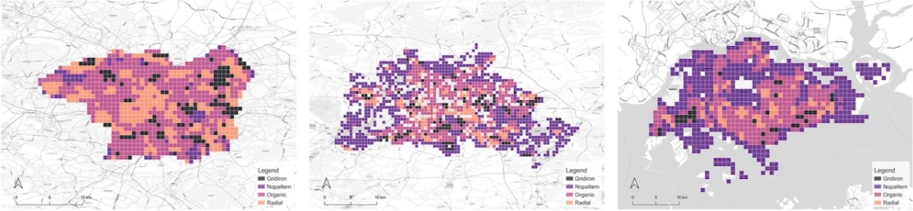

| | |
| ------------------| ------------------------------ |
| Short description: | Software to generate diagrams of the urban form at the city-scale and classify them using deep learning |
| Lead developer: | {} |
| Further reading: | Please read more in the [paper](https://doi.org/10.1016/j.compenvurbsys.2021.101706) published in Computers, Environment and Urban Systems |
| Code: | [<i class="fab fa-github"></i> Github repo](https://github.com/ualsg/Road-Network-Classification) |
| Citation: | 
@article{2021_ceus_dl_morphology,
  author = {Wangyang Chen and Abraham Noah Wu and Filip Biljecki},
  doi = {10.1016/j.compenvurbsys.2021.101706},
  journal = {Computers, Environment and Urban Systems},
  pages = {101706},
  title = {Classification of Urban Morphology with Deep Learning: Application on Urban Vitality},
  url = {https://doi.org/10.1016/j.compenvurbsys.2021.101706},
  volume = {90},
  year = 2021
}
|

## GANmapper: geographical data translation

| | |
| ------------------| ------------------------------ |
| Short description: | A building footprint generator using Generative Adversarial Networks from sparse data such as street networks |
| Lead developer: | {} |
| Further reading: | Please read more in the [paper](https://doi.org/10.1080/13658816.2022.2041643) published in the International Journal of Geographical Information Science |
| Code: | [<i class="fab fa-github"></i> Github repo](https://github.com/ualsg/GANmapper) |
| Citation: | 
@article{2022_ijgis_ganmapper, 
  year = {2022}, 
  author = {Wu, Abraham Noah and Biljecki, Filip}, 
  title = {{GANmapper: geographical data translation}}, 
  journal = {International Journal of Geographical Information Science}, 
  doi = {10.1080/13658816.2022.2041643},
  volume = {36},
  issue = {7},
  pages = {1394-1422}
}
|

## 3D dataset of all public housing (HDB) buildings in Singapore 

| | |
| ------------------| ------------------------------ |
| Short description: | About 12k semantically rich 3D buildings in Singapore in CityJSON and OBJ |
| Lead developer: | {} |
| Formats | [CityJSON](https://cityjson.org), [OBJ](https://en.wikipedia.org/wiki/Wavefront_.obj_file) |
| Further reading: | Please read more here in our [blog post]() or in the [paper](/publication/2020-3-dgeoinfo-3-d-asean/) published at 3D GeoInfo |
| Download: | [<i class="fab fa-github"></i> Github repo](https://github.com/ualsg/hdb3d-data) |
| Code: | The code used to generate the dataset is available in a [separate <i class="fab fa-github"></i>  Github repo](https://github.com/ualsg/hdb3d-code) |
| Main data source(s): | HDB, OpenStreetMap, OneMap. All open data |
| Coverage: | Singapore | 
| Citation: | 
@article{2020_3dgeoinfo_3d_asean,
 author = {Biljecki, F.},
 doi = {10.5194/isprs-annals-vi-4-w1-2020-37-2020},
 journal = {ISPRS Annals of Photogrammetry, Remote Sensing and Spatial Information Sciences},
 pages = {37--44},
 title = {Exploration of open data in Southeast Asia to generate 3D building models},
 volume = {VI-4/W1-2020},
 year = {2020}
}
|

# With our friendly collaborators

## Longitudinal thermographic dataset in Singapore

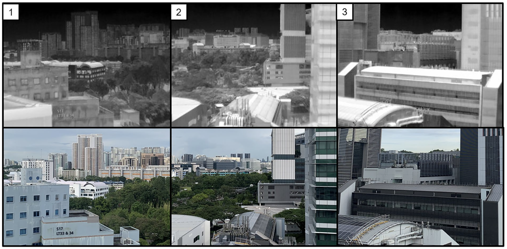

| | |
| ------------------| ------------------------------ |
| Short description: | More than a million thermographic images collected in our campus from ground-based thermal cameras over a long time, allowing users to determine the temperature trend of individual features such as buildings, roads, and vegetation in a tropical environment. |
| Lead developer: | [Subin Lin](https://sg.linkedin.com/in/subin-lin-81710b211) from NUS and the Berkeley Education Alliance for Research in Singapore (BEARS) |
| Data: | [Github](https://github.com/buds-lab/project-iris-dataset) |
| Further reading: | Please read the [paper](https://doi.org/10.1038/s41597-023-02749-0) published in Scientific Data |
| Citation: | 
@article{2023_sd_iris,
  author = {Lin, Subin and Ramani, Vasantha and Martin, Miguel and Arjunan, Pandarasamy and Chong, Adrian and Biljecki, Filip and Ignatius, Marcel and Poolla, Kameshwar and Miller, Clayton},
  doi = {10.1038/s41597-023-02749-0},
  journal = {Scientific Data},
  pages = {859},
  title = {District-scale surface temperatures generated from high-resolution longitudinal thermal infrared images},
  volume = {10},
  year = {2023}
}
|

## EUropean BUilding stock Characteristics in a Common and Open database

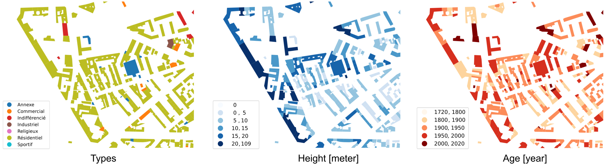

| | |
| ------------------| ------------------------------ |
| Short description: | EUBUCCO is a scientific database of individual building footprints for 206 million buildings across the 27 European Union countries and Switzerland, together with three main attributes -- building type, height and construction year -- included for respectively 45%, 74%, 24% of the buildings. |
| Lead developer: | [Nikola Milojevic-Dupont](https://milojevicdupontnikola.github.io) and [Felix Wagner](https://www.susturbecon.tu-berlin.de/team/felix_wagner/), [Mercator Research Institute for Global Commons and Climate Change](https://www.mcc-berlin.net/) and TU Berlin |
| Website: | [<i class="fas fa-home"></i> Website](https://eubucco.com) |
| Code: | [<i class="fab fa-github"></i> Github repo](https://github.com/ai4up/eubucco) |
| Data: | [Zenodo](https://zenodo.org/record/6524781) |
| Further reading: | Please read the [paper](https://doi.org/10.1038/s41597-023-02040-2) published in Scientific Data |
| Citation: | 
@article{2023_sd_eubucco,
  author = {Milojevic-Dupont, Nikola and Wagner, Felix and Nachtigall, Florian and Hu, Jiawei and Br{\"u}ser, Geza Boi and Zumwald, Marius and Biljecki, Filip and Heeren, Niko and Kaack, Lynn H. and Pichler, Peter-Paul and Creutzig, Felix},
  doi = {10.1038/s41597-023-02040-2},
  journal = {Scientific Data},
  number = {1},
  pages = {147},
  title = {EUBUCCO v0.1: European building stock characteristics in a common and open database for 200+ million individual buildings},
  volume = {10},
  year = {2023}
}
|

## 3D building metrics for urban morphology

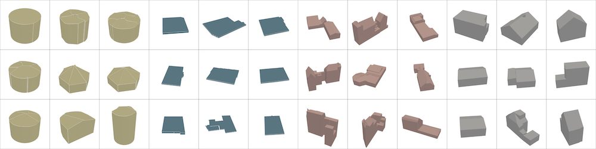

| | |
| ------------------| ------------------------------ |
| Short description: | 3D Building Metrics. Elevating geometric analysis for urban morphology, solar potential, CFD etc to the next level |
| Lead developers: | [Anna Labetski](http://3d.bk.tudelft.nl/alabetski) and [Stelios Vitalis](http://3d.bk.tudelft.nl/svitalis), [3D Geoinformation](https://3d.bk.tudelft.nl), TU Delft |
| Code: | [<i class="fab fa-github"></i> Github repo](https://github.com/tudelft3d/3d-building-metrics) |
| Data: | [Repository](https://doi.org/10.7910/DVN/6QCRRF) |
| Further reading: | Please read the [paper](https://doi.org/10.1080/13658816.2022.2103818) published in the International Journal of Geographical Information Science |
| Coverage: | Major cities in the Netherlands, extensible thanks to the code released open-source | 
| Citation: | 
@article{2023_ijgis_3dbm,
 author = {Labetski, Anna and Vitalis, Stelios and Biljecki, Filip and Arroyo Ohori, Ken and Stoter, Jantien},
 doi = {10.1080/13658816.2022.2103818},
 journal = {International Journal of Geographical Information Science},
 title = {3D building metrics for urban morphology},
 year = {2023},
 volume = {37},
 issue = {1},
 pages = {36-67}
}
|

## 3dfier: automatic reconstruction of 3D city models

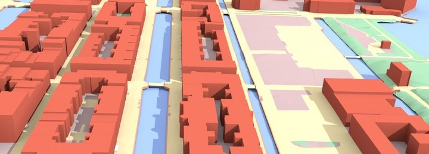

| | |
| ------------------| ------------------------------ |
| Short description: | Takes 2D GIS datasets (e.g. topographical datasets) and "3dfies" them (as in "making them three-dimensional") by lifting every polygon to 3D |
| Lead developer: | [3D Geoinformation](https://3d.bk.tudelft.nl), TU Delft |
| Code: | [<i class="fab fa-github"></i> Github repo](https://github.com/tudelft3d/3dfier) |
| Further reading: | Please read more in the [paper](https://doi.org/10.21105/joss.02866) published in the Journal of Open Source Software |
| Citation: | 
@article{2021_joss_3dfier,
 author = {Ledoux, Hugo and Biljecki, Filip and Dukai, Balázs and Kumar, Kavisha and Peters, Ravi and Stoter, Jantien and Commandeur, Tom},
 doi = {10.21105/joss.02866},
 journal = {Journal of Open Source Software},
 number = {57},
 pages = {2866},
 title = {3dfier: automatic reconstruction of 3D city models},
 volume = {6},
 year = {2021}
}
|

## ifc2indoorgml

| | |
| ------------------| ------------------------------ |
| Short description: | A tool allowing to generate IndoorGML files from IFC input models |
| Lead developer: | [Abdoulaye Diakite](https://www.unsw.edu.au/staff/abdoulaye-diakite), [GRID](http://grid.unsw.edu.au/), University of New South Wales |
| Code: | [<i class="fab fa-github"></i> Github repo](https://github.com/grid-unsw/ifc2indoorgml) |
| Further reading: | [Paper](/publication/2022-isprs-ifc-2-indoorgml/) |
| Citation: | 
@article{2022_isprs_ifc2indoorgml,
 author = {Diakite, AA and Díaz-Vilariño, L and Biljecki, F and Isikdag, Ü and Simmons, S and Li, K and Zlatanova, S},
 doi = {10.5194/isprs-archives-xliii-b4-2022-295-2022},
 journal = {Int. Arch. Photogramm. Remote Sens. Spatial Inf. Sci.},
 pages = {295--301},
 title = {ifc2indoorgml: An open-source tool for generating IndoorGML from IFC},
 volume = {XLIII-B4-2022},
 year = {2022}
}
|

## AIDA - Annotated Image Database of Architecture

| | |
| ------------------| ------------------------------ |
| Short description: | A repository of architectural photographs worldwide, labelled with a vast list of hierarchical categories and a series of auxiliary annotations |
| Lead developer: | Chen Jielin |
| Further reading: | [Paper](/publication/2021-caadria-aida/) |
| Download: | [Harvard Dataverse](https://doi.org/10.7910/DVN/IGNELZ) |
| Main data source(s): | ArchDaily |
| Citation: | 
@inproceedings{2021_caadria_aida,
 author = {Chen, Jielin and Stouffs, Rudi and Biljecki, Filip},
 booktitle = {Proceedings of the 26th International Conference of the Association for Computer-Aided Architectural Design Research in Asia (CAADRIA) 2021},
 pages = {161--170},
 title = {Hierarchical (Multi-Label) Architectural Image Recognition and Classification},
 volume = {1},
 year = {2021}
}
|

