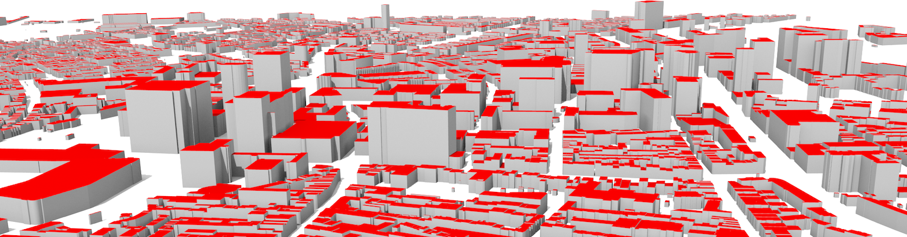

+++
date = 2019-11-08
title = "Vacancy: Scientific Developer in 3D Geographic Data Science (Full-time)"
+++

{}
The deadline to apply for this position has passed.
Thanks to all the applicants for their interest.
For new vacancies please follow our [opportunities page]().
{}

### Job and project description

The Urban Analytics Lab at the National University of Singapore (NUS) is seeking a research software engineer with strong computational skills to contribute to a project about generating 3D city models from sparse open data, such as building footprints in absence of lidar point clouds.
Among other responsibilities, the position involves developing machine learning approaches to infer additional information from sparse data leading to the enrichment of existing 2D geospatial datasets and generating 3D city models.

The principal research question of the project _Large-scale 3D geospatial data for urban analytics_ is to investigate whether it is possible to create a 3D city model from (mostly) 2D open data sources such as OpenStreetMap, resulting in a low-cost approach to obtain 3D city models of very large areas suitable for various purposes such as urban analytics.
In this position, you will be responsible for the development and management of the implementation/software portion of the project.

An earlier related work of the PI is published [here](https://doi.org/10.1016/j.compenvurbsys.2017.01.001) ([PDF](http://filip.biljecki.com/publications/2017_ceus_inferring_heights.pdf)).
This project aims to extend the work, investigate its scalability, and implement it on a large number of cities around the world.

This is an excellent opportunity to have an impact in the field of 3D GIS / urban modelling, contribute to the development of methods that range from data acquisition and processing to data quality assurance and visualisation, and derive datasets and methods that could be very valuable to other researchers worldwide -- enriching their scientific studies in urban analytics and GIS.

The project has a chance to unlock the potential of 3D geoinformation in areas where there was previously no reliable data available, and contribute to fostering new applications in regions that were previously neglected due to the lack of appropriate datasets.

Besides research on the topic and the development of software prototypes, you will be expected to work on tasks such as building a repository to disseminate the results and generated datasets.

You will be supervised by the principal investigator of the project [Dr Filip Biljecki](/authors/filip/), NUS School of Design and Environment.

### Scope and responsibilities

- Reading, processing, and writing geospatial data such as OpenStreetMap.
- Development of predictive models and their testing.
- Creating [CityJSON](https://cityjson.org) datasets.
- Dissemination and visualisation of data.
- Documenting the developed code and writing documentation.
- Quality assessment of the data obtained with the developed methodology.
- Investigating applications of the generated datasets.

### Preferred qualifications

- Masters with at least 2 years of relevant work experience preferred. Degree in a related discipline may also be considered.
- Experience with programming (preferably strong Python expertise, but not a must). Having built software used by others and/or scientific software experience is a plus.
- Excellent communication skills in English.
- A solid grasp of data science/machine learning, and expertise with modern tools.
- Familiarity with geospatial data (and 3D is a further plus), and GIS software/libraries.
- Capable of identifying and quickly learning the most suitable tools and new programming languages for the project on the go.
- You are inclined to contribute to open-source libraries and add new code, and work in a research environment.

Things that may work in your favour during the evaluation of your application:

- A Github account (or similar) demonstrating prior work, ability to document code, and an open-source stance.
- Experience with some of the following: PostgreSQL/PostGIS, R, pandas, scikit-learn, PyTorch, and/or TensorFlow.

You don’t have to tick all the boxes to be considered a strong candidate.
Hence, if you are well motivated, you are encouraged to apply even if you do not meet all the requirements above as we offer a stimulating environment supporting you to further develop your skills. 

### Our offer

- You will be working on an exciting project at the forefront of 3D city modelling developments, and helping the team implement and test their ideas and concepts.
- Possibility to make impactful contributions in the field.
- Option to publish the developed code as open-source, and contribute to open-source libraries, further increasing the visibility of your work.
- Flexible working environment.
- The appointment is for one and half year, with a probation period of 3 months.
- The remuneration will be determined according to the university's salary range depending on the degree and experience.
- Preferred start: January or February 2020.

### Employer

#### National University of Singapore

The [National University of Singapore (NUS)](http://www.nus.edu.sg) is ranked consistently as one of the world's top universities.
It aspires to be a vital community of academics, researchers, staff, students and alumni working together in a spirit of innovation and enterprise for a better world.

Ranked as the [#1 most competitive country](https://www.straitstimes.com/business/economy/singapore-economy-ranked-worlds-most-competitive) and the [safest country in the world](https://www.asiaone.com/singapore/singapore-ranked-safest-country-world-above-japan-survey), Singapore [successfully attracts talents from all over the world](https://www.straitstimes.com/singapore/singapore-retains-top-spot-in-asia-pacific-index-for-talent-competitiveness) by offering first-world living and working experience in the heart of Southeast Asia.

#### Urban Analytics Lab

The NUS Urban Analytics Lab is an interdepartmental multidisciplinary research group established in 2019 focusing on urban analytics, geographic data science, and 3D city modelling at the [NUS School of Design and Environment](http://www.sde.nus.edu.sg).
Its mission is to leverage on spatially enabled data for urban applications, making sense of big geospatial data in the built environment, and catering to disciplines such as architecture, urban planning, and real estate.
The group is the first one in Singapore encompassing the entire 3D GIS ecosystem under the same roof: from standardisation and generation of 3D city models all the way to their utilisation and visualisation, while continuously exploring new frontiers in the field. 



### Application procedure

Please apply through [JobsBank](https://www.mycareersfuture.sg/job/architecture/research-associate-scientific-developer-3d-geographic-data-science-national-university-singapore-50fa2acbc30e7199391f6083403a915f) or by [email](mailto:filip@nus.edu.sg).
Please submit the indication of possessing the qualifications listed above (CV, and optionally additional relevant material such as portfolio and cover letter).
In accordance with the Personal Data Protection Act (PDPA), please provide consent for the collection, use and disclosure of personal data, using the [NUS Personal Data Consent for Job Applicants](http://www.nus.edu.sg/careers/potentialhires/applicationprocess/NUS-Personal-Data-Consent-for-Job-Applicants.pdf) form.

{}
~~The deadline to apply is 2019-12-02.~~
The deadline to apply for this position has passed.
Thanks to all the applicants for their interest.
For new vacancies please follow our [opportunities page]().
{}

For more information, please visit NUS > Careers > [Academic Appointments](http://www.nus.edu.sg/careers/acadappt.htm).

Appreciate your understanding in advance that only selected shortlisted applicants will be notified.
Shortlisted candidates will later be asked to provide the full documentation (e.g. copy of diploma, contacts of referees).

### Contact

For more information please contact the principal investigator of the project [Dr Filip Biljecki](/authors/filip).

