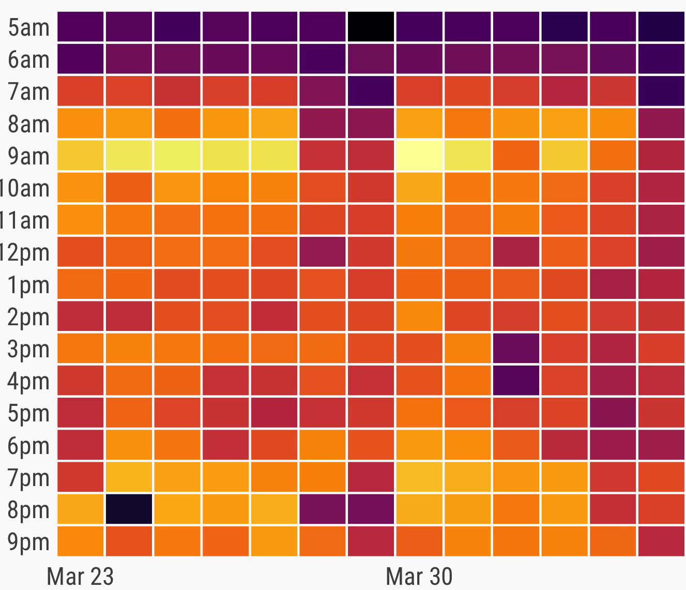

+++
date = 2020-05-14
title = "Vacancy: Researcher (Traineeship) in Urban Analytics (1 positions)"
+++

### Description

As part of the [NUS Resilience and Growth Initiative](http://www.nus.edu.sg/cfg/rg), we are seeking a STEM graduate from the NUS Class of 2019 and Class of 2020 to join us as a [Research / Doctoral Apprentice](http://www.nus.edu.sg/cfg/rg/traineeships/research) in the scope of our [activities](/projects/).
This is a paid traineeship for 12 months.

The apprentice will be introduced to a wide array of urban/geospatial data, guided on how to understand and manage it, conduct the analyses and experiments, build pipelines for data transformation and integration, and use the data for multidisciplinary use cases.

This is an excellent opportunity to be part of a multidisciplinary international team, and gain an understanding of urban analytics and a range of transferrable skills, including programming, data science / AI, international collaboration, and scientific communication.
A personalised development plan will be created, and the researcher will work on real-world problems and in the frame of [existing project(s) of the Lab](/projects/) under the supervision of the principal investigator of the lab [Dr Filip Biljecki](/authors/filip/).

For more information about the initiative, please refer to the [R&G website](http://www.nus.edu.sg/cfg/rg/traineeships/).

### Scope and responsibilities

Your key responsibilities will be:

- Conduct literature reviews
- Assist in designing experiments
- Reading, processing, and writing geospatial data 
- Development of predictive models and their testing
- Using geospatial data for urban/spatial analyses and simulations
- Dissemination and visualisation of data and results
- Evaluation of data to ensure accuracy and completeness
- Preparation of reports

### Required qualifications

You should demonstrate that you possess:

- Singapore Citizenship or PR.
- Graduated or graduating in calendar year 2019 or 2020.
- A master or PhD degree (or to be completed soon) from NUS in a STEM discipline.
- Excellent communication skills in English.
- Experience with programming. Having built software used by others and/or scientific software experience is a plus.
- Capability of identifying and quickly learning the most suitable tools on the go.

### Duration

The duration of the programme is 12 months.

### Urban Analytics Lab

The NUS Urban Analytics Lab is an interdepartmental multidisciplinary research group established in 2019 focusing on urban analytics, geographic data science, and 3D city modelling at the [NUS School of Design and Environment](http://www.sde.nus.edu.sg).
Our mission is to leverage on spatially enabled data for urban applications, catalyse the development of 3D geoinformation in the context of smart cities, make sense of big geospatial data and digital twins in the built environment, and cater to disciplines such as architecture, urban planning, and real estate to make informed decisions using 3D city models and urban analytics.
The group is the first one in Singapore encompassing the entire 3D GIS ecosystem under the same roof: from standardisation and generation of 3D city models all the way to their utilisation and visualisation, while continuously exploring new frontiers in the field. 

### Application

Please apply by [email](mailto:filip@nus.edu.sg).
Please submit the indication of possessing the qualifications listed above (CV, and optionally additional relevant material such as portfolio and cover letter), and do so preferably in PDF format.

{}
The deadline to apply is 17 May 2020.
{}

### Contact

For more information please contact [Dr Filip Biljecki](/authors/filip).

