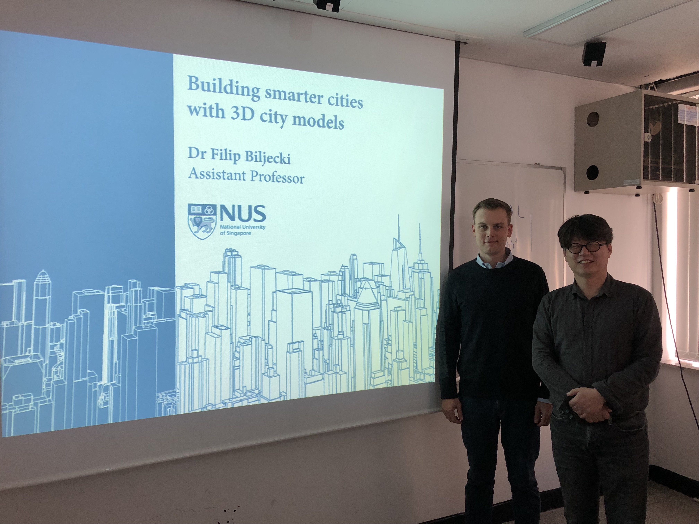

In May 2019 we have visited prominent institutions in the domain of GIS and smart city research in East Asia:

* Pusan National University (Prof Ki-Joune Li) 🇰🇷
* University of Seoul (Prof Jiyeong Lee) 🇰🇷
* National Institute of Information and Communications Technology in Tokyo 🇯🇵

It was a pleasure to visit these important organisations working on GIS, and present our latest work.

