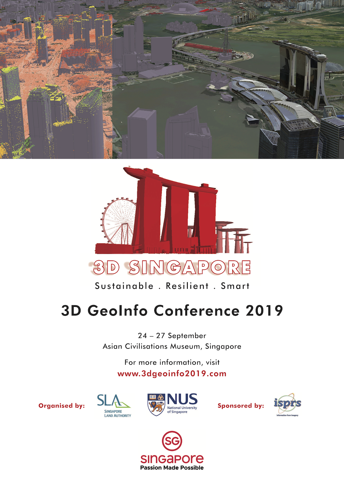

[3D GeoInfo](https://www.3dgeoinfo2019.com/) is the flagship conference of the international 3D city modelling community, with the [2018 edition held in Delft](https://3d.bk.tudelft.nl/events/3dgeoinfo2018/).
This year we are quite fortunate to be able to host it in Singapore, together with the [Singapore Land Authority](http://sla.gov.sg), in the last week of September.

The paper submission and peer review process was a competitive one: we have received 68 papers, but were able to accept only 39.
Besides an attractive selection of papers (for the full list please see the [conference website](https://www.3dgeoinfo2019.com/)) and exhibitors, we have been able to secure a very nice venue - the [Asian Civilisations Museum (ACM)](https://www.acm.org.sg/) located in downtown Singapore.

Even though the paper submission deadline passed, there is still a chance to participate: make sure to [register](https://events.miceneurol.com/3d-geoinfo-2019/register/Site/Register) before 15 August.

Please note that this edition of 3D GeoInfo is part of a larger event called 3D Singapore, which also includes the pre-conference 2th BIM/GIS Integration Workshop, the Point Clouds Training and the Big Data and Urban Analytics Workshop.

For more information, including the tentative programme, please visit the [conference website](https://www.3dgeoinfo2019.com/).
See you at the ACM in September!

{}
Update 2019-10-08: The conference has been a success! Read the report [here](). Thanks everyone!
{}
