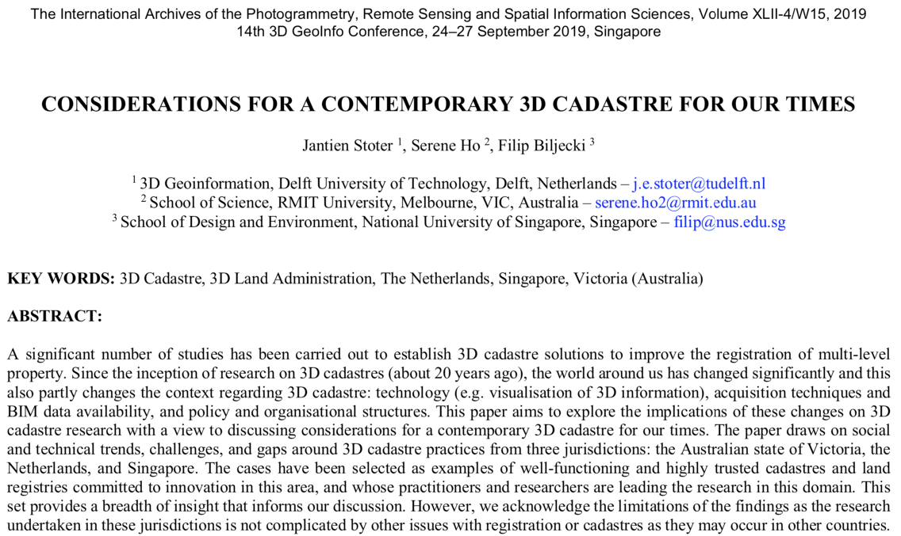

We published a new paper:

> Stoter J, Ho S, Biljecki F (2019): Considerations for a contemporary 3D cadastre for our times. _Int. Arch. Photogramm. Remote Sens. Spatial Inf. Sci._ XLII-4/W15:81–88. [<i class="ai ai-doi-square ai"></i> 10.5194/isprs-archives-XLII-4-W15-81-2019](https://doi.org/10.5194/isprs-archives-XLII-4-W15-81-2019) [<i class="far fa-file-pdf"></i> PDF](/publication/2019-considerations-3-d-cadastre/2019-considerations-3-d-cadastre.pdf) <i class="ai ai-open-access-square ai"></i>

A significant number of studies has been carried out to establish 3D cadastre solutions to improve the registration of multi-level property. Since the inception of research on 3D cadastres (about 20 years ago), the world around us has changed significantly and this also partly changes the context regarding 3D cadastre: technology (e.g. visualisation of 3D information), acquisition techniques and BIM data availability, and policy and organisational structures. This paper aims to explore the implications of these changes on 3D cadastre research with a view to discussing considerations for a contemporary 3D cadastre for our times. The paper draws on social and technical trends, challenges, and gaps around 3D cadastre practices from three jurisdictions: the Australian state of Victoria, the Netherlands, and Singapore. The cases have been selected as examples of well-functioning and highly trusted cadastres and land registries committed to innovation in this area, and whose practitioners and researchers are leading the research in this domain. This set provides a breadth of insight that informs our discussion. However, we acknowledge the limitations of the findings as the research undertaken in these jurisdictions is not complicated by other issues with registration or cadastres as they may occur in other countries.

For more information please see the [paper](/publication/2019-considerations-3-d-cadastre/) (open access <i class="ai ai-open-access-square ai"></i>).

[](/publication/2019-considerations-3-d-cadastre/)


BibTeX citation:
```bibtex
@article{2019_considerations_3d_cadastre,
    author = {Stoter, J and Ho, S and Biljecki, F},
    title = {{Considerations for a contemporary 3D cadastre for our times}},
    journal = {Int. Arch. Photogramm. Remote Sens. Spatial Inf. Sci.},
    year = {2019},
    volume = {XLII-4/W15},
    pages = {81--88},
    doi = {10.5194/isprs-archives-XLII-4-W15-81-2019}
}
```
