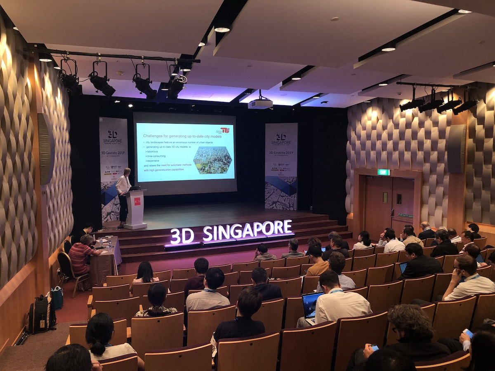
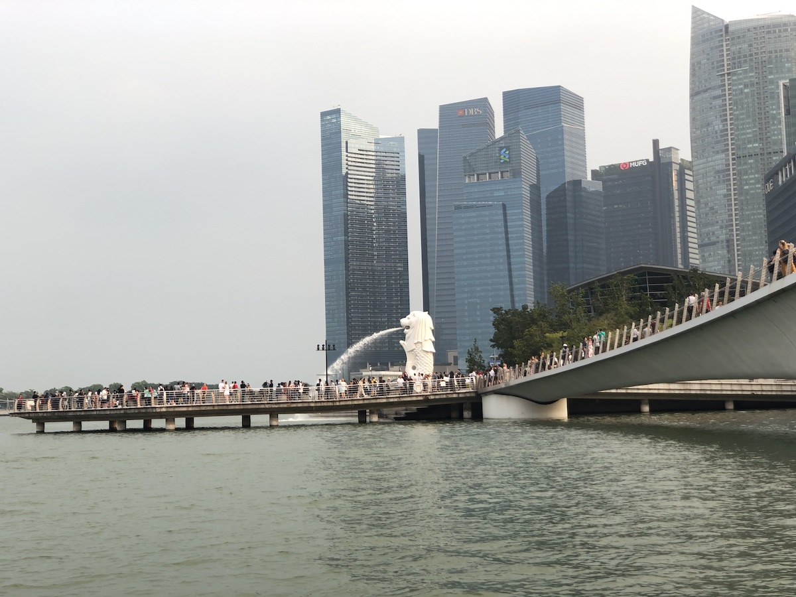
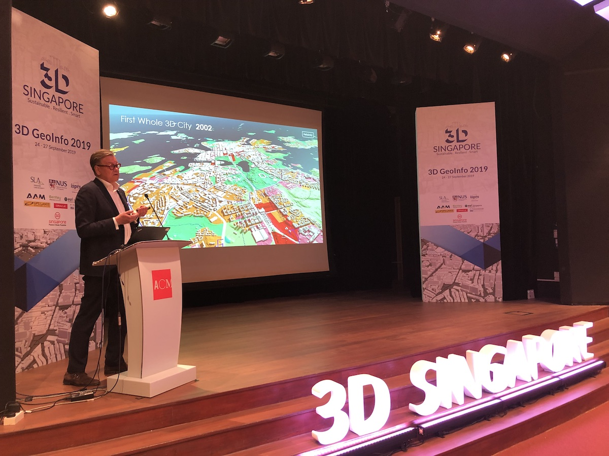
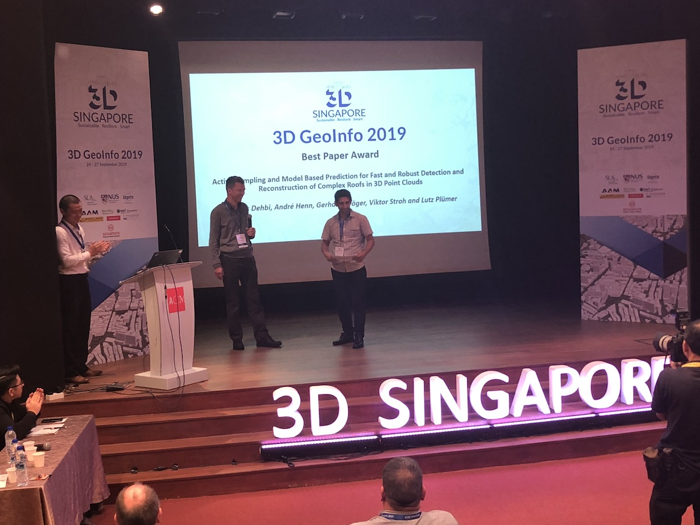

We are very pleased to have had this year's [3D GeoInfo hosted in Singapore](https://www.3dgeoinfo2019.com).
The 14th edition of the conference, co-organised by the [National University of Singapore](http://www.nus.edu.sg) and the [Singapore Land Authority](https://www1.sla.gov.sg), was part of a broader event named 3D Singapore, which comprised also three pre-conference workshops: 2nd BIM/GIS Integration Workshop, Point Clouds Training, and Big Data and Urban Analytics Workshop.
The 4-day event, endorsed by the [ISPRS](https://www.isprs.org) and hosted at the Asian Civilisations Museum, was attended by about 200 participants from academia, industry, and public organisations; and it was supported by 6 exhibitors: [AAM](http://www.aamgroup.com/), [Bentley](https://www.bentley.com/en), [Esri Singapore](http://esrisingapore.com.sg/), [GPS Lands](https://www.gpslands.com/), [Oracle](https://www.oracle.com/sg/corporate/contact/), and [YJP Surveyors](https://www.yjpsurveyors.com/).
It was a great pleasure to take part in hosting this event.

We contributed to the event with five papers, out of which one was presented as a keynote:

> Biljecki F, Dehbi Y (2019): Raise the roof: towards generating LoD2 models without aerial surveys using machine learning. _ISPRS Ann. Photogramm. Remote Sens. Spatial Inf. Sci._ IV-4/W8:27-34. [<i class="ai ai-doi-square ai"></i> 10.5194/isprs-annals-IV-4-W8-27-2019](https://doi.org/10.5194/isprs-annals-IV-4-W8-27-2019) [<i class="far fa-file-pdf"></i> PDF](/publication/2019-inferring-roof-type/2019-inferring-roof-type.pdf) <i class="ai ai-open-access-square ai"></i>

> Noardo F, Biljecki F, Agugiaro G, Arroyo Ohori K, Ellul C, Harrie L, Stoter J (2019): GeoBIM benchmark 2019: intermediate results. _Int. Arch. Photogramm. Remote Sens. Spatial Inf. Sci._ XLII-4/W15:47–52. [<i class="ai ai-doi-square ai"></i> 10.5194/isprs-archives-XLII-4-W15-47-2019](https://doi.org/10.5194/isprs-archives-XLII-4-W15-47-2019) [<i class="far fa-file-pdf"></i> PDF](/publication/2019-geobim-intermediate/2019-geobim-intermediate.pdf) <i class="ai ai-open-access-square ai"></i>

> Biljecki F, Tauscher H (2019): Quality of BIM-GIS conversion. _ISPRS Ann. Photogramm. Remote Sens. Spatial Inf. Sci._ IV-4/W8:35–42. [<i class="ai ai-doi-square ai"></i> 10.5194/isprs-annals-IV-4-W8-35-2019](https://doi.org/10.5194/isprs-annals-IV-4-W8-35-2019) [<i class="far fa-file-pdf"></i> PDF](/publication/2019-bim-gis-quality/2019-bim-gis-quality.pdf) <i class="ai ai-open-access-square ai"></i>

> Stoter J, Ho S, Biljecki F (2019): Considerations for a contemporary 3D cadastre for our times. _Int. Arch. Photogramm. Remote Sens. Spatial Inf. Sci._ XLII-4/W15:81–88. [<i class="ai ai-doi-square ai"></i> 10.5194/isprs-archives-XLII-4-W15-81-2019](https://doi.org/10.5194/isprs-archives-XLII-4-W15-81-2019) [<i class="far fa-file-pdf"></i> PDF](/publication/2019-considerations-3-d-cadastre/2019-considerations-3-d-cadastre.pdf) <i class="ai ai-open-access-square ai"></i>

> Lim J, Tauscher H, Biljecki F (2019): Graph transformation rules for IFC-to-CityGML attribute conversion. _ISPRS Ann. Photogramm. Remote Sens. Spatial Inf. Sci._ IV-4/W8:83–90. [<i class="ai ai-doi-square ai"></i> 10.5194/isprs-annals-IV-4-W8-83-2019](https://doi.org/10.5194/isprs-annals-IV-4-W8-83-2019) [<i class="far fa-file-pdf"></i> PDF](/publication/2019-graph-transformation-rules-ifc-citygml/2019-graph-transformation-rules-ifc-citygml.pdf) <i class="ai ai-open-access-square ai"></i>

All the papers from the event are published open access in the [ISPRS Annals](https://www.isprs-ann-photogramm-remote-sens-spatial-inf-sci.net/IV-4-W8/) (full papers) and [ISPRS Archives](https://www.int-arch-photogramm-remote-sens-spatial-inf-sci.net/XLII-4-W15/) (short papers / extended abstracts).

The conference was opened by Mr Tan Boon Khai (Chief Executive of SLA) and Prof Lam Khee Poh (Dean of the School of Design and Environment at NUS). 
We also had the privilege of having Prof Lui Pao Chuen (Advisor, [National Research Foundation](https://www.nrf.gov.sg)) to enrich the event as the guest of honour.
Besides the presentations of the 36 peer-reviewed papers, the conference had four invited speakers: Ms Yap Lay Bee ([Singapore's Urban Redevelopment Authority](https://www.ura.gov.sg/)), Dr Thomas Reindl ([Solar Energy Institute of Singapore](http://www.seris.nus.edu.sg)), Mr Jarmo Suomisto ([Helsinki 3D+](http://www.hel.fi/3D)), and Mr Carsten Rönsdorf ([Ordnance Survey](http://www.ordnancesurvey.co.uk)).

We also want to congratulate the winners of the best paper awards.

The best paper award went to Y. Dehbi, A. Henn, G. Gröger, V. Stroh, and L. Plümer for their paper 
[Active sampling and model based prediction for fast and robust detection and reconstruction of complex roofs in 3D point clouds](https://doi.org/10.5194/isprs-annals-IV-4-W8-43-2019).

The runner-up best paper recognition was awarded to S. Vitalis, A. Labetski, K. Arroyo Ohori, H. Ledoux, and J. Stoter for their paper [A data structure to incorporate versioning in 3D city models](https://doi.org/10.5194/isprs-annals-IV-4-W8-123-2019). 

Congratulations :trophy: :clap:

It has been a great privilege to have prominent 3D GIS researchers, practitioners, and companies in Singapore for this event. Thanks everyone for attending.

Please note that the event does not end here.
We are organising a [special issue in Transactions in GIS 'Emerging Topics in 3D GIS'](), which is aimed at authors to extend their conference papers.
That said, the special issue is open to everyone in the 3D GIS/BIM community, as having a paper at the conference is not a requirement for submission.

Next year's event, [15th 3D Geoinfo 2020](http://3dgeoinfo2020.com), will be hosted by the [University College London](https://www.ucl.ac.uk).
Also, we already know the location of the 2021 event: New York City, hosted by the [New York Univesity](https://cusp.nyu.edu).
See you! 