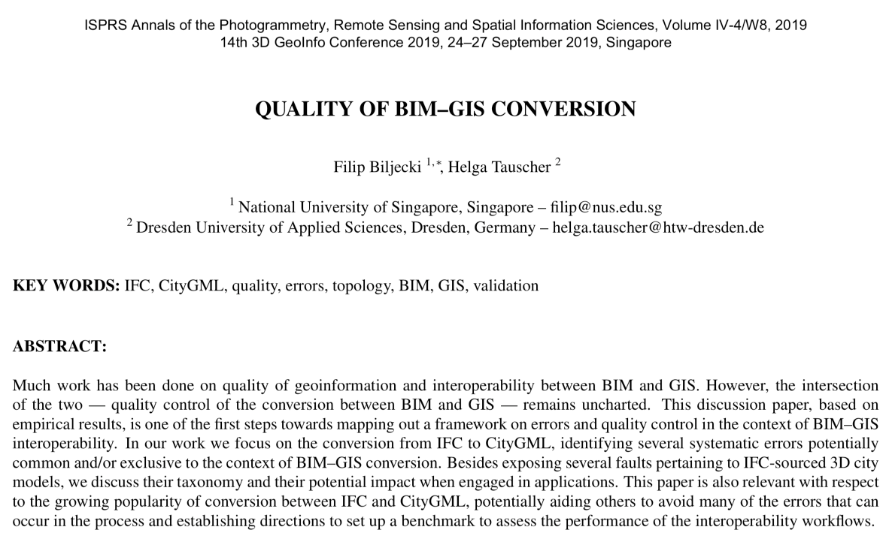



We published a new paper:

> Biljecki F, Tauscher H (2019): Quality of BIM-GIS conversion. _ISPRS Ann. Photogramm. Remote Sens. Spatial Inf. Sci._ IV-4/W8:35–42. [<i class="ai ai-doi-square ai"></i> 10.5194/isprs-annals-IV-4-W8-35-2019](https://doi.org/10.5194/isprs-annals-IV-4-W8-35-2019) [<i class="far fa-file-pdf"></i> PDF](/publication/2019-bim-gis-quality/2019-bim-gis-quality.pdf) <i class="ai ai-open-access-square ai"></i>

Much work has been done on quality of geoinformation and interoperability between BIM and GIS.
However, the intersection of the two - quality control of the conversion between BIM and GIS - remains uncharted.
This discussion paper, based on empirical results, is one of the first steps towards mapping out a framework on errors and quality control in the context of BIM–GIS interoperability.
In our work we focus on the conversion from IFC to CityGML, identifying several systematic errors potentially common and/or exclusive to the context of BIM–GIS conversion.
Besides exposing several faults pertaining to IFC-sourced 3D city models, we discuss their taxonomy and their potential impact when engaged in applications.
This paper is also relevant with respect to the growing popularity of conversion between IFC and CityGML, potentially aiding others to avoid many of the errors that can occur in the process and establishing directions to set up a benchmark to assess the performance of the interoperability workflows.

For more information please see the [paper](/publication/2019-bim-gis-quality/) (open access <i class="ai ai-open-access-square ai"></i>).

[](/publication/2019-bim-gis-quality/)


BibTeX citation:
```bibtex
@article{2019_bim_gis_quality,
 author = {Biljecki, F and Tauscher, H},
 doi = {10.5194/isprs-annals-IV-4-W8-35-2019},
 journal = {ISPRS Ann. Photogramm. Remote Sens. Spatial Inf. Sci.},
 pages = {35--42},
 title = {{Quality of BIM--GIS conversion}},
 volume = {IV-4/W8},
 year = {2019}
}
```



