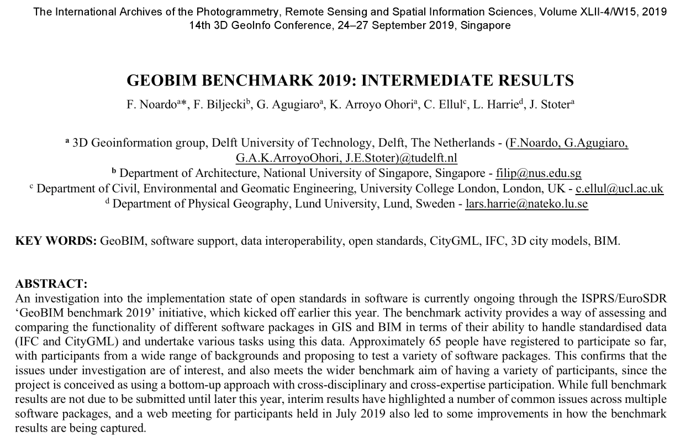

We have been involved in the [ISPRS/EuroSDR GeoBIM benchmark](https://3d.bk.tudelft.nl/projects/geobim-benchmark/), a study to investigate the state of the art of software adoption of IFC and CityGML.
The project is now halfway its timeline, so we have published a paper and delivered a keynote at the [2nd BIM/GIS Integration Workshop at the 3D Singapore 2019 event](https://www.3dgeoinfo2019.com) to give an update on the progress and preliminary results:

> Noardo F, Biljecki F, Agugiaro G, Arroyo Ohori K, Ellul C, Harrie L, Stoter J (2019): GeoBIM benchmark 2019: intermediate results. _Int. Arch. Photogramm. Remote Sens. Spatial Inf. Sci._ XLII-4/W15:47–52. [<i class="ai ai-doi-square ai"></i> 10.5194/isprs-archives-XLII-4-W15-47-2019](https://doi.org/10.5194/isprs-archives-XLII-4-W15-47-2019) [<i class="far fa-file-pdf"></i> PDF](/publication/2019-geobim-intermediate/2019-geobim-intermediate.pdf) <i class="ai ai-open-access-square ai"></i>

The abstract follows.

An investigation into the implementation state of open standards in software is currently ongoing through the ISPRS/EuroSDR ‘GeoBIM benchmark 2019’ initiative, which kicked off earlier this year. The benchmark activity provides a way of assessing and comparing the functionality of different software packages in GIS and BIM in terms of their ability to handle standardised data (IFC and CityGML) and undertake various tasks using this data. Approximately 65 people have registered to participate so far, with participants from a wide range of backgrounds and proposing to test a variety of software packages. This confirms that the issues under investigation are of interest, and also meets the wider benchmark aim of having a variety of participants, since the project is conceived as using a bottom-up approach with cross-disciplinary and cross-expertise participation. While full benchmark results are not due to be submitted until later this year, interim results have highlighted a number of common issues across multiple software packages, and a web meeting for participants held in July 2019 also led to some improvements in how the benchmark results are being captured.

For more information please see the [paper](/publication/2019-geobim-intermediate/) (open access <i class="ai ai-open-access-square ai"></i>).
There is still time to join the benchmark, with the deadline being at the end of October 2019.
For more information please check the [website of the GeoBIM benchmark](https://3d.bk.tudelft.nl/projects/geobim-benchmark/).

[](/publication/2019-geobim-intermediate/)


BibTeX citation:
```bibtex
@article{2019_geobim_intermediate,
  author = {Noardo, F and Biljecki, F and Agugiaro, G and Arroyo Ohori, K and Ellul, C and Harrie, L and Stoter, J},
  title = {{GeoBIM benchmark 2019: intermediate results}},
  journal = {Int. Arch. Photogramm. Remote Sens. Spatial Inf. Sci.},
  year = {2019},
  volume = {XLII-4/W15},
  pages = {47--52},
  doi = {10.5194/isprs-archives-XLII-4-W15-47-2019}
}
```
