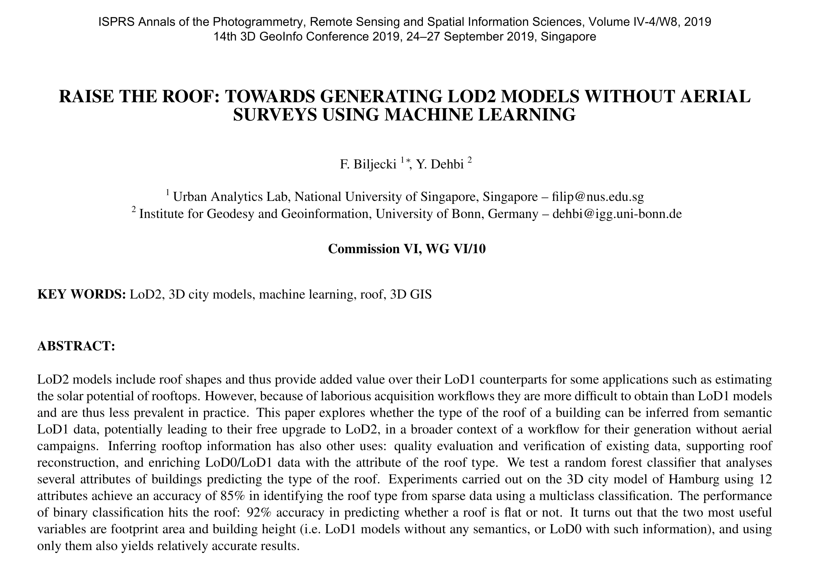



We published a new paper:

> Biljecki F, Dehbi Y (2019): Raise the roof: towards generating LoD2 models without aerial surveys using machine learning. _ISPRS Ann. Photogramm. Remote Sens. Spatial Inf. Sci._ IV-4/W8:27-34. [<i class="ai ai-doi-square ai"></i> 10.5194/isprs-annals-IV-4-W8-27-2019](https://doi.org/10.5194/isprs-annals-IV-4-W8-27-2019) [<i class="far fa-file-pdf"></i> PDF](/publication/2019-inferring-roof-type/2019-inferring-roof-type.pdf) <i class="ai ai-open-access-square ai"></i>

The paper deals with inferring the type of roof from LoD1 models, potentially contributing to a broader context of a workflow of generating LoD2 models bypassing traditional approaches.

The work is a continuation of the [previous work on generating LoD1 models from building footprints without elevation measurements](https://doi.org/10.1016/j.compenvurbsys.2017.01.001), by inferring the heights of buildings solely from 2D data (using Random Forest regression). 

We have used 10 different predictors, e.g. building function, building height, and number of OpenStreetMap amenities in the neighbourhood, some of which are more useful than others. 
For example, the vertical extent of the building (storeys and height) may give a good indication about the roof type:



For training and testing purposes we have used the 3D city model of Hamburg, Germany. 
In the end we have achieved an accuracy of 85% in predicting the type of the roof.
We also carried out another classification for predicting whether a roof is flat or not (with 92% accuracy).

The list of features we have used and their importance (in both determining the roof type and in the binary classification whether a roof is flat or non-flat) is included below:



While we are happy how this work turned out and we made a progress, there is still a lot to be done in this topic (e.g. reconstructing the geometry of the roof), which we intend to tackle in future work.
Our roadmap at the moment looks like this:




For more information please see the [paper](/publication/2019-inferring-roof-type/) (open access <i class="ai ai-open-access-square ai"></i>).

[](/publication/2019-inferring-roof-type/)


BibTeX citation:
```bibtex
@article{2019_inferring_roof_type,
    author = {Biljecki, F and Dehbi, Y},
    doi = {10.5194/isprs-annals-IV-4-W8-27-2019},
    journal = {ISPRS Ann. Photogramm. Remote Sens. Spatial Inf. Sci.},
    pages = {27--34},
    title = {Raise the roof: towards generating LoD2 models without aerial surveys using machine learning},
    volume = {IV-4/W8},
    year = {2019}
}
```
