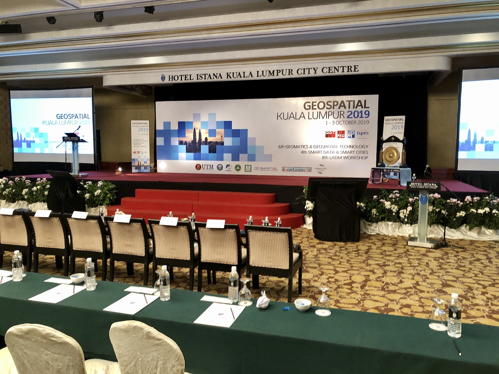
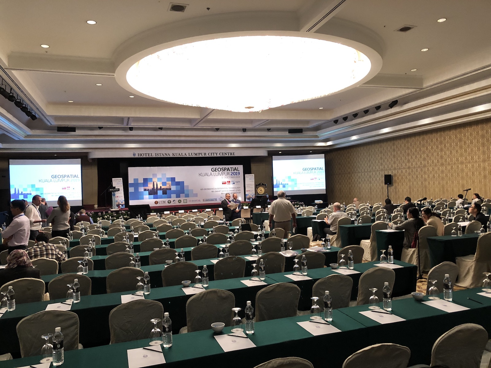
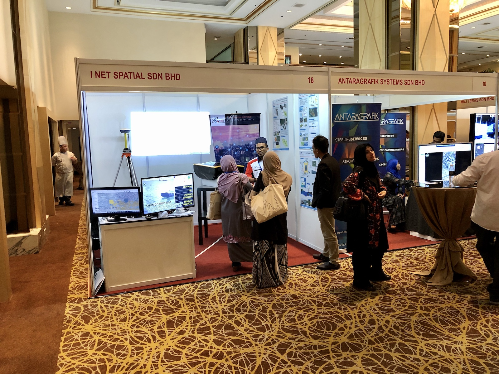
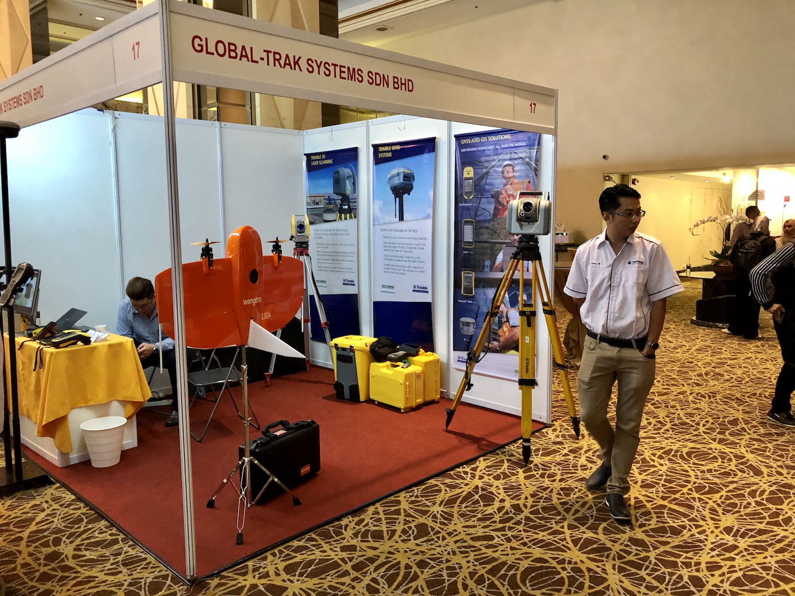

We attended the [Geospatial KL 2019 International Conference](https://www.geoinfo.utm.my/geospatial2019/), which features the following three major conferences in one place:

- [6th International Conference Geomatics & Geospatial Technology](https://www.geoinfo.utm.my/ggt2019/)
- [4th International Conference on Smart Data and Smart Cities](https://www.geoinfo.utm.my/sdsc2019/)
- [8th FIG Workshop on the Land Administration Domain Model (LADM)](http://isoladm.org/LADM2019Workshop).

This big event was held at the Hotel Istana in Kuala Lumpur, Malaysia during the first three days of October 2019.

The conference was very well attended having an impressive number of 300+ participants from 37 countries, and several exhibitors.

We also presented a [paper](/publication/2019-sdsc-airbnb-beijing/) at the Smart Data and Smart Cities conference, based on the master thesis of [Li Jialin](/authors/jialin/) who graduated from the [Master in Urban Planning programme at NUS](http://www.nus.edu.sg/nusbulletin/school-of-design-and-environment/graduate-education/coursework-programmes/degree-requirements/master-of-urban-planning/) earlier this year.
The conference papers have been published in [ISPRS Archives](https://www.int-arch-photogramm-remote-sens-spatial-inf-sci.net/XLII-4-W17/) and [ISPRS Annals](https://www.isprs-ann-photogramm-remote-sens-spatial-inf-sci.net/IV-4-W9/).

We thank the organisers, especially the conference chair Professor Sr Dr Alias bin Abdul Rahman ([3D GIS Research Lab, Faculty of Built Environment and Surveying, Universiti Teknologi Malaysia](http://builtsurvey.utm.my)), for the excellent organisation.
We also express our gratitude to the exhibitors, and fellow researchers for contributing to the conference with a variety of interesting papers and ideas.

Together with the [3D GeoInfo 2019 conference hosted last week in Singapore](), it was fantastic to have two large and prominent geospatial events in Southeast Asia in such a short period of time.

