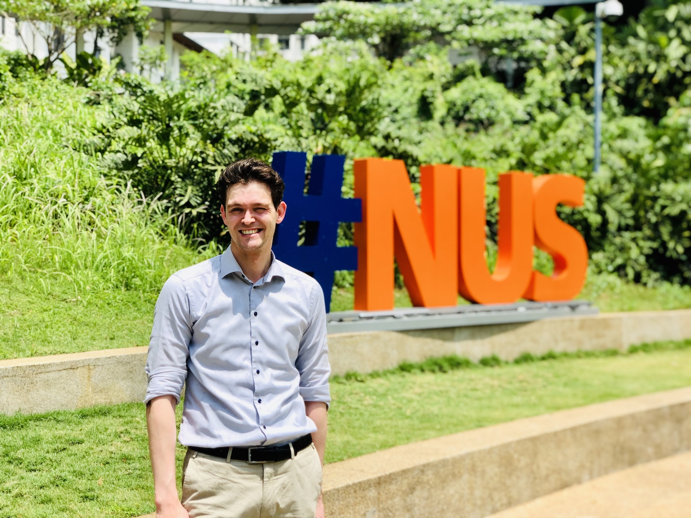

It is a pleasure to have a new visiting scholar at our lab.
Dr {} completed his PhD in Applied Mathematics, and is currently assistant professor at the Radboud University Nijmegen in the Netherlands.
Jonas' principal research focus is on the development of efficient deep learning algorithms in imaging.

At the NUS Urban Analytics Lab he will work on applications of machine learning in architecture and real estate.

Welcome Jonas, and enjoy your stay at NUS and in Singapore.
