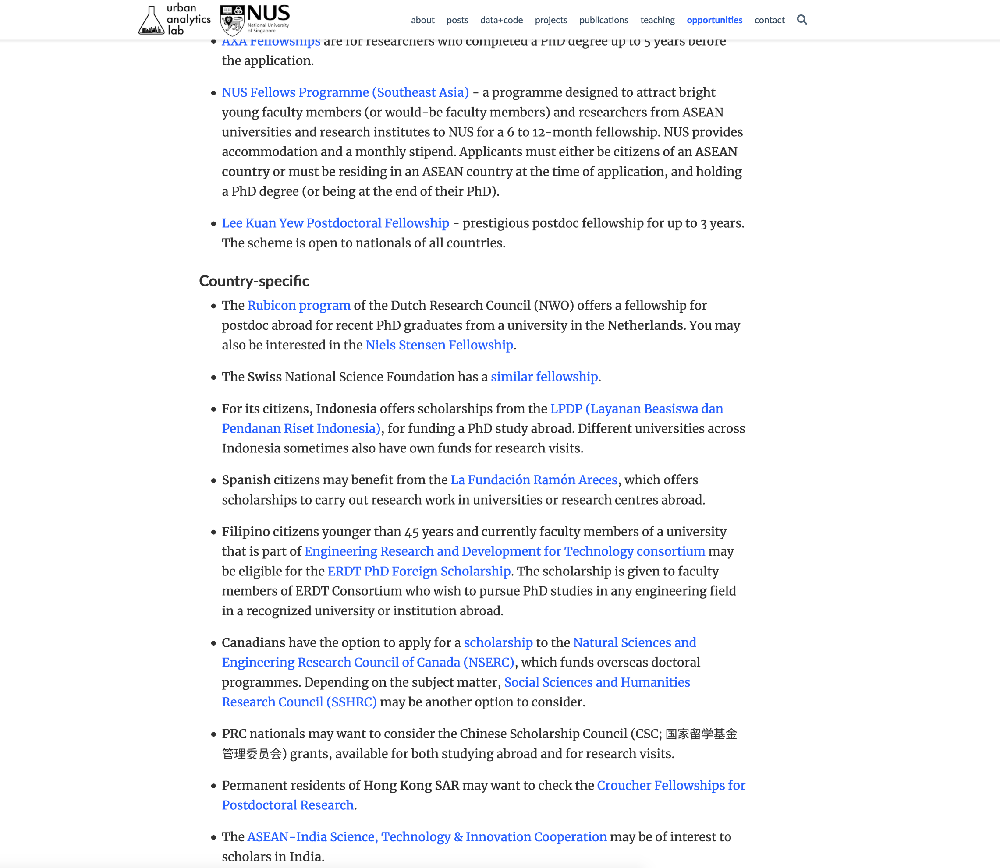

We prepared [a list](/openings/) of external funding opportunities to carry out a PhD, postdoc, or visiting research with us.
Are you interested in applying for one of these to conduct research in GIS, 3D & urban analytics?
[Contact us](/#contact).
Visit our [opportunities page](/openings/) for the full list.

