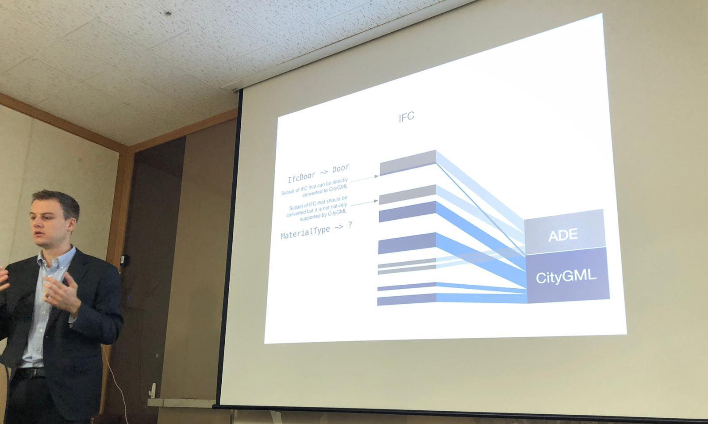

Dr {} has visited Korea to strengthen the collaborations and network of the {} in East Asia.
This is a follow up visit 6 months after [the roadshow in the region]().
The visit to Seoul included presentations and meetings at the University of Seoul and the company Allforland.

Korean organisations have been leading the development in indoor spatial data modelling.
For example, a large portion of the OGC standard [IndoorGML](http://www.indoorgml.net) was developed thanks to extensive research and development done at Korean universities.
We are pleased to be able to get a sneak peek in these developments.

Previous and current work of our Lab has been presented.
We look forward to collaborate and learn more from our Korean partners, and to contribute with our expertise in developing specifications and data models.

감사합니다.
