We are moving our geospatial analysis to the cloud. As we are evaluating the various offerings by 
[AWS](https://aws.amazon.com/) and [Google Cloud Platform](https://cloud.google.com/), we wonder to what extent 
these cloud database products support spatial functions in comparison to [PostGIS](https://postgis.net).  

Being the most widely used extended PostgreSQL object-relational database system, PostGIS allows spatial objects to be stored in the database and offers a wide range of functions for their analysis and processing.

[AWS Athena](https://aws.amazon.com/athena/), [PrestoDB](https://prestodb.io/),
[Google BigQuery](https://console.cloud.google.com/bigquery), and [AWS Redshift](https://aws.amazon.com/redshift/) 
are included in our considerations. Direct links to the respective documentation of currently supported 
spatial functions are listed in the [References](#references) section at the end of this post.

Here is a summary of the comparison. 

### Geometry/Geography/Box Data Types
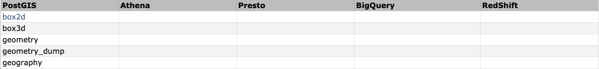

### Table Management Functions 
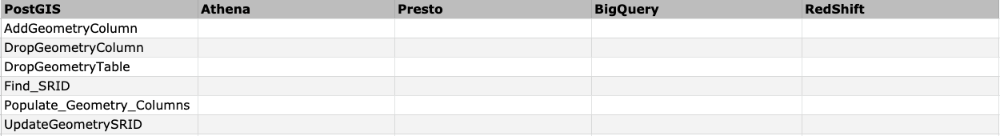

### Geometry Constructors
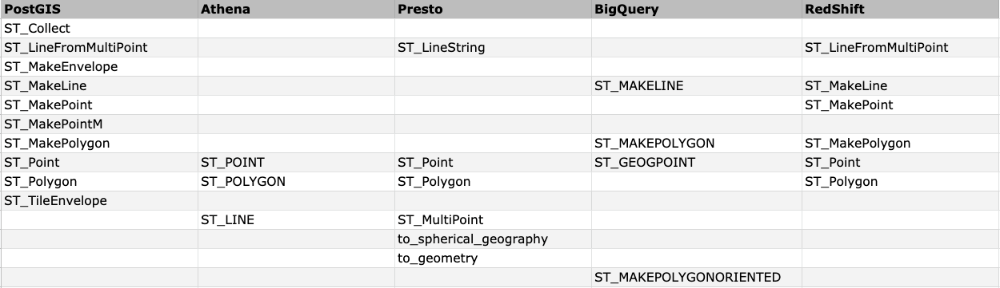

### Geometry Accessors
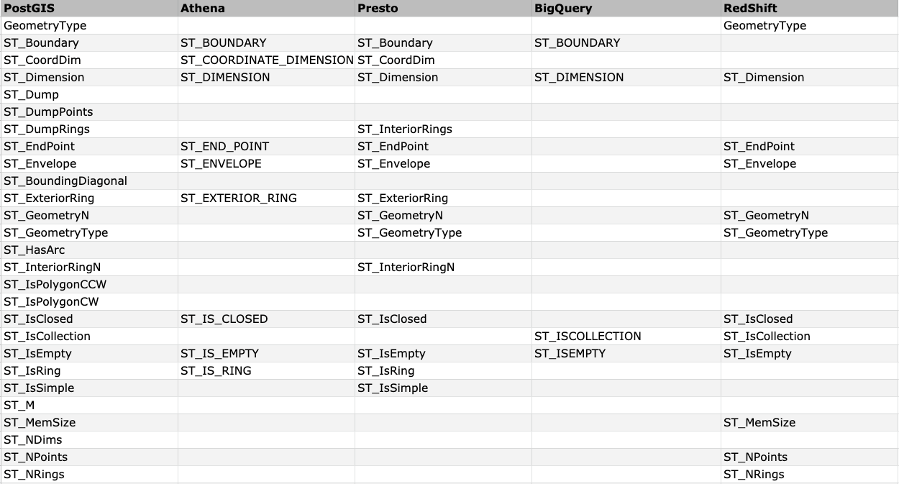
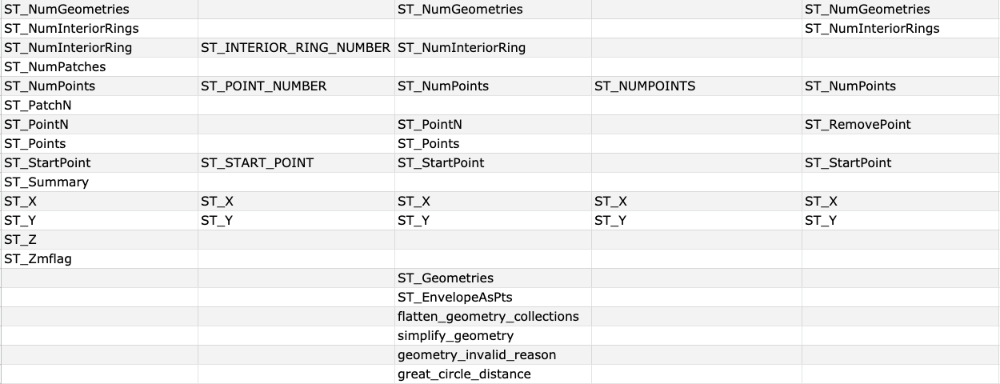

### Geometry Editors
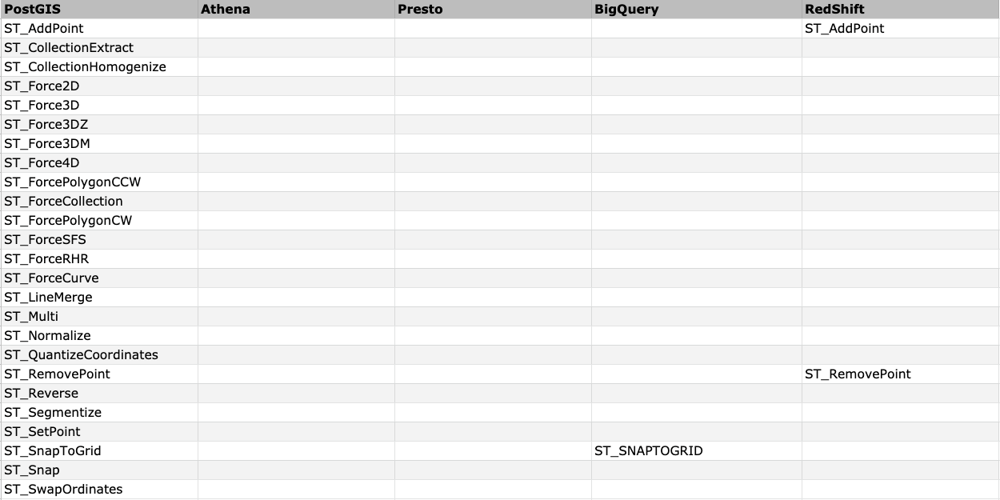

### Geometry Validation
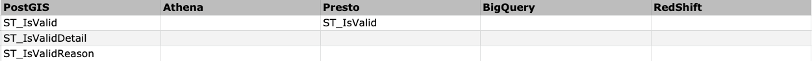

### Spatial Reference System Functions
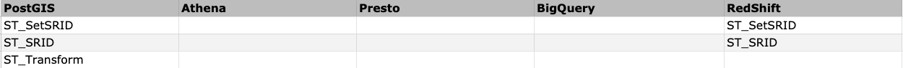

### Geometry Input
####  _Well-Known Text (WKT)_
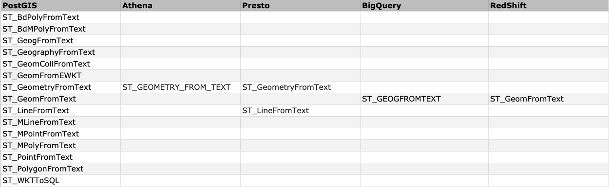
####  _Well-Known Binary (WKB)_
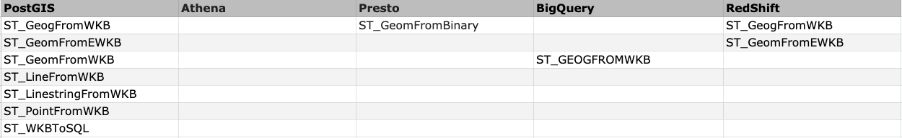
#### _Other Formats_
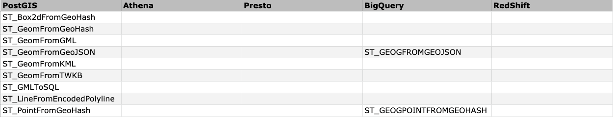

### Geometry Output
####  _Well-Known Text (WKT)_
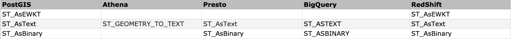
####  _Well-Known Binary (WKB)_
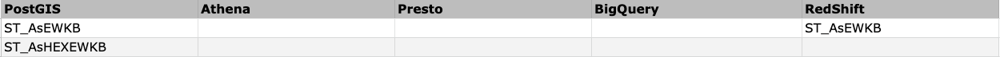
#### _Other Formats_
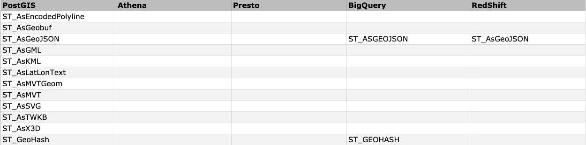

### Operators
#### _Bounding Box Operators_
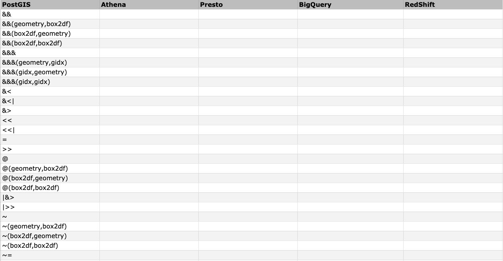
#### _Distance Operators_
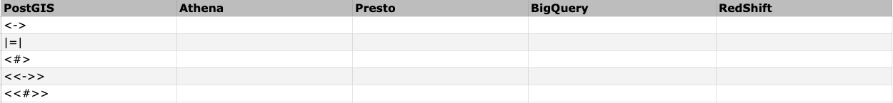

### Spatial Relationships
#### _Topological Relationships_
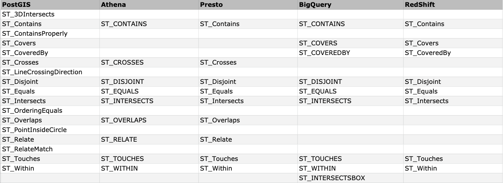
#### _Distance Relationship_

### Measurement Functions
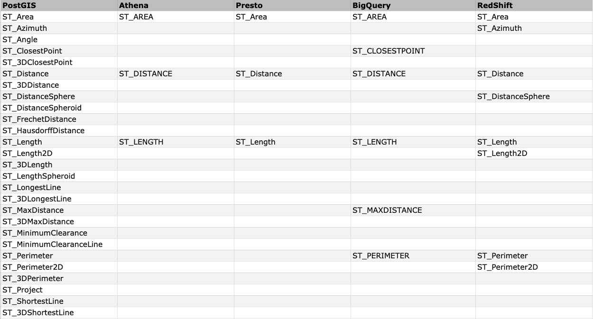

### Geometry Processing
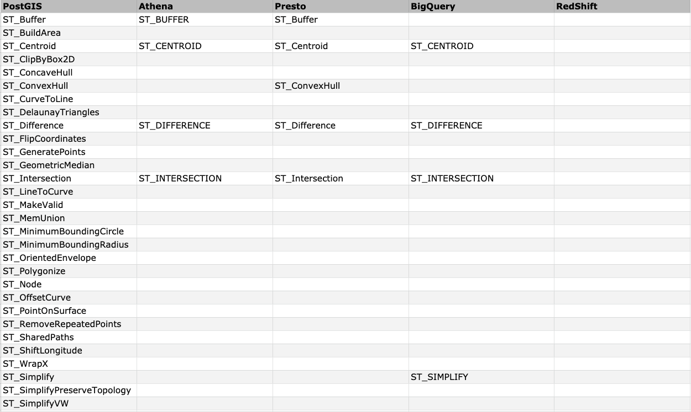
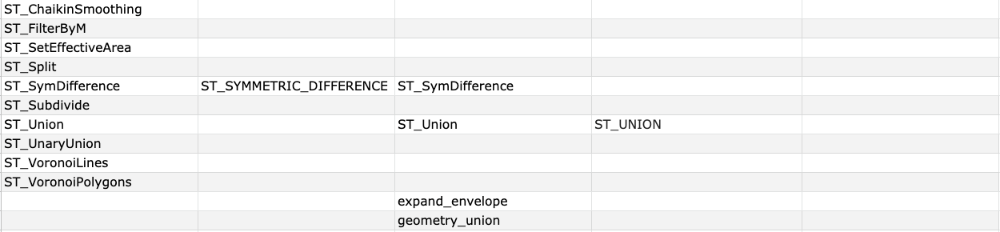

### Affine Transformations
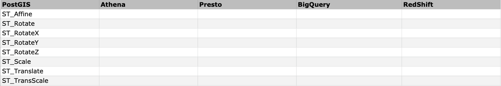

### Clustering Functions
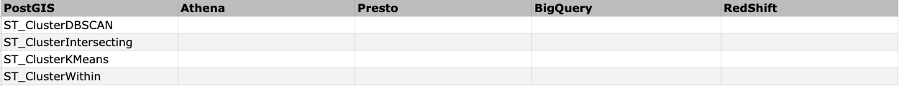

### Bounding Box Functions  
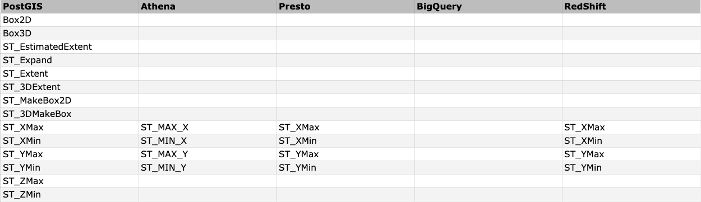

### Linear Referencing
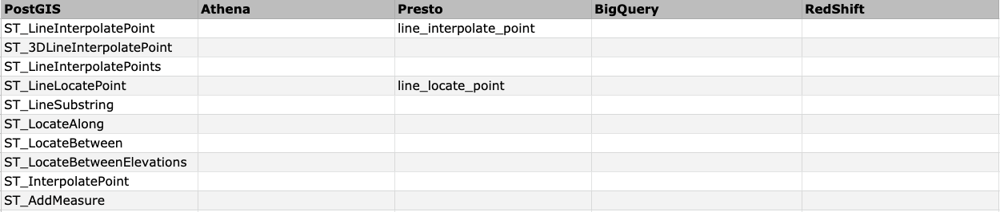

### Trajectory Functions
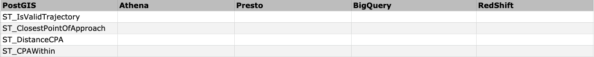

### SFCGAL Functions
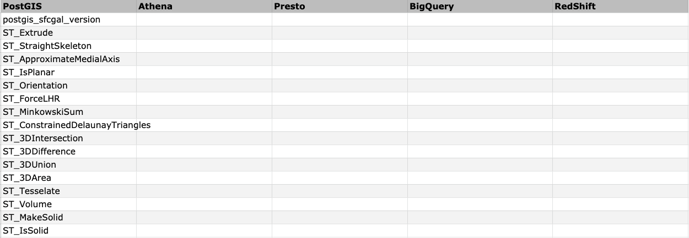

### Long Transaction Support
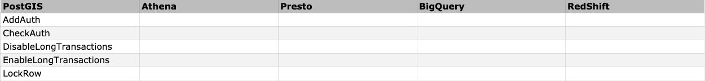

### Aggregation 
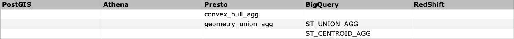

### MS Big Tiles
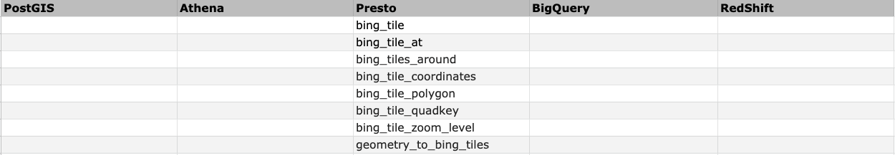

Although AWS and Google Cloud Platform have started to support spatial functions in their product offerings, there 
are still quite some spatial functions missing as the time this post is written. Hopefully more of these currently
missing functions will be available soon. 
 
 
______________________
 
<a name="references">References</a>:
- [PostGIS Reference](https://postgis.net/docs/reference.html)
- [AWS Athena Spatial Functions](https://docs.aws.amazon.com/athena/latest/ug/geospatial-functions-list.html)
- [Presto DB Geospatial Functions](https://prestodb.io/docs/current/functions/geospatial.html)
- [Google BigQuery Geography Functions](https://cloud.google.com/bigquery/docs/reference/standard-sql/geography_functions)
- [AWS Redshift Spatial Functions](https://docs.aws.amazon.com/redshift/latest/dg/geospatial-functions.html)
 
 
