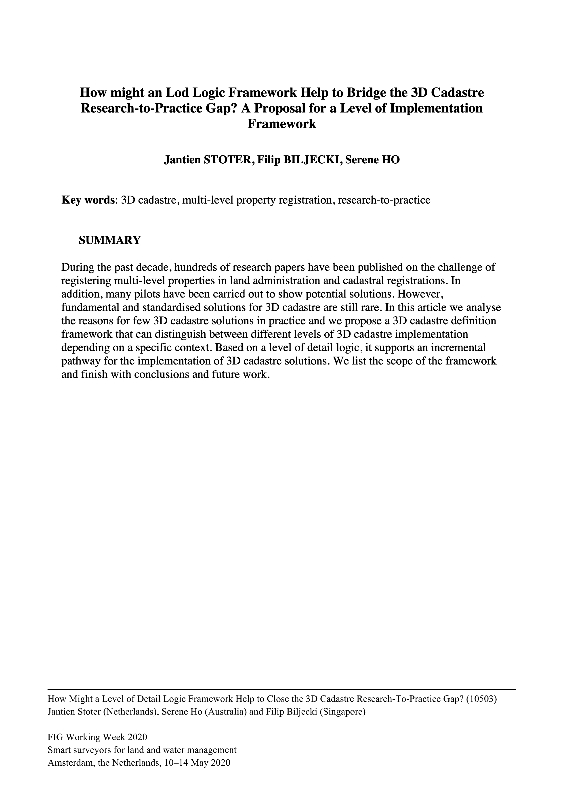

A new collaborative paper in which we have been involved has been published:

> Stoter J, Biljecki F, Ho S (2020): How might an LoD Logic Framework Help to Bridge the 3D Cadastre Research-to-Practice Gap? A Proposal for a Level of Implementation Framework. _FIG Working Week 2020._ [<i class="far fa-file-pdf"></i> PDF](/publication/2020-fig-lod/2020-fig-lod.pdf) <i class="ai ai-open-access-square ai"></i>

The paper is part of the [FIG Working Week 2020](https://www.fig.net/fig2020/).

The lead author is [Prof. dr. Jantien Stoter](https://3d.bk.tudelft.nl/jstoter/) from the [3D Geoinformation group](https://3d.bk.tudelft.nl) at the Delft University of Technology, and the work has been done also in collaboration with [Dr Serene Ho](https://www.rmit.edu.au/contact/staff-contacts/academic-staff/h/ho-dr-serene) (RMIT University).

The abstract follows.
> During the past decade, hundreds of research papers have been published on the challenge of registering multi-level properties in land administration and cadastral registrations. In addition, many pilots have been carried out to show potential solutions. However, fundamental and standardised solutions for 3D cadastre are still rare. In this article we analyse the reasons for few 3D cadastre solutions in practice and we propose a 3D cadastre definition framework that can distinguish between different levels of 3D cadastre implementation depending on a specific context. Based on a level of detail logic, it supports an incremental pathway for the implementation of 3D cadastre solutions. We list the scope of the framework and finish with conclusions and future work.

For more information please see the [paper](/publication/2020-fig-lod/) (open access <i class="ai ai-open-access-square ai"></i>).

[](/publication/2020-fig-lod/)

BibTeX citation:
```bibtex
@inproceedings{2020_fig_lod,
  address = {Amsterdam, the Netherlands},
  author = {Stoter, Jantien and Biljecki, Filip and Ho, Serene},
  booktitle = {FIG Working Week 2020},
  pages = {1--13},
  title = {{How might an LoD Logic Framework Help to Bridge the 3D Cadastre Research-to-Practice Gap? A Proposal for a Level of Implementation Framework}},
  year = {2020}
}
```


