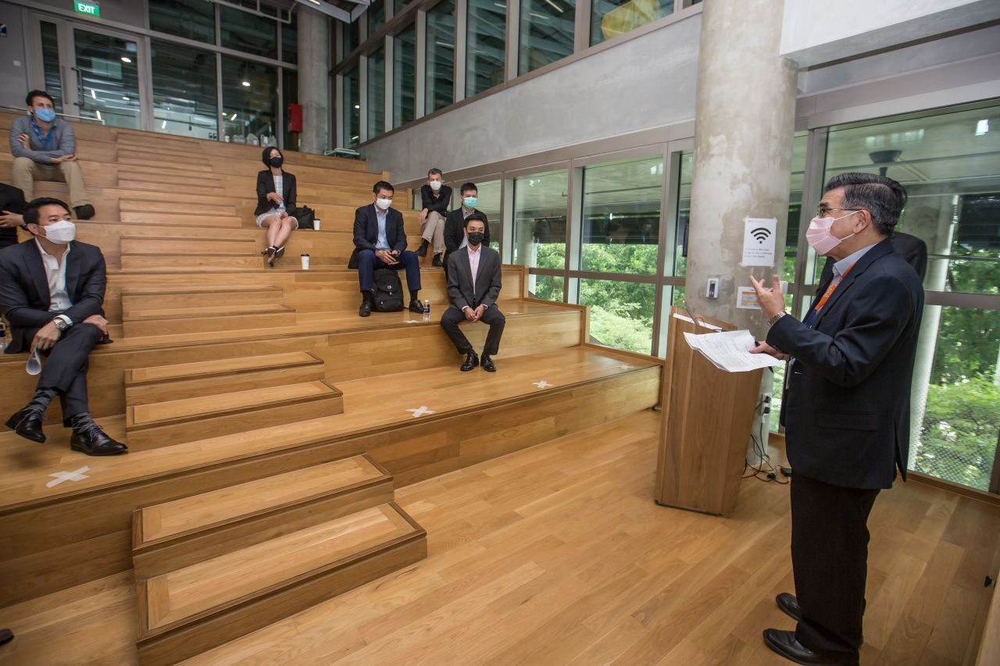

We are happy that our [NUS School of Design and Environment](https://www.sde.nus.edu.sg) signed a memorandum of understanding with [Esri Singapore](https://esrisingapore.com.sg) to strengthen collaboration.

The press release by the [School](https://www.sde.nus.edu.sg/news/sde-signed-mou-with-esri-singapore-to-expand-research-in-geospatial-analytics/) follows:

> The National University of Singapore School of Design and Environment (SDE) signed an MOU with Esri Singapore to strengthen SDE’s research in geospatial analytics.
> 
> Since its establishment in 1969, SDE remains the only faculty in a Singapore university that provides a comprehensive multi-disciplinary offering of teaching and research in architecture and landscape architecture, urban planning and design, project and facilities management, building performance and sustainability, real estate finance and economics, and industrial design.
> 
> Working together with Esri, the pioneer and global leader in Geographic Information System (GIS) technology, SDE aims to expand its research in geospatial analytics.
> 
> Professor Lam Khee Poh, Dean of NUS SDE and Mr Thomas Pramotedham, Chief Executive Officer, Esri Singapore, signed the Memorandum of Understanding (MOU) on 1 September 2020.
> 
> The MOU collaboration includes joint research and development projects in the area of geospatial data collection and integration, geospatial analytics in the built environment, 3D city modelling, digital twins, and dynamic and real-time spatial data at the building, district and urban scale; and application of geospatial technologies in urbanization, health, liveability, autonomous vehicles, urban planning, real estate, including collaborating on joint grant proposals to Singapore government agencies.
> 
> “We are excited to work with Esri Singapore to expand SDE’s research in geospatial analytics. Keeping abreast with an ever-changing built environment, the collaboration will further strengthen SDE’s position as a leading global institution in shaping a resilient future. SDE will continue our collaborative outreach to contribute to a well and green and resilient future,” said Professor Lam.
> 
> “Esri Singapore is currently working with a number of government and educational institutions as part of a larger effort to build a nation of spatial thinkers. As a long-time partner of NUS, we are proud to be part of this collaboration to drive geospatial enabled innovation in SDE’s multi-disciplinary initiatives. The adoption of a geospatial context enables SDE’s students with a holistic approach towards design and planning through a better understanding and insights on how environment influence design,” said Mr Pramotedham.
> 
> Through this partnership, we look forward to nurturing a new generation of professionals who embraces spatial thinking to design and build resilient communities,” said Mr Pramotedham.

