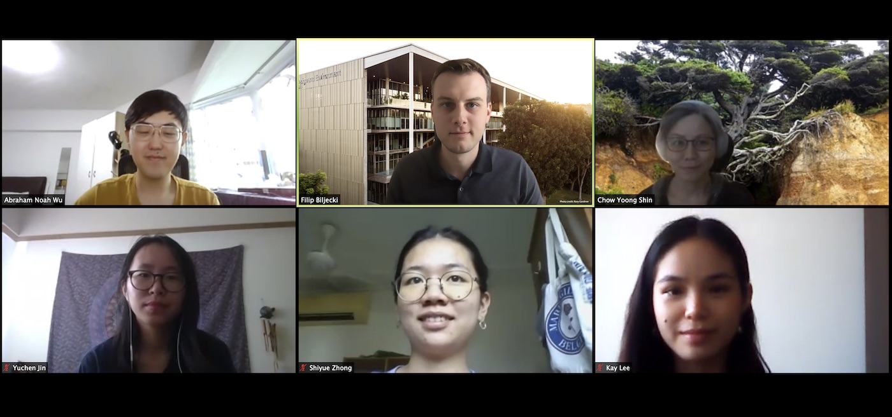

After we've enjoyed taking part in the
[State of the Map](), 
[IACAD](), and
[3D GeoInfo](),
the ongoing work of the Lab was presented at other venues.

Earlier in September, the activities of the NUS Urban Analytics Lab were presented at the [Singapore Geospatial week](https://www.geoworks.sg/programmes-n-initiatives/singapore-geospatial-week) (organised by SLA) and more recently at the Singapore Management University. 

Furthermore, the Lab was in the spotlight at the inaugural lecture at the Gadjah Mada University, given to the Indonesian Geomatics academic community.

Thanks to all the parties for inviting us to share our work.

Oh, and we also had our Lab seminar! :blush:
{} presented his very cool ongoing work on deriving new geospatial datasets to promote carbon neutrality and utilisation of underused spaces. :v:

Stay tuned for more!

