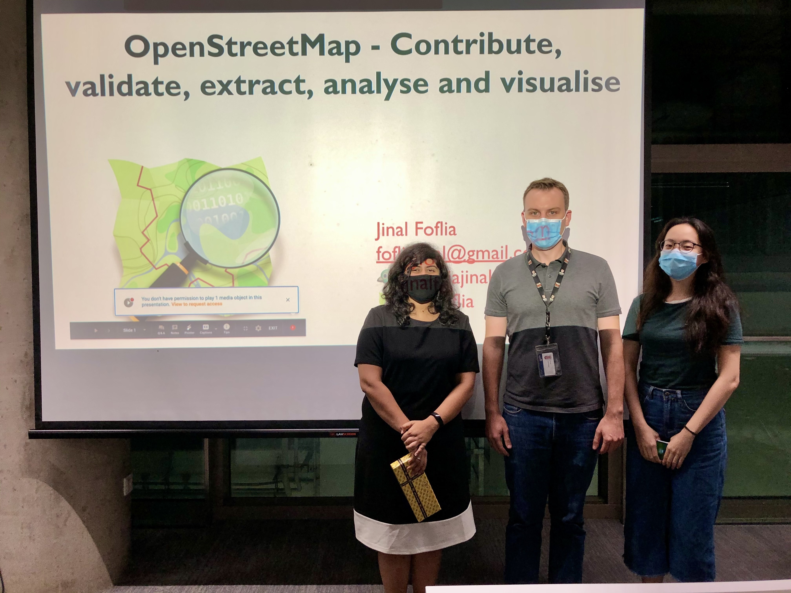

We are very pleased that [Ms Jinal Foflia](https://twitter.com/fofliajinal), Senior Program Manager -- Geo at Grab has visited us to give a guest lecture as part of our module [_Geographic Information Systems (GIS) and Cartography_](/teaching).

Jinal has given a very exciting and engaging talk on her experience with OpenStreetMap and shared her vision on future developments, both from the personal and corporate perspective.

Many thanks, Jinal.
You are welcome back at NUS at any time.

