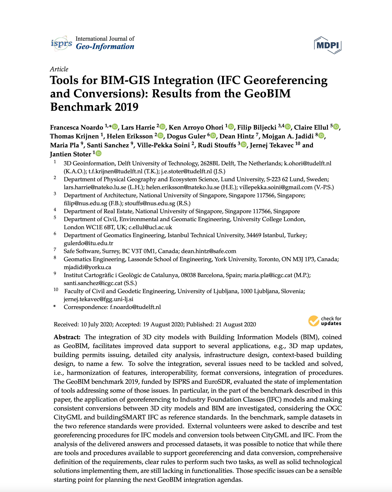

We published a new paper:

> Biljecki F, Lim J, Crawford J, Moraru D, Tauscher H, Konde A, Adouane K, Lawrence S, Janssen P, Stouffs R (2021): Extending CityGML for IFC-sourced 3D city models. _Automation in Construction._ 121: 103440. [<i class="ai ai-doi-square ai"></i> 10.1016/j.autcon.2020.103440](https://doi.org/10.1016/j.autcon.2020.103440) [<i class="far fa-file-pdf"></i> PDF](/publication/2021-autcon-ifc-citygml-ade/2021-autcon-ifc-citygml-ade.pdf) <i class="ai ai-open-access-square ai"></i>

This publication is one of the final papers stemming from the [IFC2CityGML](https://ifc2citygml.github.io) project (PI: Rudi Stouffs) carried out at NUS and conducted in collaboration with [Ordnance Survey](https://www.ordnancesurvey.co.uk).
The lead author is .

The abstract follows:

> Differences in the scope and intent of the contrasting IFC and CityGML data formats entail that converting the former to the latter results in loss of information.
However, for some use cases it is beneficial to keep also particular information from IFC that is not native to CityGML, and achieving that requires mechanisms such as the CityGML Application Domain Extension (ADE).
We develop an ADE to support retaining relevant information from IFC.
Besides being driven by the particular source of the input data (IFC), this multi-purpose ADE is shaped after a discovery process that involved examining potentially applicable use cases in Singapore, doubling as an extension that is adapted to a set of use cases and the local geographic context.
We implement the conceptual work by generating an enriched dataset (with an automatic conversion from IFC to CityGML), visualising it, and discuss its added value in a use case.

As part of our commitment to open science, the publication is available in [green open access](/publication/2021-autcon-ifc-citygml-ade/).

Other relevant papers from the project are available on the [project's website](https://ifc2citygml.github.io), including [the publication on the developed web viewer](), which is mentioned in the implementation section of the paper.


[](/publication/2021-autcon-ifc-citygml-ade/)


BibTeX citation:
```bibtex
@article{2021_autcon_ifc_citygml_ade,
 author = {Biljecki, Filip and Lim, Joie and Crawford, James and Moraru, Diana and Tauscher, Helga and Konde, Amol and Adouane, Kamel and Lawrence, Simon and Janssen, Patrick and Stouffs, Rudi},
 doi = {10.1016/j.autcon.2020.103440},
 journal = {Automation in Construction},
 pages = {103440},
 title = {{Extending CityGML for IFC-sourced 3D city models}},
 volume = {121},
 year = {2021}
}
```
