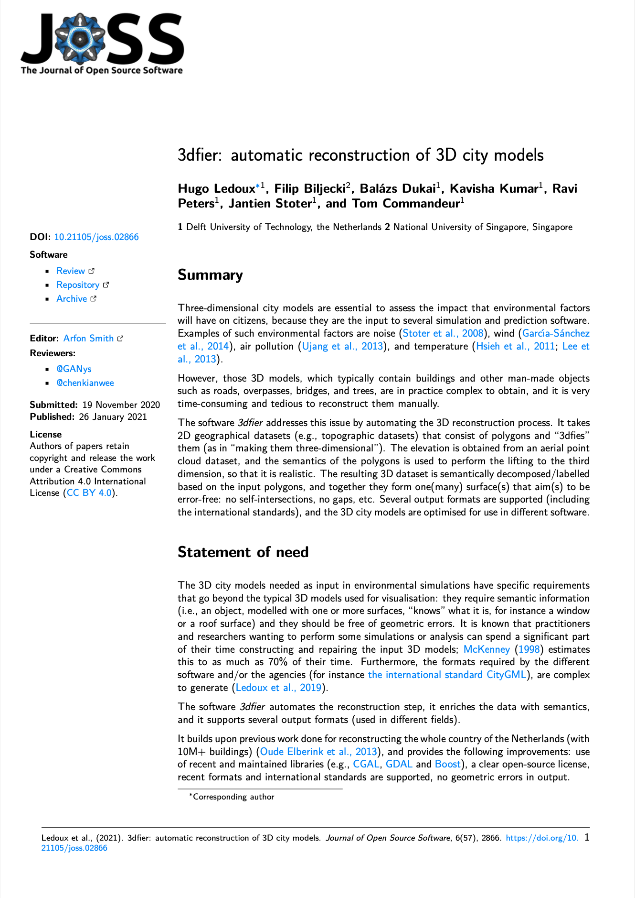

A new collaborative paper in which we have been involved has been published:

> Ledoux H, Biljecki F, Dukai B, Kumar K, Peters R, Stoter J, Commandeur T (2021): 3dfier: automatic reconstruction of 3D city models. _Journal of Open Source Software_ 6(57): 2866. [<i class="ai ai-doi-square ai"></i> 10.21105/joss.02866](https://doi.org/10.21105/joss.02866) [<i class="far fa-file-pdf"></i> PDF](/publication/2021-joss-3-dfier/2021-joss-3-dfier.pdf) <i class="ai ai-open-access-square ai"></i>

The paper describes [3dfier](https://github.com/tudelft3d/3dfier), an open-source software developed by [our friends at TU Delft](https://3d.bk.tudelft.nl) to automatically generate 3D city models using a 2D GIS dataset and point cloud (extrusion).
Its advantages are speed, output in multiple formats (e.g. [CityJSON](https://www.cityjson.org)), and topological consistency.
Its code has been released as open-source, and it is available on its [Github repo](https://github.com/tudelft3d/3dfier).
A video about the software with an example of the output is available [here](https://vimeo.com/181421237).

The paper was published in the [Journal of Open Source Software](https://joss.theoj.org), a developer friendly, open access journal for research software packages.
The journal adheres to all open science principles :clap:, e.g. their peer review process is entirely open; for an example, [you can check the review process of our paper as a Github issue](https://github.com/openjournals/joss-reviews/issues/2866), which we find to be a very clever and commendable approach.

The lead author is [Dr Hugo Ledoux](https://3d.bk.tudelft.nl/hledoux/) from the [3D Geoinformation group](https://3d.bk.tudelft.nl) at the Delft University of Technology.


The abstract follows.
> Three-dimensional city models are essential to assess the impact that environmental factors will have on citizens, because they are the input to several simulation and prediction software. Examples of such environmental factors are noise (Stoter et al., 2008), wind (Garcı́a-Sánchez et al., 2014), air pollution (Ujang et al., 2013), and temperature (Hsieh et al., 2011; Lee et al., 2013).
However, those 3D models, which typically contain buildings and other man-made objects such as roads, overpasses, bridges, and trees, are in practice complex to obtain, and it is very time-consuming and tedious to reconstruct them manually.
The software 3dfier addresses this issue by automating the 3D reconstruction process. It takes 2D geographical datasets (e.g., topographic datasets) that consist of polygons and “3dfies” them (as in “making them three-dimensional”). The elevation is obtained from an aerial point cloud dataset, and the semantics of the polygons is used to perform the lifting to the third dimension, so that it is realistic. The resulting 3D dataset is semantically decomposed/labelled based on the input polygons, and together they form one(many) surface(s) that aim(s) to be error-free: no self-intersections, no gaps, etc. Several output formats are supported (including the international standards), and the 3D city models are optimised for use in different software.

For more information, please see the [paper](/publication/2021-joss-3-dfier/) (open access <i class="ai ai-open-access-square ai"></i>).

[](/publication/2021-joss-3-dfier/)

BibTeX citation:
```bibtex
@article{2021_joss_3dfier,
  author = {Ledoux, Hugo and Biljecki, Filip and Dukai, Balázs and Kumar, Kavisha and Peters, Ravi and Stoter, Jantien and Commandeur, Tom},
  doi = {10.21105/joss.02866},
  journal = {Journal of Open Source Software},
  number = {57},
  pages = {2866},
  title = {{3dfier: automatic reconstruction of 3D city models}},
  volume = {6},
  year = {2021}
}
```


