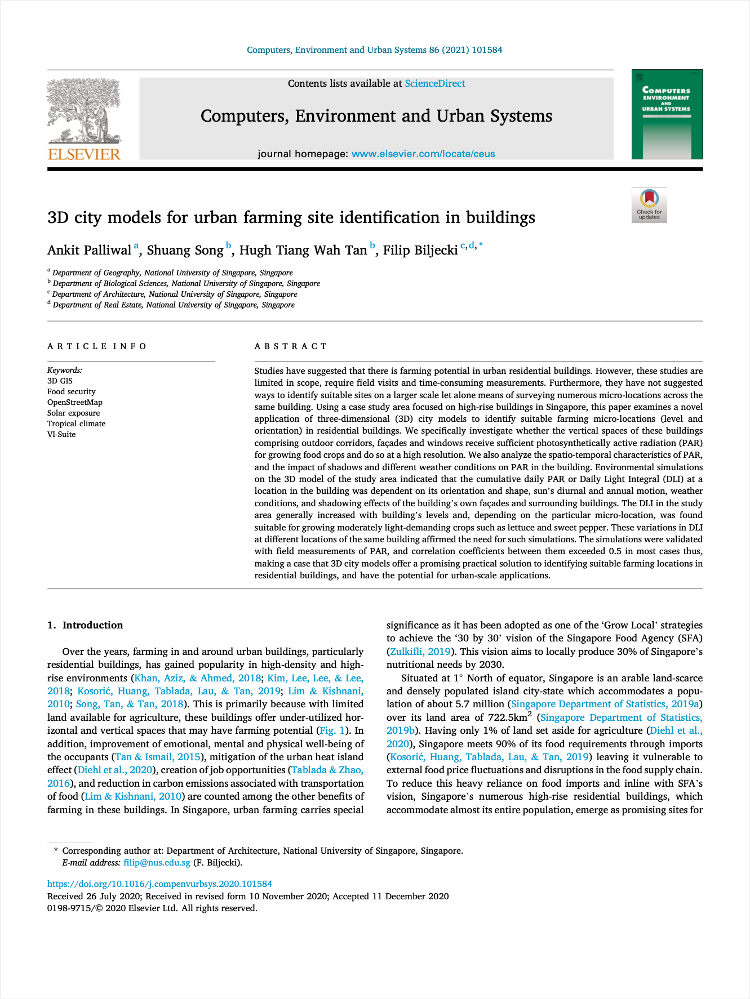

We have a new paper:

> Palliwal A, Song S, Tan HTW, Biljecki F (2021): 3D city models for urban farming site identification in buildings. _Computers, Environment and Urban Systems_ 86: 101584, 2021. [<i class="ai ai-doi-square ai"></i> 10.1016/j.compenvurbsys.2020.101584](https://doi.org/10.1016/j.compenvurbsys.2020.101584) [<i class="far fa-file-pdf"></i> PDF](/publication/2021-ceus-3-d-farming/2021-ceus-3-d-farming.pdf)

The first author is {}, who has graduated with an MSc in Applied GIS, and has completed his graduation project with us, on which this paper is based.

The paper presents a new use case for 3D models: using them to identify locations in buildings suitable for urban farming, based on the light conditions, and potentially recommending the optimal crop to be cultivated at a particular location and estimating the yield.

### Highlights

- Residential buildings are becoming an increasingly relevant venue for urban farming.
- The suitability of a particular site depends mostly on the level of sunlight availability therein.
- Conventional methods to assess farming potential involve field visits and time-consuming measurements.
- We demonstrate that 3D city models can replace field surveys by showcasing their new application.
- The approach using 3D city models has advantages such as enabling urban-scale estimations of the urban farming potential.

### Abstract

The abstract follows.

> Studies have suggested that there is farming potential in urban residential buildings. However, these studies are limited in scope, require field visits and time-consuming measurements. Furthermore, they have not suggested ways to identify suitable sites on a larger scale let alone means of surveying numerous micro-locations across the same building. Using a case study area focused on high-rise buildings in Singapore, this paper examines a novel application of three-dimensional (3D) city models to identify suitable farming micro-locations (level and orientation) in residential buildings. We specifically investigate whether the vertical spaces of these buildings comprising outdoor corridors, façades and windows receive sufficient photosynthetically active radiation (PAR) for growing food crops and do so at a high resolution. We also analyze the spatio-temporal characteristics of PAR, and the impact of shadows and different weather conditions on PAR in the building. Environmental simulations on the 3D model of the study area indicated that the cumulative daily PAR or Daily Light Integral (DLI) at a location in the building was dependent on its orientation and shape, sun's diurnal and annual motion, weather conditions, and shadowing effects of the building's own façades and surrounding buildings. The DLI in the study area generally increased with building's levels and, depending on the particular micro-location, was found suitable for growing moderately light-demanding crops such as lettuce and sweet pepper. These variations in DLI at different locations of the same building affirmed the need for such simulations. The simulations were validated with field measurements of PAR, and correlation coefficients between them exceeded 0.5 in most cases thus, making a case that 3D city models offer a promising practical solution to identifying suitable farming locations in residential buildings, and have the potential for urban-scale applications.

### Paper 

For more information, please see the [paper](/publication/2021-ceus-3-d-farming/).

[](/publication/2021-ceus-3-d-farming/)

BibTeX citation:
```bibtex
@article{2021_ceus_3d_farming,
 author = {Palliwal, Ankit and Song, Shuang and Tan, Hugh Tiang Wah and Biljecki, Filip},
 doi = {10.1016/j.compenvurbsys.2020.101584},
 journal = {Computers, Environment and Urban Systems},
 pages = {101584},
 title = {3D city models for urban farming site identification in buildings},
 volume = {86},
 year = {2021}
}
```


