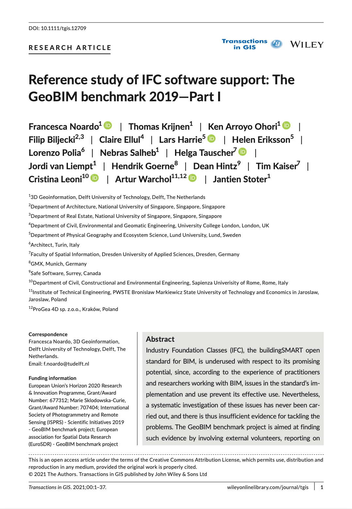
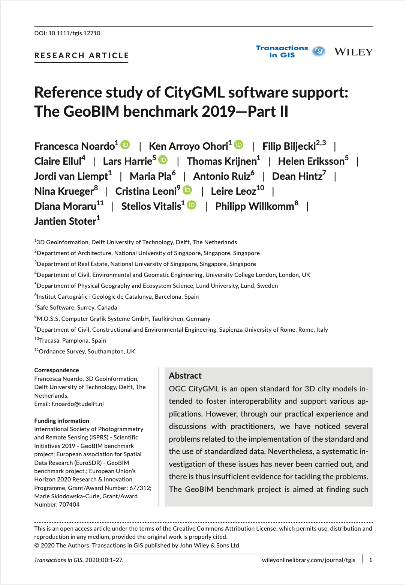



The [GeoBIM Benchmark 2019](/project/geobim-benchmark) is finalised with two papers published in tandem in Transactions in GIS.
These back-to-back papers describe our findings on the software support of IFC and CityGML.
There is also a [third paper](), announced previously, describing the part of the benchmark focusing on BIM-GIS Integration (IFC georeferencing and conversions).

The lead author of both papers is [Dr Francesca Noardo](http://www.noardo.eu) from the [3D Geoinformation group](https://3d.bk.tudelft.nl) at the Delft University of Technology.
We thank her, and the other members of the team, for involving us in their project and leading a series of papers well-documenting the insights gained during this topical and very interesting initiative.

The project was endorsed and co-funded by the [International Society for Photogrammetry and Remote Sensing (ISPRS)](https://www.isprs.org) and the [European Spatial Data Research (EuroSDR)](http://www.eurosdr.net).

Both papers are described below, and both are (as well as the third paper), published as gold open access <i class="ai ai-open-access-square ai"></i>.
Further, the final report of the project is available [here](/publication/2020-geobim-final-report).


## Part I: Reference study of IFC software support

> Noardo F, Krijnen T, Arroyo Ohori K, Biljecki F, Ellul C, Harrie L, Eriksson H, Polia L, Salheb N, Tauscher H, van Liempt J, Goerne H, Hintz D, Kaiser T, Leoni C, Warchol A, Stoter J (2021): Reference study of IFC software support: The GeoBIM benchmark 2019---Part I. _Transactions in GIS_ 25(2): 805-841, 2021. [<i class="ai ai-doi-square ai"></i> 10.1111/tgis.12709](https://doi.org/10.1111/tgis.12709) [<i class="far fa-file-pdf"></i> PDF](/publication/2021-tgis-geobim-ifc/2021-tgis-geobim-ifc.pdf) <i class="ai ai-open-access-square ai"></i>

Abstract:

> Industry Foundation Classes (IFC), the buildingSMART open standard for BIM, is underused with respect to its promising potential, since, according to the experience of practitioners and researchers working with BIM, issues in the standard’s implementation and use prevent its effective use. Nevertheless, a systematic investigation of these issues has never been carried out, and there is thus insufficient evidence for tackling the problems. The GeoBIM benchmark project is aimed at finding such evidence by involving external volunteers, reporting on various aspects of the behavior of tools (geometry, semantics, georeferencing, functionalities), analyzed and described in this article. Interestingly, different IFC software programs with the same standardized data sets yield inconsistent results, with few detectable common patterns, and significant issues are found in their support of the standard, probably due to the very high complexity of the standard data model. A companion article (Part II) describes the results of the benchmark related to CityGML, the counterpart of IFC within geoinformation.

For more information please see the [paper](/publication/2021-tgis-geobim-ifc/) (open access <i class="ai ai-open-access-square ai"></i>).

[](/publication/2021-tgis-geobim-ifc/)

BibTeX citation:
```bibtex
@article{2021_tgis_geobim_ifc,
 author = {Noardo, Francesca and Krijnen, Thomas and Arroyo Ohori, Ken and Biljecki, Filip and Ellul, Claire and Harrie, Lars and Eriksson, Helen and Polia, Lorenzo and Salheb, Nebras and Tauscher, Helga and van Liempt, Jordi and Goerne, Hendrik and Hintz, Dean and Kaiser, Tim and Leoni, Cristina and Warchol, Artur and Stoter, Jantien},
 doi = {10.1111/tgis.12709},
 journal = {Transactions in GIS},
 volume = {25},
 issue = {2},
 pages = {805-841},
 title = {Reference study of IFC software support: The GeoBIM benchmark 2019---Part I},
 year = {2021}
}
```


## Part II: Reference study of CityGML software support

> Noardo F, Arroyo Ohori K, Biljecki F, Ellul C, Harrie L, Krijnen T, Eriksson H, van Liempt J, Pla M, Ruiz A, Hintz D, Krueger N, Leoni C, Leoz L, Moraru D, Vitalis S, Willkomm P, Stoter J (2021): Reference study of CityGML software support: The GeoBIM benchmark 2019---Part II. _Transactions in GIS_ 25(2): 842-868, 2021. [<i class="ai ai-doi-square ai"></i> 10.1111/tgis.12710](https://doi.org/10.1111/tgis.12710) [<i class="far fa-file-pdf"></i> PDF](/publication/2021-tgis-geobim-citygml/2021-tgis-geobim-citygml.pdf) <i class="ai ai-open-access-square ai"></i>

Abstract:

> OGC CityGML is an open standard for 3D city models intended to foster interoperability and support various applications. However, through our practical experience and discussions with practitioners, we have noticed several problems related to the implementation of the standard and the use of standardized data. Nevertheless, a systematic investigation of these issues has never been carried out, and there is thus insufficient evidence for tackling the problems. The GeoBIM benchmark project is aimed at finding such evidence by involving external volunteers, reporting on various aspects of the behavior of tools (geometry, semantics, georeferencing, functionalities), analyzed and described in this article. This study explicitly pointed out the critical points embedded in the format as an evidence base for future development. A companion article (Part I) describes the results of the benchmark related to IFC, the counterpart of CityGML within building information modeling.

For more information please see the [paper](/publication/2021-tgis-geobim-citygml/) (open access <i class="ai ai-open-access-square ai"></i>).

[](/publication/2021-tgis-geobim-citygml/)

BibTeX citation:
```bibtex
@article{2021_tgis_geobim_citygml,
 author = {Noardo, Francesca and Arroyo Ohori, Ken and Biljecki, Filip and Ellul, Claire and Harrie, Lars and Krijnen, Thomas and Eriksson, Helen and van Liempt, Jordi and Pla, Maria and Ruiz, Antonio and Hintz, Dean and Krueger, Nina and Leoni, Cristina and Leoz, Leire and Moraru, Diana and Vitalis, Stelios and Willkomm, Philipp and Stoter, Jantien},
 doi = {10.1111/tgis.12710},
 journal = {Transactions in GIS},
 volume = {25},
 issue = {2},
 pages = {842-868},
 title = {Reference study of CityGML software support: The GeoBIM benchmark 2019---Part II},
 year = {2021}
}
```


