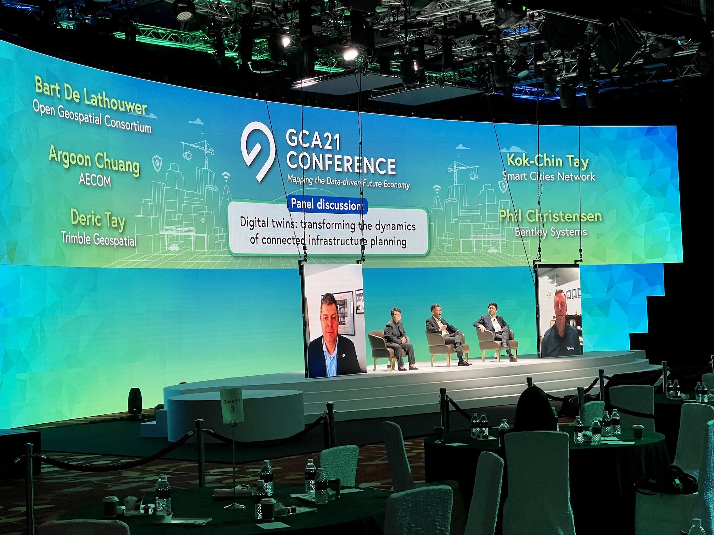
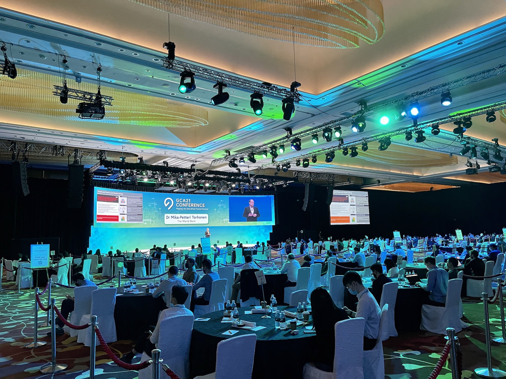

The Director of the NUS Urban Analytics Lab, Dr {} gave an invited talk at the debut of [Geo Connect Asia](https://www.geoconnectasia.com).
The conference, conducted in hybrid mode at the Marina Bay Sands in Singapore, provided a strategic and collaborative platform for industry professionals, government agencies and start-ups to come together to build and develop knowledge and solutions for Asia’s geospatial & location intelligence markets.

This was a high profile event, bringing together industry and government leaders in the geospatial domain from around the world.
The conference started with a talk by [Dr Vivian Balakrishnan](https://en.wikipedia.org/wiki/Vivian_Balakrishnan), Singapore's Minister for Foreign Affairs and Minister-in-Charge of the Smart Nation Initiative.

UAL's Dr Biljecki was the only speaker from academia, affirming our relevance and the hard work of [everyone at the Lab](/people).
The talk was on assessing and benchmarking open geospatial data, giving the audience a sneak peak in our ongoing work.

GCA 2021 was Singapore's first large-scale industrial event in a long time, attracting 1000+ attendees in person, and many online across 55 countries, transcending well beyond Singapore and Southeast Asia.
It was also well publicised in the media [^1] [^2].

It was an immense privilege and honour to have our developments featured at the inaugural event of Geo Connect Asia and in front of such an esteemed audience.

Thanks to the sponsors and organisers for the invitation.
Congratulations on a great job amid the circumstances, especially on facilitating the smooth hybrid mode including attendees from so many countries, and seamlessly implementing enhancements such as contact tracing tokens, testing, and facial recognition.

[^1]: https://www.straitstimes.com/singapore/transport/movement-tracking-wristbands-to-be-trialled-at-hybrid-mice-event

[^2]: https://www.channelnewsasia.com/news/singapore/covid-19-distancing-dongles-meetings-wef-geo-connect-asia-14480724
