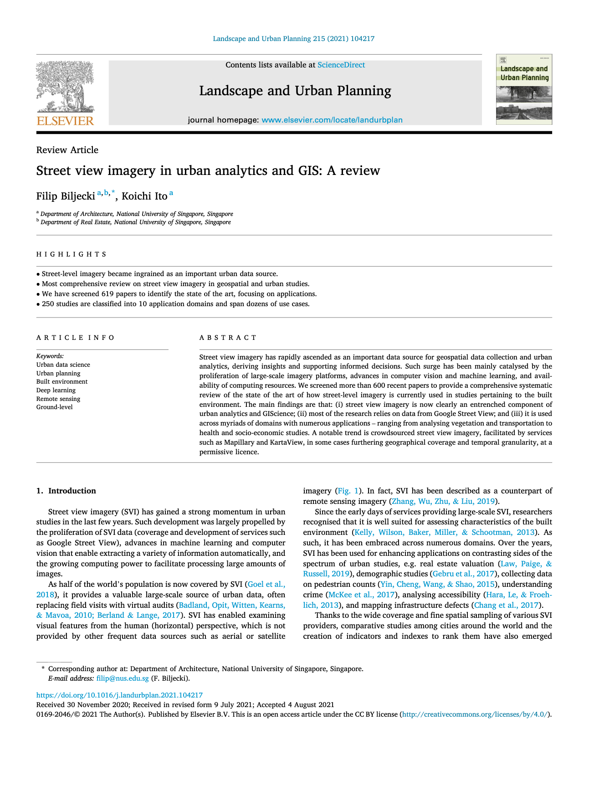

We have a new paper:

> Biljecki F, Ito K (2021): Street view imagery in urban analytics and GIS: A review. _Landscape and Urban Planning_ 215: 104217. [<i class="ai ai-doi-square ai"></i> 10.1016/j.landurbplan.2021.104217](https://doi.org/10.1016/j.landurbplan.2021.104217) [<i class="far fa-file-pdf"></i> PDF](/publication/2021-land-svi-review/2021-land-svi-review.pdf) <i class="ai ai-open-access-square ai"></i>

Street view imagery has rapidly increased in prominence as to an important and omnipresent urban data source. 
In this review, published open access, {} and {} have combed through 619 papers to explore the versatile range of applications of street view imagery and current challenges, services, and opportunities.

The review presents scores of interesting insights.
For example, the most comprehensive source of street view imagery -- Google Street View -- dominates and underpins 2/3 of the body of knowledge. It is followed by Baidu & Tencent. All these commercial services are increasingly restrictive, not guaranteeing easy access in the future. On the other hand, volunteered SVI -- Mapillary & KartaView provide an alternative but they’re not used frequently, due to scarce panoramas and heterogeneous quality/coverage. However, crowdsourced street view imagery has advantages too, e.g. permissive licence, opposing the restrictions of commercial counterparts.

Landscape and Urban Planning is a top 1% journal in its discipline according to Scopus.



### Highlights

- Street-level imagery became ingrained as an important urban data source.
- Most comprehensive review on street view imagery in geospatial and urban studies.
- We have screened 619 papers to identify the state of the art, focusing on applications.
- 250 studies are classified into 10 application domains and span dozens of use cases.


### Abstract

The abstract follows.

> Street view imagery has rapidly ascended as an important data source for geospatial data collection and urban analytics, deriving insights and supporting informed decisions. Such surge has been mainly catalysed by the proliferation of large-scale imagery platforms, advances in computer vision and machine learning, and availability of computing resources. We screened more than 600 recent papers to provide a comprehensive systematic review of the state of the art of how street-level imagery is currently used in studies pertaining to the built environment. The main findings are that: (i) street view imagery is now clearly an entrenched component of urban analytics and GIScience; (ii) most of the research relies on data from Google Street View; and (iii) it is used across myriads of domains with numerous applications – ranging from analysing vegetation and transportation to health and socio-economic studies. A notable trend is crowdsourced street view imagery, facilitated by services such as Mapillary and KartaView, in some cases furthering geographical coverage and temporal granularity, at a permissive licence.

### Paper 

For more information, please see the [paper](/publication/2021-land-svi-review/) (open access <i class="ai ai-open-access-square ai"></i>).

[](/publication/2021-land-svi-review/)

BibTeX citation:
```bibtex
@article{2021_land_svi_review,
  author = {Filip Biljecki and Koichi Ito},
  doi = {10.1016/j.landurbplan.2021.104217},
  journal = {Landscape and Urban Planning},
  pages = {104217},
  title = {Street view imagery in urban analytics and GIS: A review},
  url = {https://doi.org/10.1016/j.landurbplan.2021.104217},
  volume = {215},
  year = 2021
}
```


