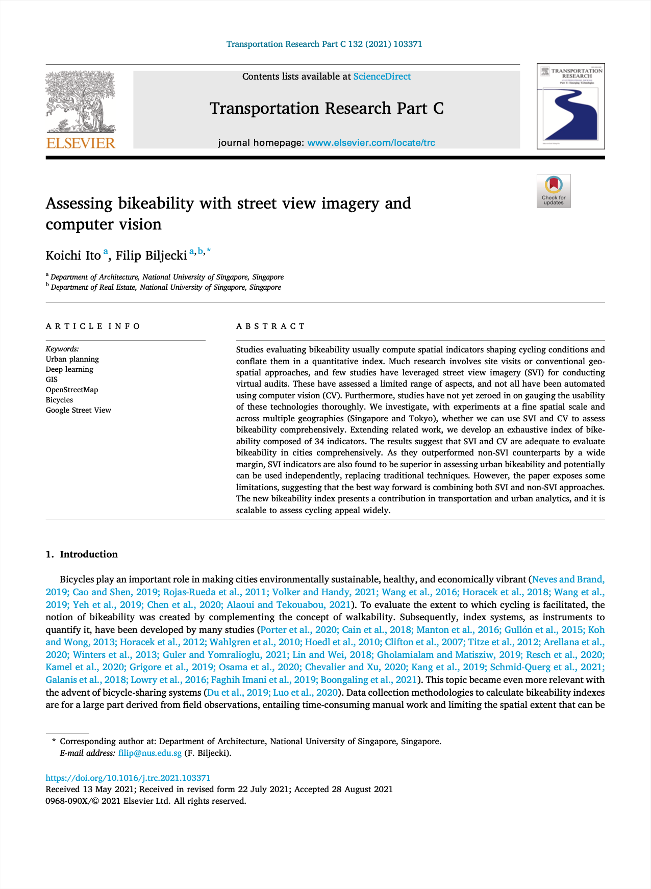

We are glad to share our new paper:

> Ito K, Biljecki F (2021): Assessing bikeability with street view imagery and computer vision. _Transportation Research Part C: Emerging Technologies_ 132: 103371. [<i class="ai ai-doi-square ai"></i> 10.1016/j.trc.2021.103371](https://doi.org/10.1016/j.trc.2021.103371) [<i class="far fa-file-pdf"></i> PDF](/publication/2021-trc-bikeability/2021-trc-bikeability.pdf)</i>

In this research, a new approach to assess bikeability has been developed: automatically, at a high resolution, at a large spatial scale, and from street view imagery.

Congratulations to {}, our Master of Urban Planning graduate, on the great job and the publication of his first first-author paper! :raised_hands: :clap:

Transportation Research Part C: Emerging Technologies is a top 1% journal in its discipline according to Scopus, and this is Koichi's second paper overall in the same month, with the first one being a [review paper published on street view imagery](), in another top journal.

### Highlights

- Understanding and scoring bikeability is crucial in urban transportation planning.
- Studies so far have largely relied on field visits and manual work.
- Street-level images and computer vision techniques are seldom used in bikeability assessment.
- First and most comprehensive study investigating the usability of these techniques.
- With some caveats, conventional approaches may be replaced with automated virtual audits.


### Abstract

The abstract follows.

> Studies evaluating bikeability usually compute spatial indicators shaping cycling conditions and conflate them in a quantitative index. Much research involves site visits or conventional geospatial approaches, and few studies have leveraged street view imagery (SVI) for conducting virtual audits. These have assessed a limited range of aspects, and not all have been automated using computer vision (CV). Furthermore, studies have not yet zeroed in on gauging the usability of these technologies thoroughly. We investigate, with experiments at a fine spatial scale and across multiple geographies (Singapore and Tokyo), whether we can use SVI and CV to assess bikeability comprehensively. Extending related work, we develop an exhaustive index of bikeability composed of 34 indicators. The results suggest that SVI and CV are adequate to evaluate bikeability in cities comprehensively. As they outperformed non-SVI counterparts by a wide margin, SVI indicators are also found to be superior in assessing urban bikeability and potentially can be used independently, replacing traditional techniques. However, the paper exposes some limitations, suggesting that the best way forward is combining both SVI and non-SVI approaches. The new bikeability index presents a contribution in transportation and urban analytics, and it is scalable to assess cycling appeal widely.

### Paper 

For more information, please see the [paper](/publication/2021-trc-bikeability/).

Free access to the article is available on [this link](https://authors.elsevier.com/a/1dn8b,M0mRJjVR) until 9 November 2021.


[](/publication/2021-trc-bikeability/)

BibTeX citation:
```bibtex
@article{2021_trc_bikeability,
  author = {Koichi Ito and Filip Biljecki},
  title = {Assessing bikeability with street view imagery and computer vision},
  journal = {Transportation Research Part C: Emerging Technologies},
  volume = {132},
  pages = {103371},
  year = {2021},
  doi = {10.1016/j.trc.2021.103371},
  url = {https://www.sciencedirect.com/science/article/pii/S0968090X21003739}
}
```


