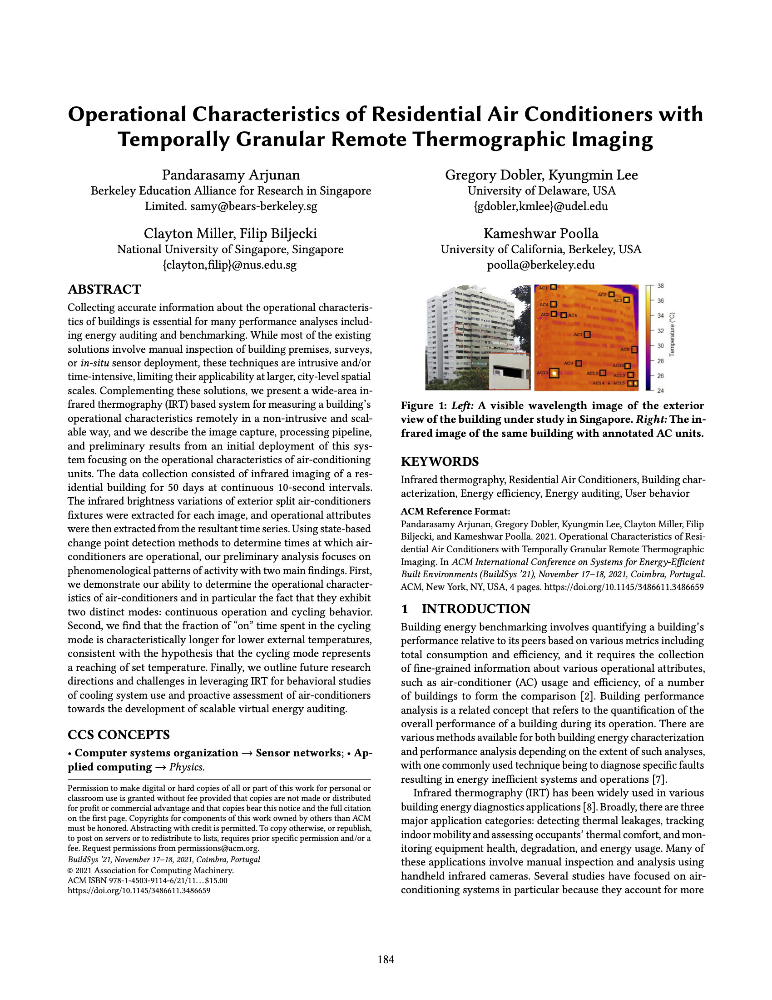

We are glad to share a new collaborative paper in which we were involved:

> Arjunan P, Dobler G, Lee K, Miller C, Biljecki F, Poolla K (2021): Operational characteristics of residential air conditioners with temporally granular remote thermographic imaging. _BuildSys '21: Proceedings of the 8th ACM International Conference on Systems for Energy-Efficient Buildings, Cities, and Transportation_, pp. 184--187. [<i class="ai ai-doi-square ai"></i> 10.1145/3486611.3486659](https://doi.org/10.1145/3486611.3486659) [<i class="far fa-file-pdf"></i> PDF](/publication/2021-buildsys-acir/2021-buildsys-acir.pdf)</i>

This paper, led by [Dr Pandarasamy Arjunan](https://www.samy101.com) (Berkeley Education Alliance for Research in Singapore), examines a new application of infrared thermography -- analysing the patterns of residential air conditioners.
The work has been presented at the [BuildSys 2021 conference](https://buildsys.acm.org/2021/) in Coimbra, Portugal.
Other co-authors are [Dr Gregory Dobler](https://www.bidenschool.udel.edu/people/gdobler) and [Kyungmin Lee](https://www.linkedin.com/in/kyungmin-lee-477b5b144/en) (University of Delaware), [Clayton Miller](https://www.budslab.org) (NUS Building and Urban Data Science Lab), and Prof [Kameshwar Poolla](https://en.wikipedia.org/wiki/Kameshwar_Poolla) (University of California, Berkeley).


### Abstract

The abstract follows.

> Collecting accurate information about the operational characteristics of buildings is essential for many performance analyses including energy auditing and benchmarking. While most of the existing solutions involve manual inspection of building premises, surveys, or in-situ sensor deployment, these techniques are intrusive and/or time-intensive, limiting their applicability at larger, city-level spatial scales. Complementing these solutions, we present a wide-area infrared thermography (IRT) based system for measuring a building's operational characteristics remotely in a non-intrusive and scalable way, and we describe the image capture, processing pipeline, and preliminary results from an initial deployment of this system focusing on the operational characteristics of air-conditioning units. The data collection consisted of infrared imaging of a residential building for 50 days at continuous 10-second intervals. The infrared brightness variations of exterior split air-conditioners fixtures were extracted for each image, and operational attributes were then extracted from the resultant time series. Using state-based change point detection methods to determine times at which air-conditioners are operational, our preliminary analysis focuses on phenomenological patterns of activity with two main findings. First, we demonstrate our ability to determine the operational characteristics of air-conditioners and in particular the fact that they exhibit two distinct modes: continuous operation and cycling behavior. Second, we find that the fraction of "on" time spent in the cycling mode is characteristically longer for lower external temperatures, consistent with the hypothesis that the cycling mode represents a reaching of set temperature. Finally, we outline future research directions and challenges in leveraging IRT for behavioral studies of cooling system use and proactive assessment of air-conditioners towards the development of scalable virtual energy auditing.

### Paper 

For more information, please see the [paper](/publication/2021-buildsys-acir/), published as open access.

[](/publication/2021-buildsys-acir/)

BibTeX citation:
```bibtex
@inproceedings{2021_buildsys_acir, 
  year = {2021}, 
  author = {Arjunan, Pandarasamy and Dobler, Gregory and Lee, Kyungmin and Miller, Clayton and Biljecki, Filip and Poolla, Kameshwar}, 
  title = {{Operational characteristics of residential air conditioners with temporally granular remote thermographic imaging}}, 
  booktitle = {BuildSys '21: Proceedings of the 8th ACM International Conference on Systems for Energy-Efficient Buildings, Cities, and Transportation}, 
  isbn = {9781450391146}, 
  doi = {10.1145/3486611.3486659}, 
  pages = {184--187}, 
  series = {Proceedings of the 8th ACM International Conference on Systems for Energy-Efficient Buildings, Cities, and Transportation}
}
```


