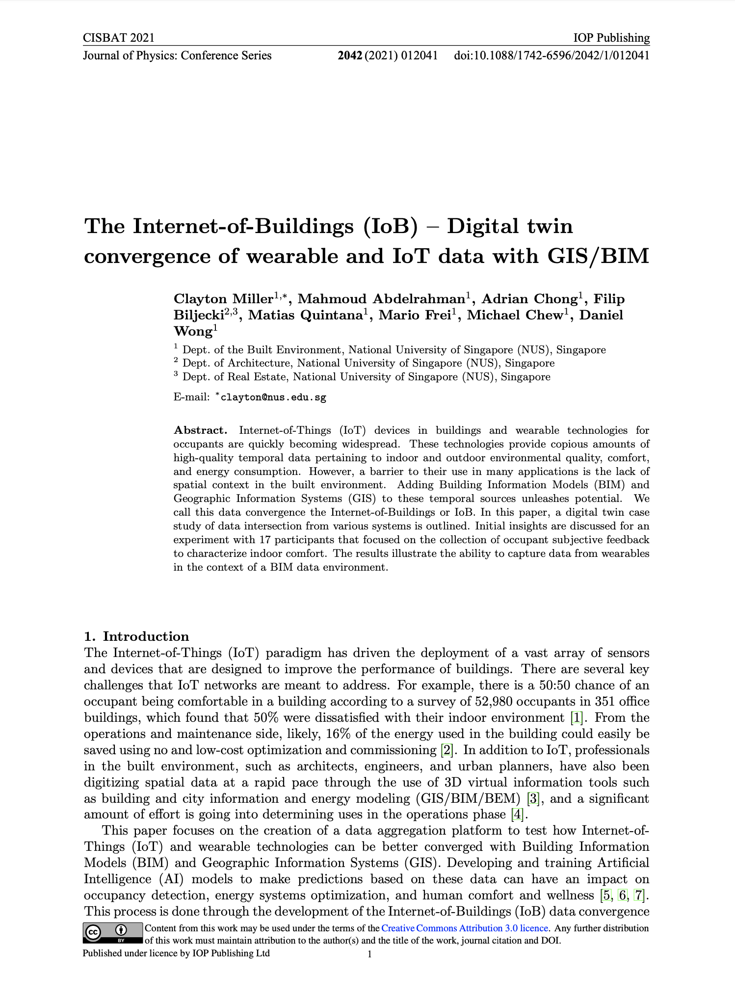

We are glad to share a new collaborative paper in which we were involved:

> Miller C, Abdelrahman M, Chong A, Biljecki F, Quintana M, Frei M, Chew M, Wong D (2021): The Internet-of-Buildings (IoB) --- Digital twin convergence of wearable and IoT data with GIS/BIM. _Journal of Physics: Conference Series_ 2042(1): 012041. [<i class="ai ai-doi-square ai"></i> 10.1088/1742-6596/2042/1/012041](https://doi.org/10.1088/1742-6596/2042/1/012041) [<i class="far fa-file-pdf"></i> PDF](/publication/2021-cisbat-iob/2021-cisbat-iob.pdf)</i>

This paper, led by Dr Clayton Miller from the NUS Department of the Built Environment, is a result of a collaboration with our sister labs --- the [Building and Urban Data Science (BUDS) Lab](https://www.budslab.org) and the [Integrated Data, Energy Analysis + Simulation (IDEAS) Lab](https://ideaslab.io).
The work has been presented at the [CISBAT 2021 conference](https://cisbat.epfl.ch) in Lausanne, Switzerland.

### Abstract

The abstract follows.

> Internet-of-Things (IoT) devices in buildings and wearable technologies for occupants are quickly becoming widespread. These technologies provide copious amounts of high-quality temporal data pertaining to indoor and outdoor environmental quality, comfort, and energy consumption. However, a barrier to their use in many applications is the lack of spatial context in the built environment. Adding Building Information Models (BIM) and Geographic Information Systems (GIS) to these temporal sources unleashes potential. We call this data convergence the Internet-of-Buildings or IoB. In this paper, a digital twin case study of data intersection from various systems is outlined. Initial insights are discussed for an experiment with 17 participants that focused on the collection of occupant subjective feedback to characterize indoor comfort. The results illustrate the ability to capture data from wearables in the context of a BIM data environment.

### Paper 

For more information, please see the [paper](/publication/2021-cisbat-iob/), published as open access.

[](/publication/2021-cisbat-iob/)

BibTeX citation:
```bibtex
@article{2021_cisbat_iob,
  author = {Miller, Clayton and Abdelrahman, Mahmoud and Chong, Adrian and Biljecki, Filip and Quintana, Matias and Frei, Mario and Chew, Michael and Wong, Daniel},
  doi = {10.1088/1742-6596/2042/1/012041},
  journal = {Journal of Physics: Conference Series},
  number = {1},
  pages = {012041},
  title = {The Internet-of-Buildings (IoB) --- Digital twin convergence of wearable and IoT data with GIS/BIM},
  volume = {2042},
  year = {2021}
}
```


