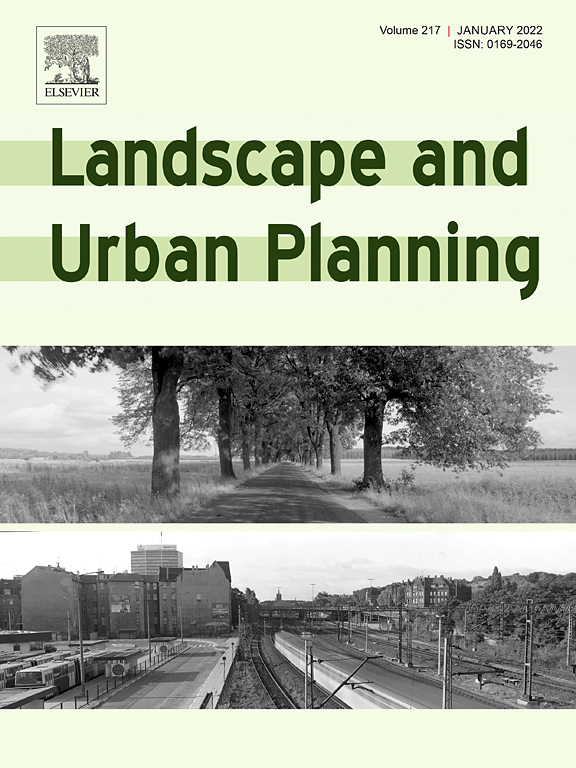

{} was appointed as member of the [Editorial Board](https://www.sciencedirect.com/journal/landscape-and-urban-planning/about/editorial-board) of [Landscape and Urban Planning](https://www.sciencedirect.com/journal/landscape-and-urban-planning).

_Landscape and Urban Planning_ is an international journal aimed at advancing conceptual, scientific, and applied understandings of landscape in order to promote sustainable solutions for landscape change.
The journal, published by Elsevier, was established in 1974 as _Landscape Planning_, and since then it ascended to rank within top 1% journals in the category of Urban Studies according to Scopus.

In the past few years, the journal has published scores of highly relevant articles in domains coinciding with the interests of our [Lab](/), such as 3D city modelling, urban form, and street view imagery.

