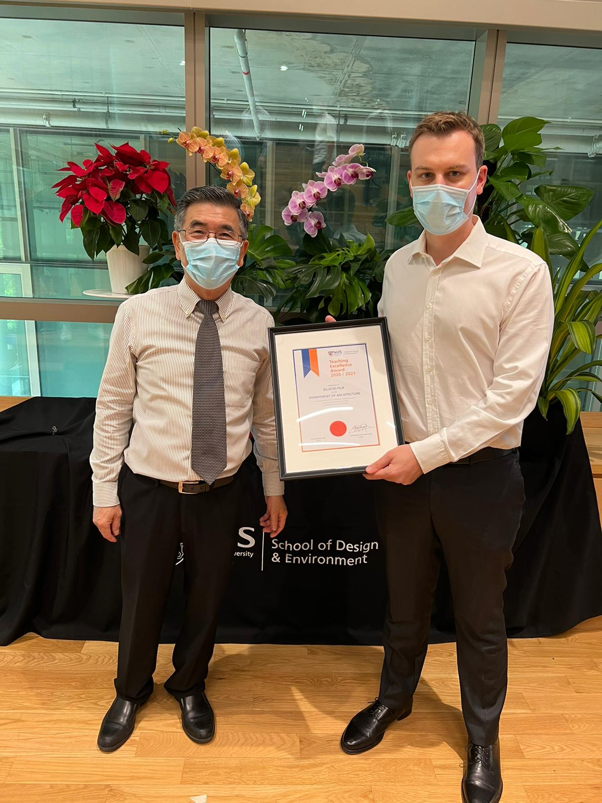

Asst Prof {} was awarded the Teaching Excellence Award by the NUS School of Design and Environment.
The award is presented in recognition of excellence, dedication, and commitment to the education of students at NUS in AY2020/2021, based on the three graduate modules in urban data science in which our Lab is involved and other activities such as [supervision of master theses](/opportunities/student-projects/).
It was conferred on him by Prof Lam Khee Poh, Dean of SDE.

:tada:

