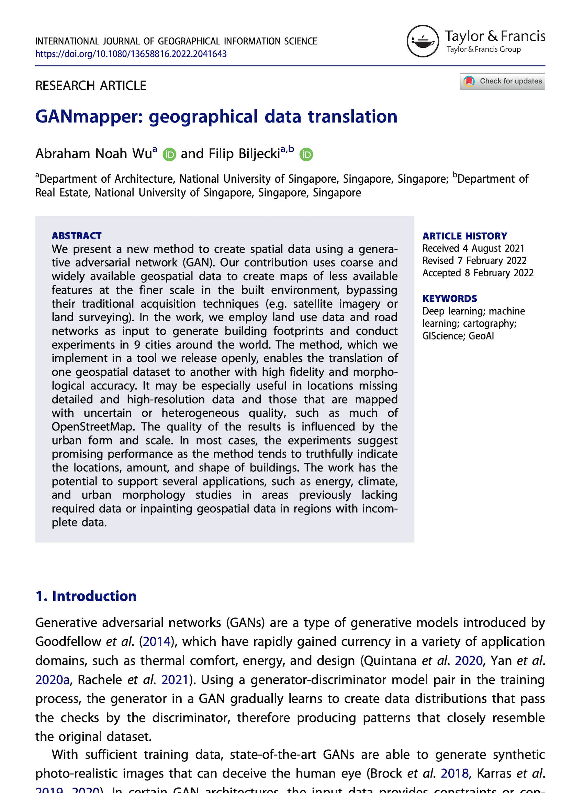

We are glad to share our new paper:

> Wu AN, Biljecki F (2022): GANmapper: geographical data translation. _International Journal of Geographical Information Science_ 36(7): 1394-1422. [<i class="ai ai-doi-square ai"></i> 10.1080/13658816.2022.2041643](https://doi.org/10.1080/13658816.2022.2041643) [<i class="far fa-file-pdf"></i> PDF](/publication/2022-ijgis-ganmapper/2022-ijgis-ganmapper.pdf)</i>


Congratulations to {} on this very nice job and his new first-author paper! :raised_hands:

In this paper, we take GAN to new heights in GIScience, by introducing a new application: geographical data translation.
Leveraging on their relationship, our contribution uses more commonly found and coarse geospatial data (land use and road network) to predict less common features at the finer scale (building footprints) without data and measurements on them (e.g. satellite imagery or land surveying).

We developed a software, [GANmapper](https://github.com/ualsg/GANmapper), to translate road network data into building footprint data to demonstrate the feasibility and effectiveness of geographical data translation. 
It is released open-source.

The experiments suggest a high degree of veracity across different urban morphologies around the world (see the [figure below](#cityall)).

We hope that this new application of GAN in GIS would introduce a new approach for digital cartography and may catalyse further investigations how can GAN be leveraged in GIScience.




### Abstract

The abstract follows.

> We present a new method to create spatial data using a generative adversarial network (GAN).
Our contribution uses coarse and widely available geospatial data to create maps of less available features at the finer scale in the built environment, bypassing their traditional acquisition techniques (e.g. satellite imagery or land surveying).
In the work, we employ land use data and road networks as input to generate building footprints and conduct experiments in 9 cities around the world.
The method, which we implement in a tool we release openly, enables the translation of one geospatial dataset to another with high fidelity and morphological accuracy. 
It may be especially useful in locations missing detailed and high-resolution data and those that are mapped with uncertain or heterogeneous quality, such as much of OpenStreetMap.
The quality of the results is influenced by the urban form and scale.
In most cases, the experiments suggest promising performance as the method tends to truthfully indicate the locations, amount, and shape of buildings.
The work has the potential to support several applications, such as energy, climate, and urban morphology studies in areas previously lacking required data or inpainting geospatial data in regions with incomplete data.

### Paper 

For more information, please see the [paper](/publication/2022-ijgis-ganmapper/) or access it directly at the [publisher's website](https://doi.org/10.1080/13658816.2022.2041643).

### Code

The code is shared openly on our [Github repository](https://github.com/ualsg/GANmapper).

[](/publication/2022-ijgis-ganmapper/)

BibTeX citation:
```bibtex
@article{2022_ijgis_ganmapper, 
  year = {2022}, 
  author = {Wu, Abraham Noah and Biljecki, Filip}, 
  title = {{GANmapper: geographical data translation}}, 
  journal = {International Journal of Geographical Information Science}, 
  volume = {36},
  issue = {7},
  pages = {1394-1422},
  doi = {10.1080/13658816.2022.2041643}
}
```

