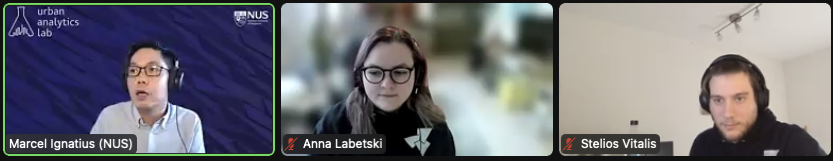
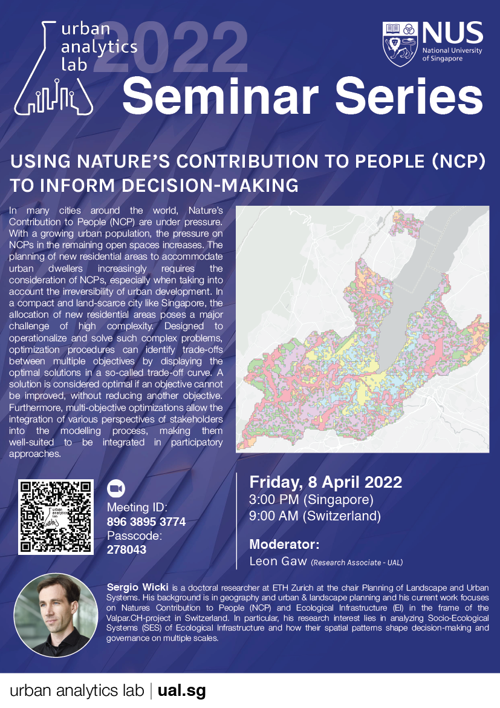

We started an online [seminar series](/seminars/).
Our first guests were [Anna Labetski](http://3d.bk.tudelft.nl/alabetski) and [Stelios Vitalis](http://3d.bk.tudelft.nl/svitalis) from the [3D Geoinformation group](https://3d.bk.tudelft.nl) at the Delft University of Technology.
The session was moderated by Dr {}, who is the initiator and manager of the series.

The Urban Analytics Lab seminar series is part of our community engagement and to provide a platform leading to interesting discussions, new ideas, and spurring collaborations. 
In our seminar series, we give priority to early career researchers.

The next seminar will be given by [Sergio Wicki](https://irl.ethz.ch/people/person-detail.MTY4ODA4.TGlzdC8xNzM4LC0xMzk1OTgzMDM3.html) from the [Planning of Landscape and Urban Systems](https://plus.ethz.ch) at ETH Zurich (see the poster below).
You are welcome to register [here](https://forms.gle/HttoRensJuLbAGDz7).

For further developments and announcements, please bookmark [the page of the seminar series](/seminars/).

