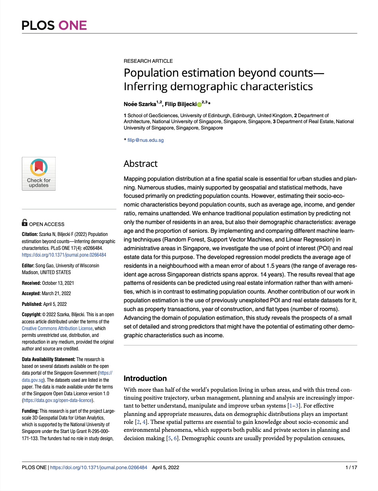

We are glad to share our new paper:

> Szarka N, Biljecki F (2022): Population estimation beyond counts—Inferring demographic characteristics. _PLOS ONE_ 17(4): e0266484. [<i class="ai ai-doi-square ai"></i> 10.1371/journal.pone.0266484](https://doi.org/10.1371/journal.pone.0266484) [<i class="far fa-file-pdf"></i> PDF](/publication/2022-plos-population-estimation/2022-plos-population-estimation.pdf)</i>  <i class="ai ai-open-access-square ai"></i>

In this research, population estimation, a traditional research topic in GIS, has been advanced.
Most studies so far have been confined to predicting population counts.
This multi-pronged comparative work involving multiple ML techniques has advanced such traditional techniques by not only estimating the population in an area, but also demographic characteristics behind these counts: average age of residents and share of seniors in a region.

Congratulations to {}, our visiting scholar from the University of Edinburgh, on the great job and the publication of her first first-author paper! :raised_hands: :clap:

Also, congrats to her on graduating in the MSc in GIS programme.
Noée has continued her career as a Geospatial Developer at the municipal government of the City of Lucerne Council in Switzerland.

### Abstract

The abstract follows.

> Mapping population distribution at a fine spatial scale is essential for urban studies and planning. Numerous studies, mainly supported by geospatial and statistical methods, have focused primarily on predicting population counts. However, estimating their socio-economic characteristics beyond population counts, such as average age, income, and gender ratio, remains unattended. We enhance traditional population estimation by predicting not only the number of residents in an area, but also their demographic characteristics: average age and the proportion of seniors. By implementing and comparing different machine learning techniques (Random Forest, Support Vector Machines, and Linear Regression) in administrative areas in Singapore, we investigate the use of point of interest (POI) and real estate data for this purpose. The developed regression model predicts the average age of residents in a neighbourhood with a mean error of about 1.5 years (the range of average resident age across Singaporean districts spans approx. 14 years). The results reveal that age patterns of residents can be predicted using real estate information rather than with amenities, which is in contrast to estimating population counts. Another contribution of our work in population estimation is the use of previously unexploited POI and real estate datasets for it, such as property transactions, year of construction, and flat types (number of rooms). Advancing the domain of population estimation, this study reveals the prospects of a small set of detailed and strong predictors that might have the potential of estimating other demographic characteristics such as income.

### Paper 

For more information, please see the [paper](/publication/2022-plos-population-estimation/) (open access <i class="ai ai-open-access-square ai"></i>).

[](/publication/2022-plos-population-estimation/)

BibTeX citation:
```bibtex
@article{2022_plos_population_estimation,
 author = {Szarka, Noée and Biljecki, Filip},
 doi = {10.1371/journal.pone.0266484},
 journal = {PLOS ONE},
 number = {4},
 pages = {e0266484},
 title = {{Population estimation beyond counts---Inferring demographic characteristics}},
 volume = {17},
 year = {2022}
}
```


