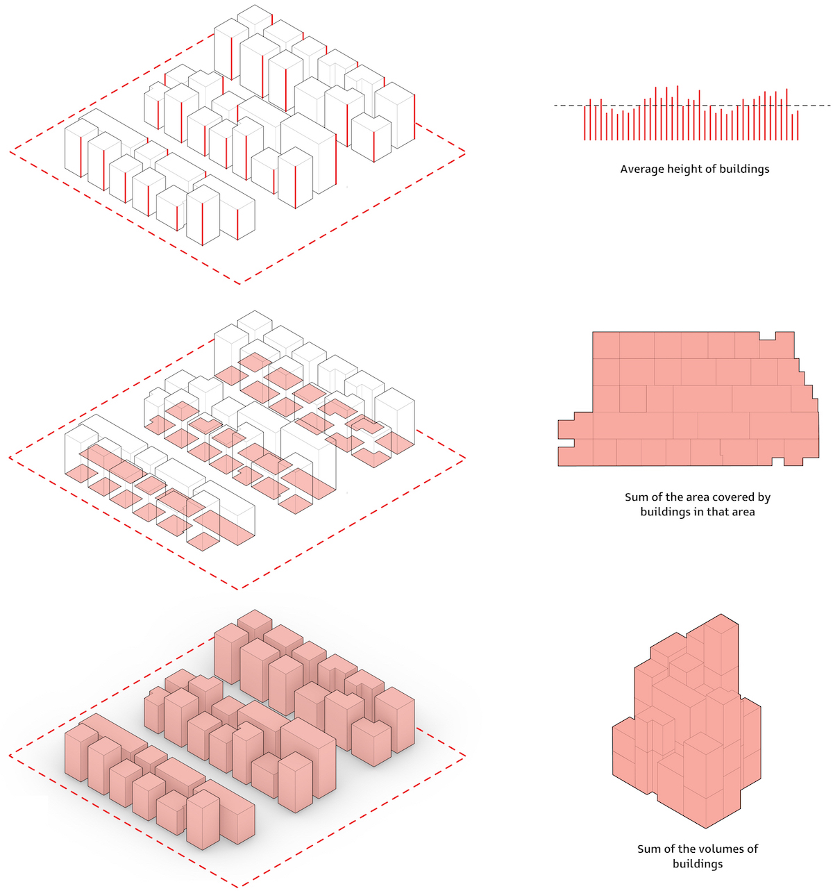
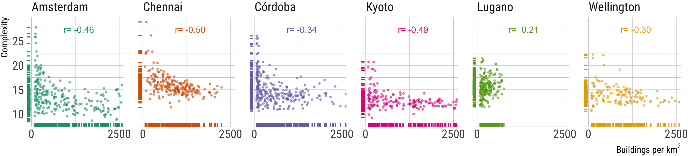
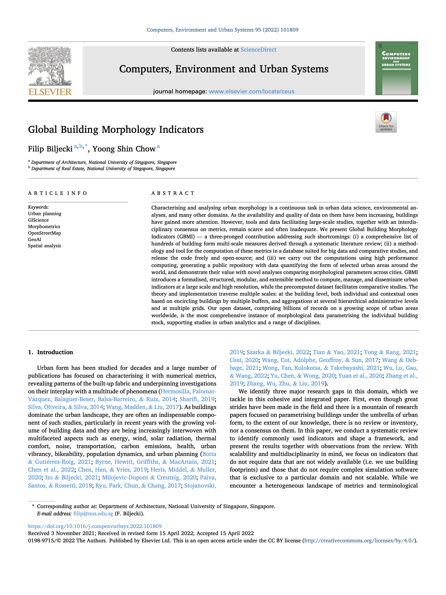

We are pleased to share that our latest project [_Global Building Morphology Indicators_](/project/gbmi/) has been 
published as a namesake article in the Computers, Environment and Urban Systems:

> Biljecki F, Chow YS (2022): Global Building Morphology Indicators. _Computers, Environment and Urban Systems_ XX(XX): 101809.
> [<i class="ai ai-doi-square ai"></i>10.1016/j.compenvurbsys.2022.101809](https://doi.org/10.1016/j.compenvurbsys.2022.101809) [<i class="far fa-file-pdf"></i> PDF](/publication/2022-ceus-gbmi/2022-ceus-gbmi.pdf)</i><i class="ai ai-open-access-square ai"></i>

Urban morphology has been instrumental in a variety of disciplines. 
Addressing multiple research gaps related to the building aspect, GBMI is a cohesive set of three contributions in this domain:

* A comprehensive catalogue of commonly used metrics characterising the urban building form based on a systematic literature review. We consolidated a set of hundreds of indicators.
* An open-source database solution to implement all these metrics based on building footprints. There are some software approaches to deal with quantitative analyses on the built form, but there isn't one relying on a database, which may be more suited for big data analyses.
* An open dataset with the computed metrics for dozens of urban areas around the world. Such contribution bringing ready-to-use datasets may facilitate analyses, especially comparative ones among multiple study areas.



The paper also includes a variety of analyses to give a peek in the work and hint at some potential applications.



The project has a dedicated [website](/project/gbmi).
Please visit it to learn more about the metrics, software, and dataset.

### Abstract

The abstract follows.

> Characterising and analysing urban morphology is a continuous task in urban data science, environmental analyses, and many other domains. As the availability and quality of data on them have been increasing, buildings have gained more attention. However, tools and data facilitating large-scale studies, together with an interdisciplinary consensus on metrics, remain scarce and often inadequate. We present Global Building Morphology Indicators (GBMI) — a three-pronged contribution addressing such shortcomings: (i) a comprehensive list of hundreds of building form multi-scale measures derived through a systematic literature review; (ii) a methodology and tool for the computation of these metrics in a database suited for big data and comparative studies, and release the code freely and open-source; and (iii) we carry out the computations using high performance computing, generating a public repository with data quantifying the form of selected urban areas around the world, and demonstrate their value with novel analyses comparing morphological parameters across cities. GBMI introduces a formalised, structured, modular, and extensible method to compute, manage, and disseminate urban indicators at a large scale and high resolution, while the precomputed dataset facilitates comparative studies. The theory and implementation traverse multiple scales: at the building level, both individual and contextual ones based on encircling buildings by multiple buffers, and aggregations at several hierarchical administrative levels and at multiple grids. Our open dataset, comprising billions of records on a growing scope of urban areas worldwide, is the most comprehensive instance of morphological data parametrising the individual building stock, supporting studies in urban analytics and a range of disciplines.


### Paper 

For more information, please see the [paper](/publication/2022-ceus-gbmi/) (open 
access <i class="ai ai-open-access-square ai"></i>).

[](/publication/2022-ceus-gbmi/)

BibTeX citation:
```bibtex
@article{2022_ceus_gbmi,
 author = {Biljecki, Filip and Chow, Yoong Shin},
 doi = {10.1016/j.compenvurbsys.2022.101809},
 journal = {Computers, Environment and Urban Systems},
 number = {X},
 pages = {X},
 title = {Global Building Morphology Indicators},
 volume = {X},
 year = {2022}
}
```


