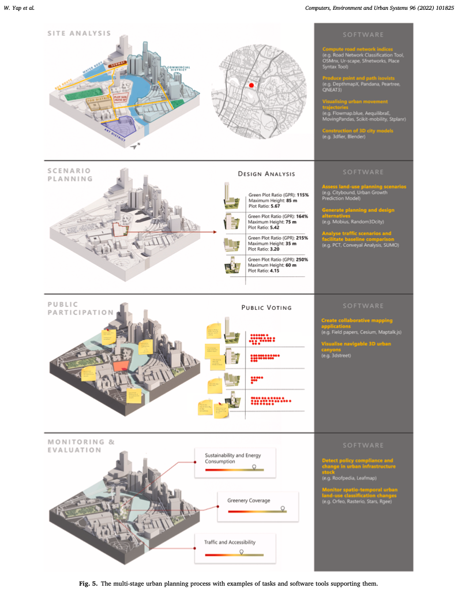
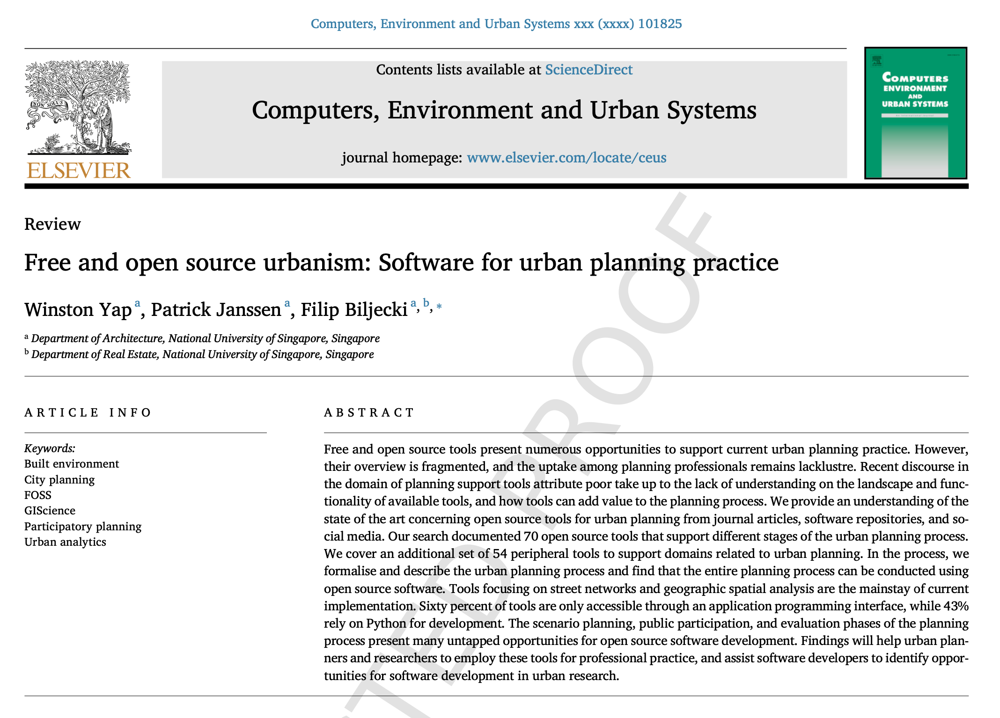

We are glad to share our new paper:

> Yap W, Janssen P, Biljecki F (2022): Free and open source urbanism: Software for urban planning practice. _Computers, Environment and Urban Planning_ 96: 101825. [<i class="ai ai-doi-square ai"></i> 10.1016/j.compenvurbsys.2022.101825](https://doi.org/10.1016/j.compenvurbsys.2022.101825) [<i class="far fa-file-pdf"></i> PDF](/publication/2022-ceus-open-source-urbanism/2022-ceus-open-source-urbanism.pdf)</i> <i class="ai ai-open-access-square ai"></i>

This review paper was led by {}.
Congratulations on his first journal paper out of his PhD, in a top journal no less. :raised_hands: :clap:



### Highlights

+ State of the art of open source software for urban planning.
+ Open source software is increasingly supporting urban planning.
+ The current landscape of open tools presents numerous opportunities to augment a wide range of urban analytical processes.
+ 70 relevant tools for urban planning, categorised according to planning process phases, application domains, and use cases.
+ An extended list of 54 peripheral tools that provide additional support for domains related to urban planning.

### Abstract

The abstract follows.

> Free and open source tools present numerous opportunities to support current urban planning practice. However, their overview is fragmented, and the uptake among planning professionals remains lacklustre. Recent discourse in the domain of planning support tools attribute poor take up to the lack of understanding on the landscape and functionality of available tools, and how tools can add value to the planning process. We provide an understanding of the state of the art concerning open source tools for urban planning from journal articles, software repositories, and social media. Our search documented 70 open source tools that support different stages of the urban planning process. We cover an additional set of 54 peripheral tools to support domains related to urban planning. In the process, we formalise and describe the urban planning process and find that the entire planning process can be conducted using open source software. 
Tools focusing on street networks and geographic spatial analysis are the mainstay of current implementation. Sixty percent of tools are only accessible through an application programming interface, while 43% rely on Python for development. The scenario planning, public participation, and evaluation phases of the planning process present many untapped opportunities for open source software development. Findings will help urban planners and researchers to employ these tools for professional practice, and assist software developers to identify opportunities for software development in urban research. 

### Paper 

For more information, please see the [paper](/publication/2022-ceus-open-source-urbanism/), published as open access. <i class="ai ai-open-access-square ai"></i>

[](/publication/2022-ceus-open-source-urbanism/)

BibTeX citation:
```bibtex
@article{2022_ceus_open_source_urbanism,
  author = {Yap, Winston and Janssen, Patrick and Biljecki, Filip},
  doi = {10.1016/j.compenvurbsys.2022.101825},
  journal = {Computers, Environment and Urban Planning},
  pages = {101825},
  title = {{Free and open source urbanism: Software for urban planning practice}},
  volume = {96},
  year = {2022}
}
```


