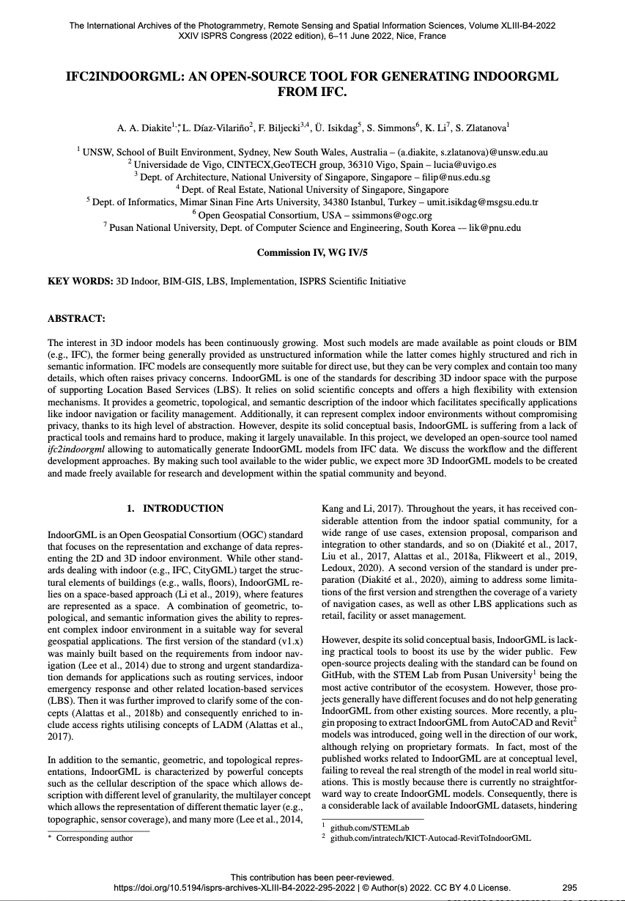

We are glad to share a new collaborative paper in which we were involved:

> Diakite, AA, Díaz-Vilariño L, Biljecki F, Isikdag Ü, Simmons S, Li K, Zlatanova S (2022): ifc2indoorgml: An open-source tool for generating IndoorGML from IFC. _Int. Arch. Photogramm. Remote Sens. Spatial Inf. Sci._ XLIII-B4-2022: 295–301. [<i class="ai ai-doi-square ai"></i> 10.5194/isprs-archives-xliii-b4-2022-295-2022](https://doi.org/10.5194/isprs-archives-xliii-b4-2022-295-2022) [<i class="far fa-file-pdf"></i> PDF](/publication/2022-isprs-ifc-2-indoorgml/2022-isprs-ifc-2-indoorgml.pdf)</i> <i class="ai ai-open-access-square ai"></i>

This conference paper describes [ifc2indoorgml](https://github.com/grid-unsw/ifc2indoorgml), a tool to generate IndoorGML files from IFC input models.
The collaboration was supported by the [ISPRS Scientific Initiatives 2021](https://www.isprs.org/society/si/default.aspx) and the Ministry of Land, Infrastructure, and Transport of Korean government through the iNOUS initiative leb by Pusan National University.

The project, development, and paper were led by [Dr Abdoulaye Diakite](https://www.unsw.edu.au/staff/abdoulaye-diakite) from the [Geospatial, Research, Innovation and Development (GRID) Lab](https://www.unsw.edu.au/arts-design-architecture/our-schools/built-environment/our-research/clusters-groups/grid) at the University of New South Wales (Australia).
Others involved in this project are collaborators from University of Vigo (Spain), Mimar Sinan Fine Arts University (Turkey), Open Geospatial Consortium, and the Pusan National University (South Korea).


### Abstract

The abstract follows.

> The interest in 3D indoor models has been continuously growing. Most such models are made available as point clouds or BIM (e.g., IFC), the former being generally provided as unstructured information while the latter comes highly structured and rich in semantic information. IFC models are consequently more suitable for direct use, but they can be very complex and contain too many details, which often raises privacy concerns. IndoorGML is one of the standards for describing 3D indoor space with the purpose of supporting Location Based Services (LBS). It relies on solid scientific concepts and offers a high flexibility with extension mechanisms. It provides a geometric, topological, and semantic description of the indoor which facilitates specifically applications like indoor navigation or facility management. Additionally, it can represent complex indoor environments without compromising privacy, thanks to its high level of abstraction. However, despite its solid conceptual basis, IndoorGML is suffering from a lack of practical tools and remains hard to produce, making it largely unavailable. In this project, we developed an open-source tool named ifc2indoorgml allowing to automatically generate IndoorGML models from IFC data. We discuss the workflow and the different development approaches. By making such tool available to the wider public, we expect more 3D IndoorGML models to be created and made freely available for research and development within the spatial community and beyond.

### Paper 

For more information, please see the [paper](/publication/2022-isprs-ifc-2-indoorgml/), published open access. <i class="ai ai-open-access-square ai"></i>

[](/publication/2022-isprs-ifc-2-indoorgml/)

BibTeX citation:
```bibtex
@article{2022_isprs_ifc2indoorgml,
 author = {Diakite, AA and Díaz-Vilariño, L and Biljecki, F and Isikdag, Ü and Simmons, S and Li, K and Zlatanova, S},
 doi = {10.5194/isprs-archives-xliii-b4-2022-295-2022},
 journal = {Int. Arch. Photogramm. Remote Sens. Spatial Inf. Sci.},
 pages = {295--301},
 title = {ifc2indoorgml: An open-source tool for generating IndoorGML from IFC},
 volume = {XLIII-B4-2022},
 year = {2022}
}
```


