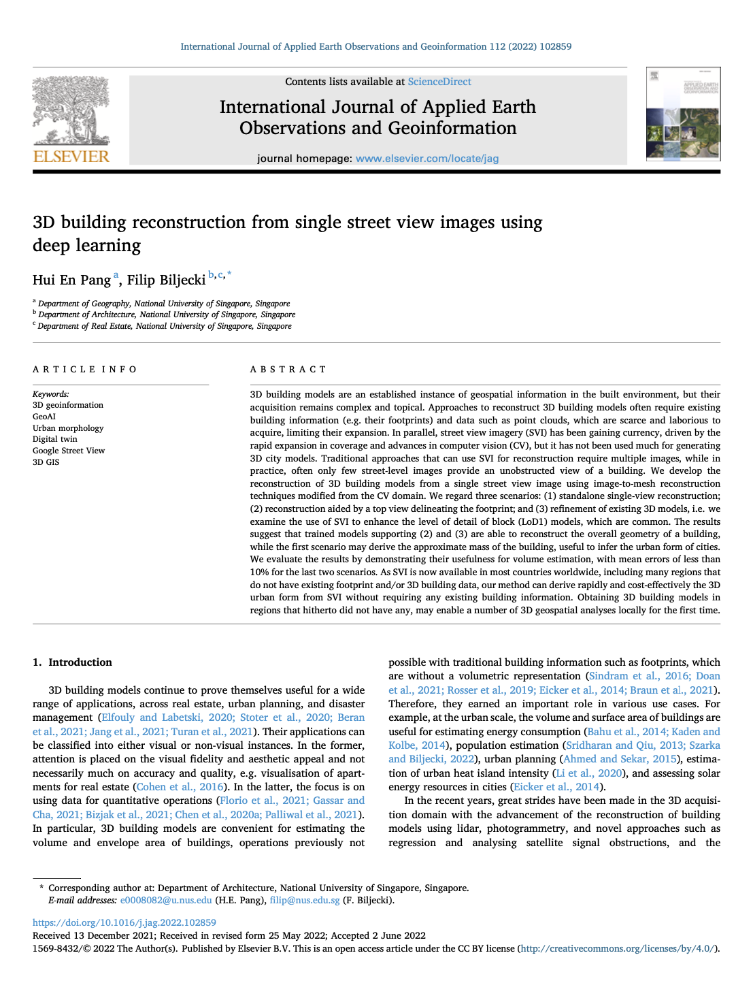

We are glad to share our new paper:

> Pang HE, Biljecki F (2022): 3D building reconstruction from single street view images using deep learning. _International Journal of Applied Earth Observation and Geoinformation_ 112: 102859. [<i class="ai ai-doi-square ai"></i> 10.1016/j.jag.2022.102859](https://doi.org/10.1016/j.jag.2022.102859) [<i class="far fa-file-pdf"></i> PDF](/publication/2022-jag-3-d-svi/2022-jag-3-d-svi.pdf)</i> <i class="ai ai-open-access-square ai"></i>

This research was led by {} as part of her MSc.
Congratulations to her on the graduation, and we wish Hui En all the best in her PhD at NTU. :raised_hands: :clap:

### Highlights

+ Street-level photographs are now an omnipresent urban dataset.
+ Buildings are often imaged multiple times, but most photos are obstructed.
+ An approach to generate 3D models of buildings from their single views.
+ The method can be aided by building footprints.
+ The resulting models are usable for a variety of use cases.

### Abstract

The abstract follows.

> 3D building models are an established instance of geospatial information in the built environment, but their acquisition remains complex and topical. Approaches to reconstruct 3D building models often require existing building information (e.g. their footprints) and data such as point clouds, which are scarce and laborious to acquire, limiting their expansion. In parallel, street view imagery (SVI) has been gaining currency, driven by the rapid expansion in coverage and advances in computer vision (CV), but it has not been used much for generating 3D city models. Traditional approaches that can use SVI for reconstruction require multiple images, while in practice, often only few street-level images provide an unobstructed view of a building. We develop the reconstruction of 3D building models from a single street view image using image-to-mesh reconstruction techniques modified from the CV domain. We regard three scenarios: (1) standalone single-view reconstruction; (2) reconstruction aided by a top view delineating the footprint; and (3) refinement of existing 3D models, i.e. we examine the use of SVI to enhance the level of detail of block (LoD1) models, which are common. The results suggest that trained models supporting (2) and (3) are able to reconstruct the overall geometry of a building, while the first scenario may derive the approximate mass of the building, useful to infer the urban form of cities. We evaluate the results by demonstrating their usefulness for volume estimation, with mean errors of less than 10% for the last two scenarios. As SVI is now available in most countries worldwide, including many regions that do not have existing footprint and/or 3D building data, our method can derive rapidly and cost-effectively the 3D urban form from SVI without requiring any existing building information. Obtaining 3D building models in regions that hitherto did not have any, may enable a number of 3D geospatial analyses locally for the first time.

### Paper 

For more information, please see the [paper](/publication/2022-jag-3-d-svi/), published open access. <i class="ai ai-open-access-square ai"></i>

[](/publication/2022-jag-3-d-svi/)

BibTeX citation:
```bibtex
@article{2022_jag_3d_svi,
  author = {Pang, Hui En and Biljecki, Filip},
  journal = {International Journal of Applied Earth Observation and Geoinformation},
  title = {{3D building reconstruction from single street view images using deep learning}},
  volume = {112},
  pages = {102859},
  doi = {10.1016/j.jag.2022.102859},
  year = {2022}
}
```
