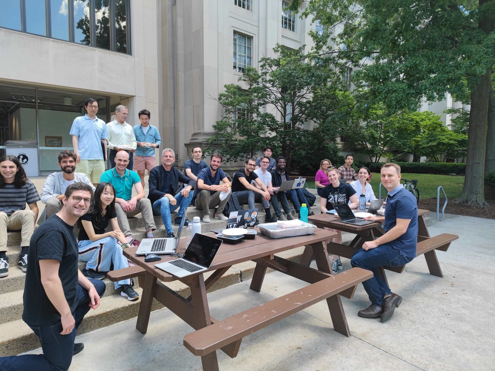
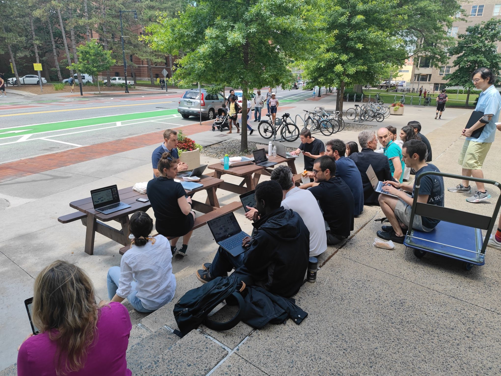
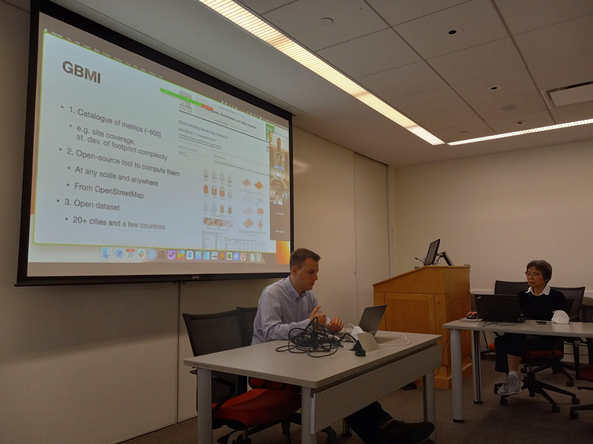
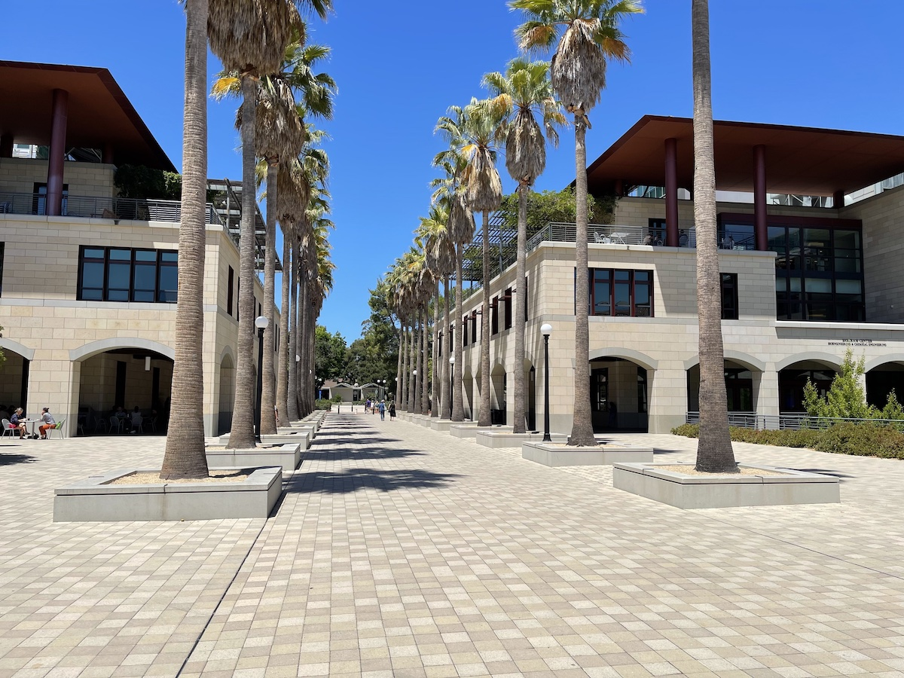

The PI of the NUS Urban Analytics Lab, Prof {}, has been on a work trip in the US :us: where he has visited 9 universities and delivered lectures, talks, and other collaborative exchanges.

The full list of visited universities and groups is as follows, with some photos below.
* Massachusetts Institute of Technology, [Senseable City Lab](https://senseable.mit.edu/)
* Harvard University, [Center for Geographic Analysis](https://gis.harvard.edu/) ([link](https://gis.harvard.edu/event/geospatial-research-urban-analytics-lab-national-university-singapore) to the talk)
* Massachusetts Institute of Technology, [Sustainable Design Lab](http://web.mit.edu/sustainabledesignlab/)
* University of Pennsylvania, [Stuart Weitzman School of Design](https://www.design.upenn.edu/), [Thermal Architecture Lab](https://thermal-architecture.org/)
* Princeton University, [School of Architecture](https://soa.princeton.edu/), [CHAOS Lab](https://soa.princeton.edu/content/c.h..o.s.-lab)
* Carnegie Mellon University, [School of Architecture](https://soa.cmu.edu/)
* [University of Colorado Boulder](https://www.colorado.edu/) / [National Renewable Energy Laboratory](https://www.nrel.gov/index.html)
* [Lawrence Berkeley National Laboratory](https://www.lbl.gov/)
* University of California, Berkeley, [Center for the Built Environment](https://cbe.berkeley.edu/)
* Stanford University, [Civil and Environmental Engineering](https://cee.stanford.edu/), [Urban Informatics Lab](https://www.uil.stanford.edu/)

We look forward to collaborating with these great research groups, and thank them for their hospitality.

Credits to [Yuhao Kang](http://www.kkyyhh96.site/) and [Junghwan Kim](https://scholar.harvard.edu/junghwankim/home) for some of the photos. :pray:

