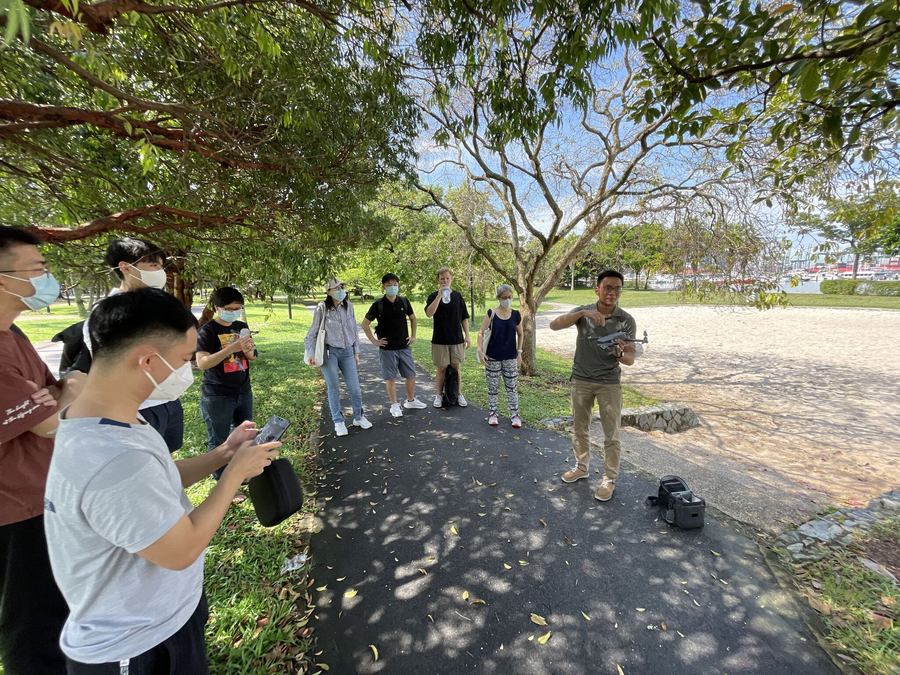
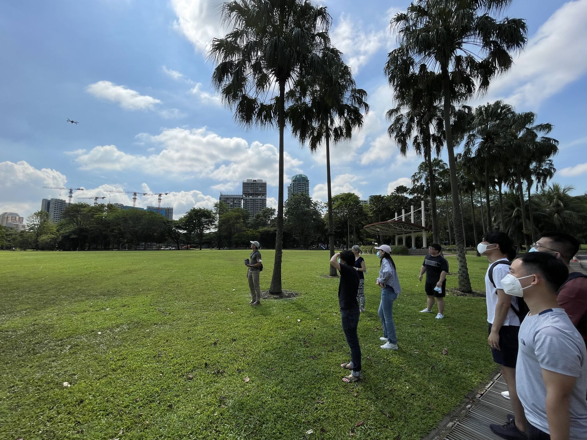
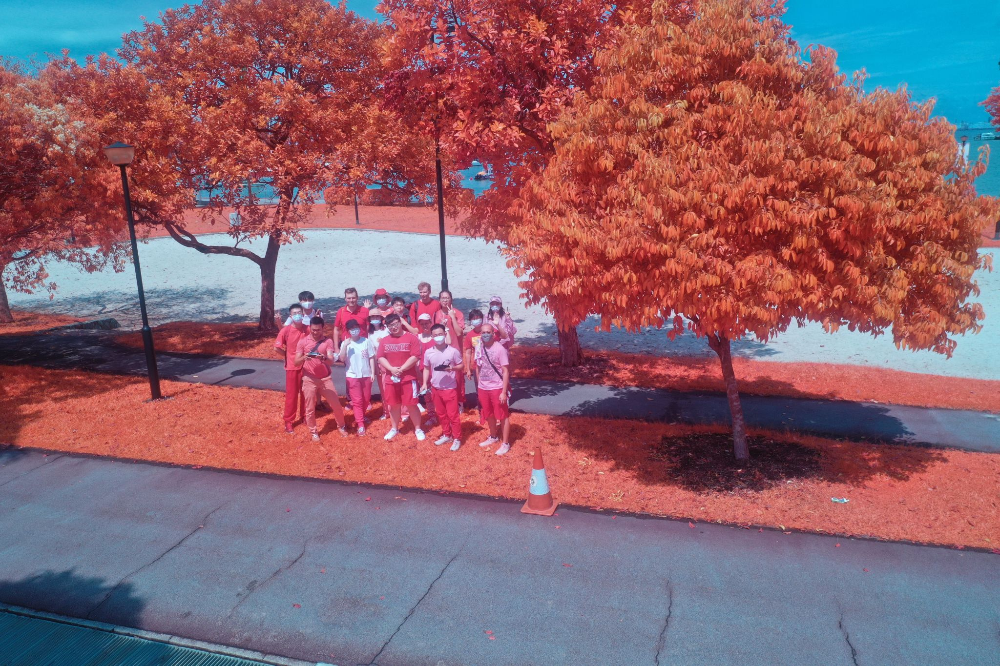

Our researchers {} and {} have conducted a seminar about UAV for the rest of the group, and discussed their potential applications in research.
Drones are increasingly important in research of the built environment.
For example, Junjie has been busy collecting and segmenting oblique imagery of riverscapes in Tianjin, China to support his PhD research on perception and participatory planning.
He has released the dataset openly (see the [Github repo](https://github.com/ualsg/semantic-riverscapes-dataset)).

Many thanks to Junjie and Leon! :pray:
