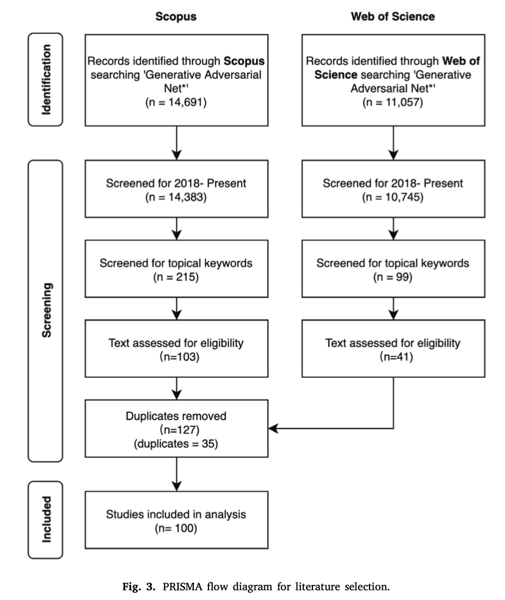
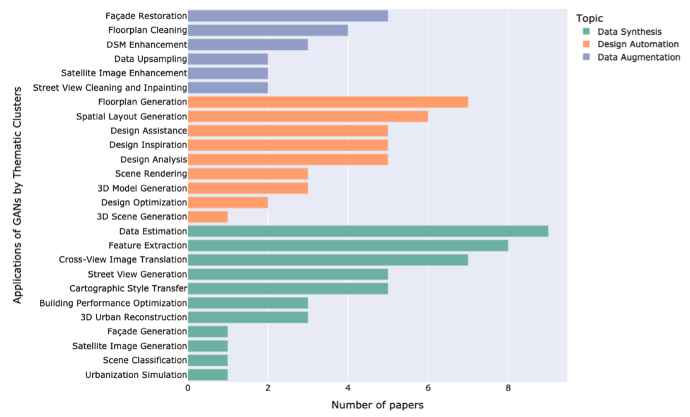
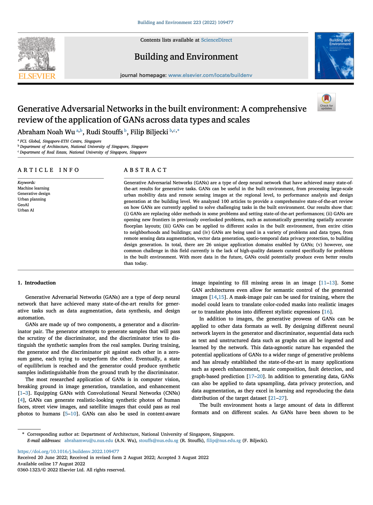

We are glad to share our new paper:

> Wu AN, Stouffs R, Biljecki F (2022): Generative Adversarial Networks in the Built Environment: A Comprehensive Review of the Application of GANs across Data Types and Scales. _Building and Environment_ 223: 109477. [<i class="ai ai-doi-square ai"></i> 10.1016/j.buildenv.2022.109477](https://doi.org/10.1016/j.buildenv.2022.109477) [<i class="far fa-file-pdf"></i> PDF](/publication/2022-bae-gan/2022-bae-gan.pdf)</i> <i class="ai ai-open-access-square ai"></i>

This review paper was led by {}.
Congratulations on his continued publication successes into his academic career. :raised_hands: :clap:



### Abstract

The abstract follows.

> Generative Adversarial Networks (GANs) are a type of deep neural network that have achieved many state-of-the-art results for generative tasks. GANs can be useful in the built environment, from processing large-scale urban mobility data and remote sensing images at the regional level, to performance analysis and design generation at the building level. We analyzed 100 articles to provide a comprehensive state-of-the-art review on how GANs are currently applied to solve challenging tasks in the built environment. Our results show that: (i) GANs are replacing older methods in some problems and setting state-of-the-art performances; (ii) GANs are opening new frontiers in previously overlooked problems, such as automatically generating spatially accurate floorplan layouts; (iii) GANs can be applied to different scales in the built environment, from entire cities to neighborhoods and buildings; and (iv) GANs are being used in a variety of problems and data types, from remote sensing data augmentation, vector data generation, spatio-temporal data privacy protection, to building design generation. In total, there are 26 unique application domains enabled by GANs; (v) however, one common challenge in this field currently is the lack of high-quality datasets curated specifically for problems in the built environment. With more data in the future, GANs could potentially produce even better results than today.



### Paper 

For more information, please see the [paper](/publication/2022-bae-gan/), published open access. <i class="ai ai-open-access-square ai"></i>

[](/publication/2022-bae-gan/)

BibTeX citation:
```bibtex
@article{2022_bae_gan,
  author = {Wu, Abraham Noah and Stouffs, Rudi and Biljecki, Filip},
  journal = {Building and Environment},
  title = {Generative Adversarial Networks in the Built Environment: A Comprehensive Review of the Application of GANs across Data Types and Scales},
  year = {2022},
  pages = {109477},
  volume = {223},
  doi = {10.1016/j.buildenv.2022.109477}
}
```
