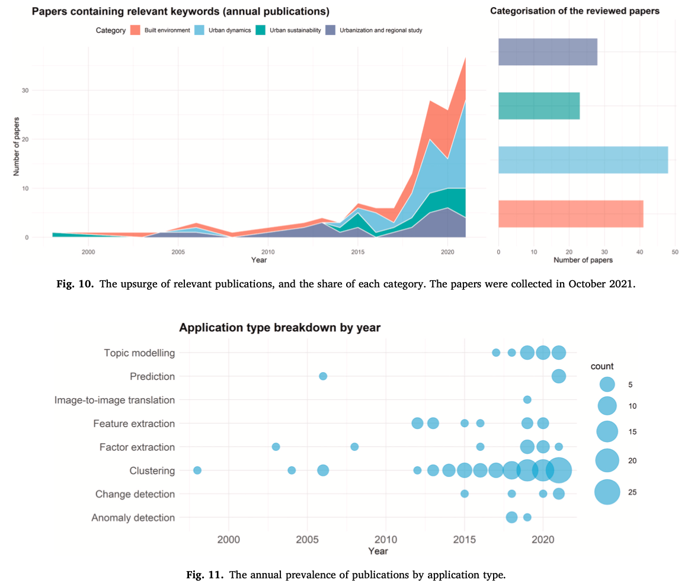
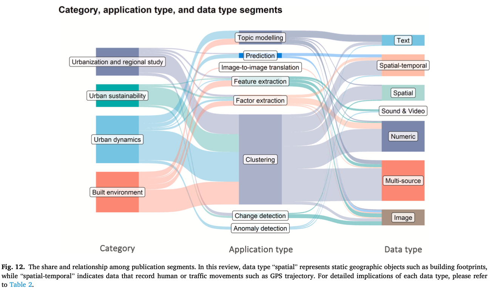
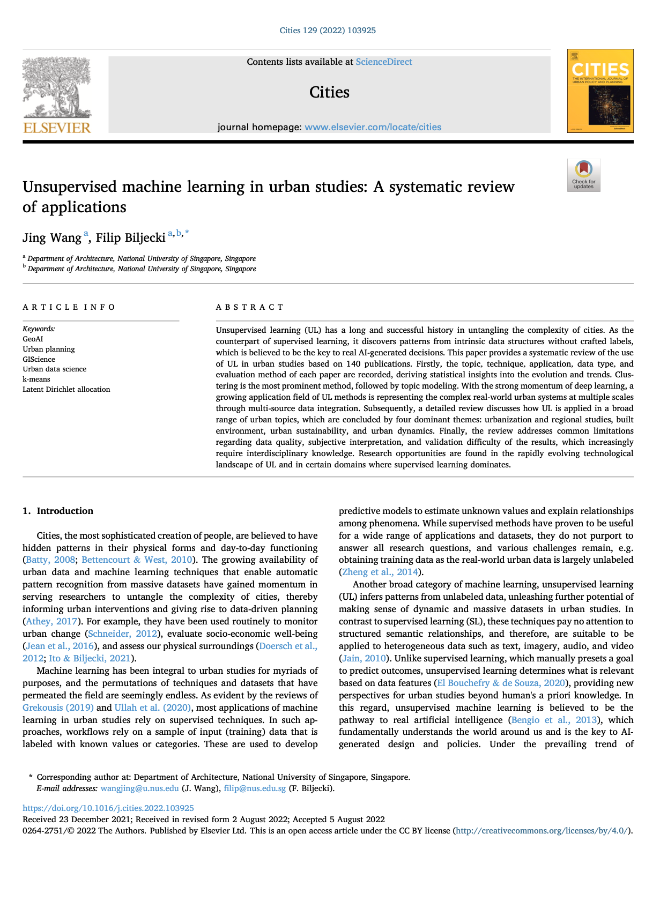

We are glad to share our new paper:

> Wang J, Biljecki F (2022): Unsupervised machine learning in urban studies: A systematic review of applications. _Cities_ 129: 103925. [<i class="ai ai-doi-square ai"></i> 10.1016/j.cities.2022.103925](https://doi.org/10.1016/j.cities.2022.103925) [<i class="far fa-file-pdf"></i> PDF](/publication/2022-cities-unsupervised/2022-cities-unsupervised.pdf)</i> <i class="ai ai-open-access-square ai"></i>

This review paper was led by {}.
Congratulations on her first journal paper ever, great job! :raised_hands: :clap:



### Highlights

+ An in-depth systematic review on the applications of unsupervised learning in urban studies.
+ 140 papers reveal unsupervised learning penetrates a broad range of topics under four main themes.
+ Introduction to the concept and common techniques.
+ Statistical insights into evolution and prominent trends.
+ Limitations and research opportunities of leveraging unsupervised learning in analyzing cities.



### Abstract

The abstract follows.

> Unsupervised learning (UL) has a long and successful history in untangling the complexity of cities. As the counterpart of supervised learning, it discovers patterns from intrinsic data structures without crafted labels, which is believed to be the key to real AI-generated decisions. This paper provides a systematic review of the use of UL in urban studies based on 140 publications. Firstly, the topic, technique, application, data type, and evaluation method of each paper are recorded, deriving statistical insights into the evolution and trends. Clustering is the most prominent method, followed by topic modeling. With the strong momentum of deep learning, a growing application field of UL methods is representing the complex real-world urban systems at multiple scales through multi-source data integration. Subsequently, a detailed review discusses how UL is applied in a broad range of urban topics, which are concluded by four dominant themes: urbanization and regional studies, built environment, urban sustainability, and urban dynamics. Finally, the review addresses common limitations regarding data quality, subjective interpretation, and validation difficulty of the results, which increasingly require interdisciplinary knowledge. Research opportunities are found in the rapidly evolving technological landscape of UL and in certain domains where supervised learning dominates.

### Paper 

For more information, please see the [paper](/publication/2022-cities-unsupervised/), published open access. <i class="ai ai-open-access-square ai"></i>

[](/publication/2022-cities-unsupervised/)

BibTeX citation:
```bibtex
@article{2022_cities_unsupervised,
  author = {Wang, Jing and Biljecki, Filip},
  journal = {Cities},
  title = {Unsupervised machine learning in urban studies: A systematic review of applications},
  year = {2022},
  pages = {103925}, 
  volume = {129},
  doi = {10.1016/j.cities.2022.103925} 
}
```


