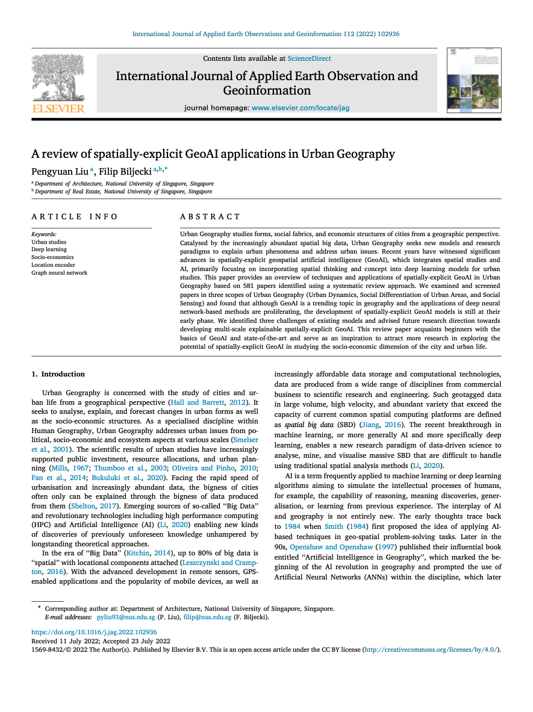

We are glad to share our new paper:

> Liu P, Biljecki F (2022): A review of spatially-explicit GeoAI applications in Urban Geography. _International Journal of Applied Earth Observation and Geoinformation_ 112: 102936. [<i class="ai ai-doi-square ai"></i> 10.1016/j.jag.2022.102936](https://doi.org/10.1016/j.jag.2022.102936) [<i class="far fa-file-pdf"></i> PDF](/publication/2022-jag-geoai/2022-jag-geoai.pdf)</i> <i class="ai ai-open-access-square ai"></i>

This review paper was led by {}.
Congratulations on his first journal paper during his tenure in the Lab. :raised_hands: :clap:


### Highlights

+ Techniques and applications of spatially-explicit GeoAI in Urban Geography.
+ The review focuses on urban dynamics, social differentiation, and social sensing.
+ The development of this line in Urban Geography is still in its early phase.
+ Graph neural networks are promising solutions to incorporate spatial information.
+ Challenges identified are data, scale, MAUP, and lack of interpretation (black box).

### Abstract

The abstract follows.

> Urban Geography studies forms, social fabrics, and economic structures of cities from a geographic perspective. Catalysed by the increasingly abundant spatial big data, Urban Geography seeks new models and research paradigms to explain urban phenomena and address urban issues. Recent years have witnessed significant advances in spatially-explicit geospatial artificial intelligence (GeoAI), which integrates spatial studies and AI, primarily focusing on incorporating spatial thinking and concept into deep learning models for urban studies. This paper provides an overview of techniques and applications of spatially-explicit GeoAI in Urban Geography based on 581 papers identified using a systematic review approach. We examined and screened papers in three scopes of Urban Geography (Urban Dynamics, Social Differentiation of Urban Areas, and Social Sensing) and found that although GeoAI is a trending topic in geography and the applications of deep neural network-based methods are proliferating, the development of spatially-explicit GeoAI models is still at their early phase. We identified three challenges of existing models and advised future research direction towards developing multi-scale explainable spatially-explicit GeoAI. This review paper acquaints beginners with the basics of GeoAI and state-of-the-art and serve as an inspiration to attract more research in exploring the potential of spatially-explicit GeoAI in studying the socio-economic dimension of the city and urban life.

### Paper 

For more information, please see the [paper](/publication/2022-jag-geoai/), published open access. <i class="ai ai-open-access-square ai"></i>

[](/publication/2022-jag-geoai/)

BibTeX citation:
```bibtex
@article{2022_jag_geoai,
  author = {Liu, Pengyuan and Biljecki, Filip},
  journal = {International Journal of Applied Earth Observation and Geoinformation},
  title = {A review of spatially-explicit GeoAI applications in Urban Geography},
  year = {2022},
  volume = {112},
  pages = {102936},
  doi = {10.1016/j.jag.2022.102936},
}
```


