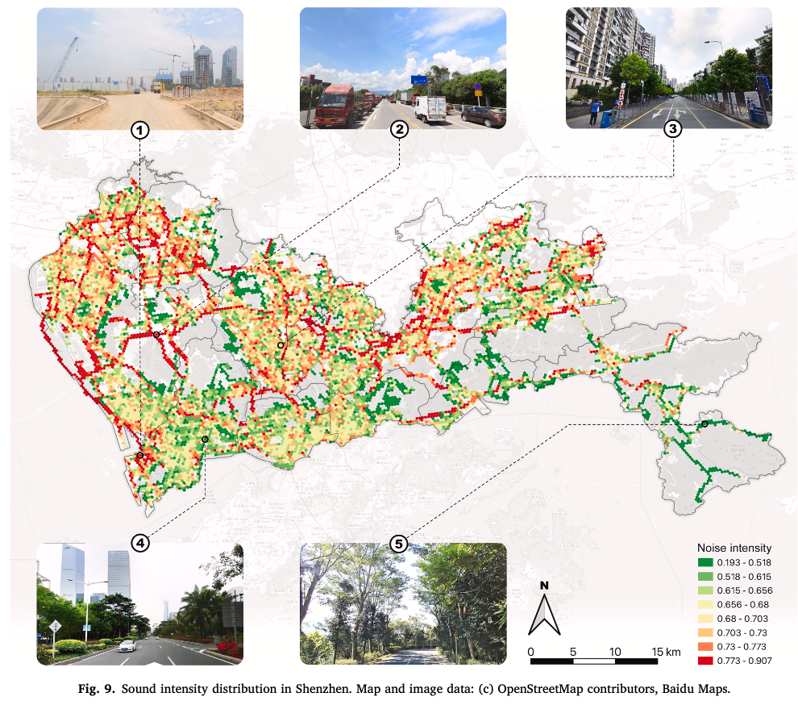
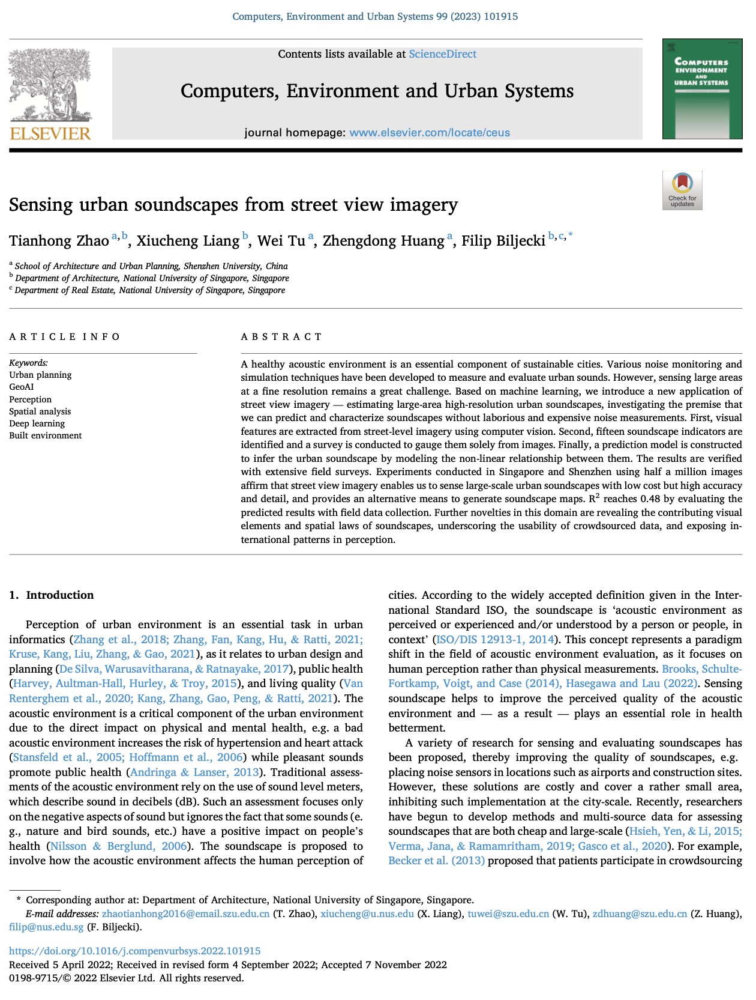

We are glad to share our new paper:

> Zhao T, Liang X, Tu W, Huang Z, Biljecki F (2023): Sensing urban soundscapes from street view imagery. _Computers, Environment and Urban Systems_ 99: 101915. [<i class="ai ai-doi-square ai"></i> 10.1016/j.compenvurbsys.2022.101915](https://doi.org/10.1016/j.compenvurbsys.2022.101915) [<i class="far fa-file-pdf"></i> PDF](/publication/2023-ceus-soundscapes/2023-ceus-soundscapes.pdf)</i>

This research was led by {}.
Congratulations on his first journal paper in our Lab, great job! :raised_hands: :clap:
Congratulations also to {} who also played an important role in the research.

The work resulted in an open dataset: [Visual soundscapes](https://github.com/ualsg/Visual-soundscapes).

Until 2023-01-09, the article is available for free via [this link](https://authors.elsevier.com/a/1g6y8jFQguwgw).



### Highlights

+ Large-scale and high-resolution approach sensing urban soundscapes without ground measurements with machine learning.
+ A dataset of street view imagery tagged with multivariate soundscape indicators.
+ Quantifying the relationships between visual features and human soundscape perception.
+ Validation with sound intensity and corresponding street view imagery using noise meters and cameras.
+ Comparative analysis including two cities and a scalable approach.


### Abstract

The abstract follows.

> A healthy acoustic environment is an essential component of sustainable cities. Various noise monitoring and simulation techniques have been developed to measure and evaluate urban sounds. However, sensing large areas at a fine resolution remains a great challenge. Based on machine learning, we introduce a new application of street view imagery — estimating large-area high-resolution urban soundscapes, investigating the premise that we can predict and characterize soundscapes without laborious and expensive noise measurements. First, visual features are extracted from street-level imagery using computer vision. Second, fifteen soundscape indicators are identified and a survey is conducted to gauge them solely from images. Finally, a prediction model is constructed to infer the urban soundscape by modeling the non-linear relationship between them. The results are verified with extensive field surveys. Experiments conducted in Singapore and Shenzhen using half a million images affirm that street view imagery enables us to sense large-scale urban soundscapes with low cost but high accuracy and detail, and provides an alternative means to generate soundscape maps. R squared reaches 0.48 by evaluating the predicted results with field data collection. Further novelties in this domain are revealing the contributing visual elements and spatial laws of soundscapes, underscoring the usability of crowdsourced data, and exposing international patterns in perception.

### Paper 

For more information, please see the [paper](/publication/2023-ceus-soundscapes/).

[](/publication/2023-ceus-soundscapes/)

BibTeX citation:
```bibtex
@article{2023_ceus_soundscapes,
  author = {Zhao, Tianhong and Liang, Xiucheng and Tu, Wei and Huang, Zhengdong and Biljecki, Filip},
  doi = {10.1016/j.compenvurbsys.2022.101915},
  journal = {Computers, Environment and Urban Systems},
  pages = {101915},
  title = {Sensing urban soundscapes from street view imagery},
  volume = {99},
  year = {2023}
}
```
