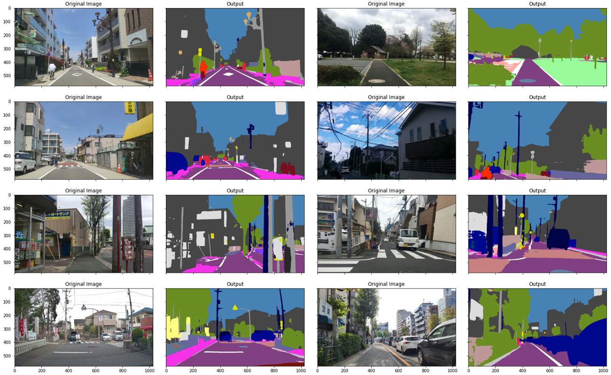
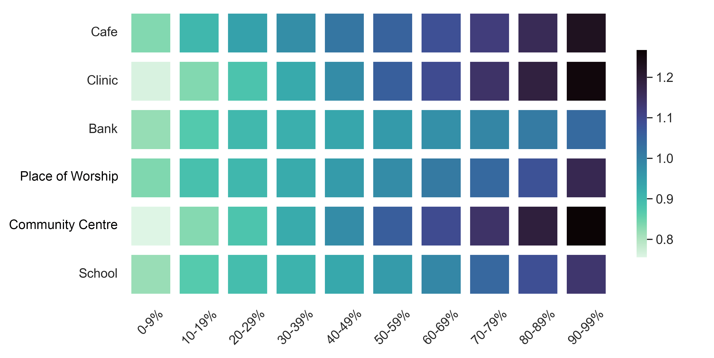
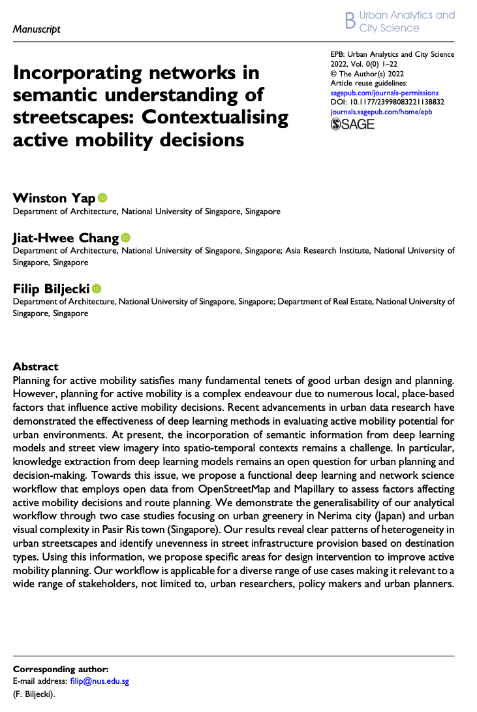

We are glad to share our new paper:

> Yap W, Chang JH, Biljecki F (2023): Incorporating Networks in Semantic Understanding of Streetscapes: Contextualising Active Mobility Decisions. _Environment and Planning B: Urban Analytics and City Science_ 50(6): 1416-1437. [<i class="ai ai-doi-square ai"></i> 10.1177/23998083221138832](https://doi.org/10.1177/23998083221138832) [<i class="far fa-file-pdf"></i> PDF](/publication/2023-epb-semantic-networks/2023-epb-semantic-networks.pdf)</i>

This research was led by {}.
Congratulations on his continued successes during his PhD! :raised_hands: :clap:





### Abstract

The abstract follows.

> Planning for active mobility satisfies many fundamental tenets of good urban design and planning. However, planning for active mobility is a complex endeavour due to numerous local, place-based factors that influence active mobility decisions. Recent advancements in urban data research have demonstrated the effectiveness of deep learning methods in evaluating active mobility potential for urban environments. At present, the incorporation of semantic information from deep learning models and street view imagery into spatio-temporal contexts remains a challenge. In particular, knowledge extraction from deep learning models remains an open question for urban planning and decision-making. Towards this issue, we propose a functional deep learning and network science workflow that employs open data from OpenStreetMap and Mapillary to assess factors affecting active mobility decisions and route planning. We demonstrate the generalisability of our analytical workflow through two case studies focusing on urban greenery in Nerima city (Japan) and urban visual complexity in Pasir Ris town (Singapore). Our results reveal clear patterns of heterogeneity in urban streetscapes and identify unevenness in street infrastructure provision based on destination types. Using this information, we propose specific areas for design intervention to improve active mobility planning. Our workflow is applicable for a diverse range of use cases making it relevant to a wide range of stakeholders, not limited to, urban researchers, policy makers and urban planners.

### Paper 

For more information, please see the [paper](/publication/2023-epb-semantic-networks/).

[](/publication/2023-epb-semantic-networks/)

BibTeX citation:
```bibtex
@article{2023_epb_semantic_networks,
 author = {Yap, Winston and Chang, Jiat-Hwee and Biljecki, Filip},
 doi = {10.1177/23998083221138832},
 journal = {Environment and Planning B: Urban Analytics and City Science},
 title = {Incorporating Networks in Semantic Understanding of Streetscapes: Contextualising Active Mobility Decisions},
 year = {2023},
 pages = {1416-1437},
 volume = {50},
 issue = {6}
}
```
