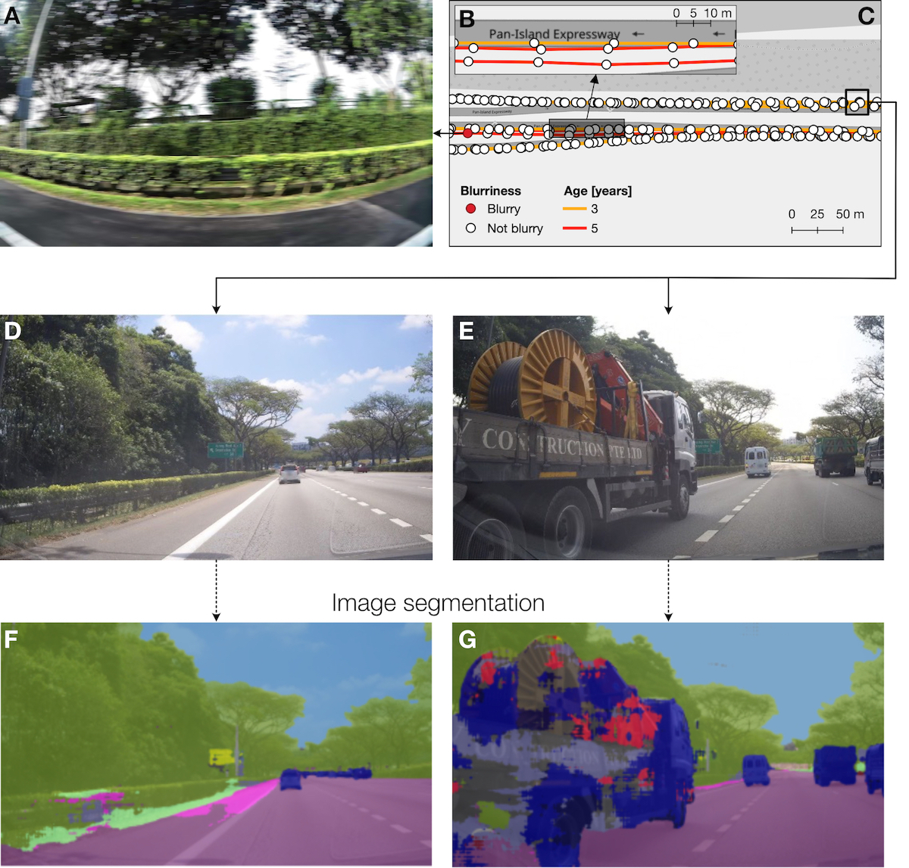
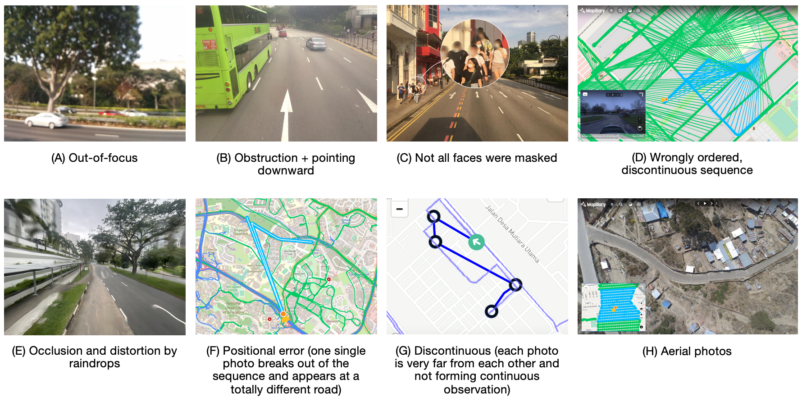
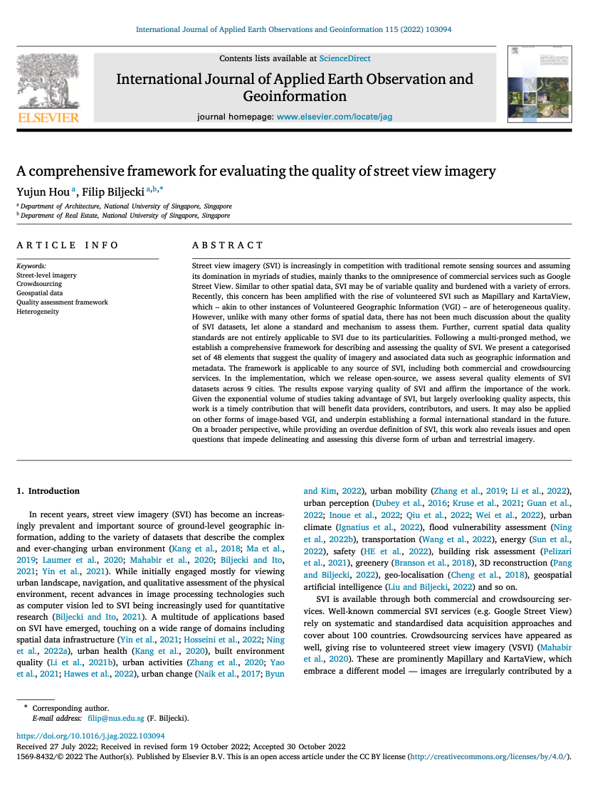

We are glad to share our new paper:

> Hou Y, Biljecki F (2022): A comprehensive framework for evaluating the quality of street view imagery. _International Journal of Applied Earth Observation and Geoinformation_ 115: 103094. [<i class="ai ai-doi-square ai"></i> 10.1016/j.jag.2022.103094](https://doi.org/10.1016/j.jag.2022.103094) [<i class="far fa-file-pdf"></i> PDF](/publication/2022-jag-svi-quality/2022-jag-svi-quality.pdf)</i> <i class="ai ai-open-access-square ai"></i>

This research was led by {}.
Congratulations on the first first-author paper! :raised_hands: :clap:

The implementation was released openly: [Street View Imagery Quality Checker](https://github.com/ualsg/SVI-Quality-Checker).

The paper is also the first one to provide a definition of the concept of SVI:
> Street view imagery (SVI) is typically a sequence of geotagged, ground-level photographs taken along a trajectory, providing spatially continuous observation of its vicinity.



### Highlights

+ We propose the first comprehensive quality framework for street view imagery.
+ Framework comprises 48 quality elements and may be applied to other image datasets.
+ We implement partial evaluation for data in 9 cities, exposing varying quality.
+ The implementation is released open-source and can be applied to other locations.
+ We provide an overdue definition of street view imagery.



### Abstract

The abstract follows.

> Street view imagery (SVI) is increasingly in competition with traditional remote sensing sources and assuming its domination in myriads of studies, mainly thanks to the omnipresence of commercial services such as Google Street View. Similar to other spatial data, SVI may be of variable quality and burdened with a variety of errors. Recently, this concern has been amplified with the rise of volunteered SVI such as Mapillary and KartaView, which – akin to other instances of Volunteered Geographic Information (VGI) – are of heterogeneous quality. However, unlike with many other forms of spatial data, there has not been much discussion about the quality of SVI datasets, let alone a standard and mechanism to assess them. Further, current spatial data quality standards are not entirely applicable to SVI due to its particularities. Following a multi-pronged method, we establish a comprehensive framework for describing and assessing the quality of SVI. We present a categorised set of 48 elements that suggest the quality of imagery and associated data such as geographic information and metadata. The framework is applicable to any source of SVI, including both commercial and crowdsourcing services. In the implementation, which we release open-source, we assess several quality elements of SVI datasets across 9 cities. The results expose varying quality of SVI and affirm the importance of the work. Given the exponential volume of studies taking advantage of SVI, but largely overlooking quality aspects, this work is a timely contribution that will benefit data providers, contributors, and users. It may also be applied on other forms of image-based VGI, and underpin establishing a formal international standard in the future. On a broader perspective, while providing an overdue definition of SVI, this work also reveals issues and open questions that impede delineating and assessing this diverse form of urban and terrestrial imagery.

### Paper 

For more information, please see the [paper](/publication/2022-jag-svi-quality/), published open access. <i class="ai ai-open-access-square ai"></i>

[](/publication/2022-jag-svi-quality/)

BibTeX citation:
```bibtex
@article{2022_jag_svi_quality, 
  year = {2022}, 
  title = {{A comprehensive framework for evaluating the quality of street view imagery}}, 
  author = {Hou, Yujun and Biljecki, Filip}, 
  journal = {International Journal of Applied Earth Observation and Geoinformation}, 
  doi = {10.1016/j.jag.2022.103094}, 
  pages = {103094}, 
  volume = {115}
}
```
