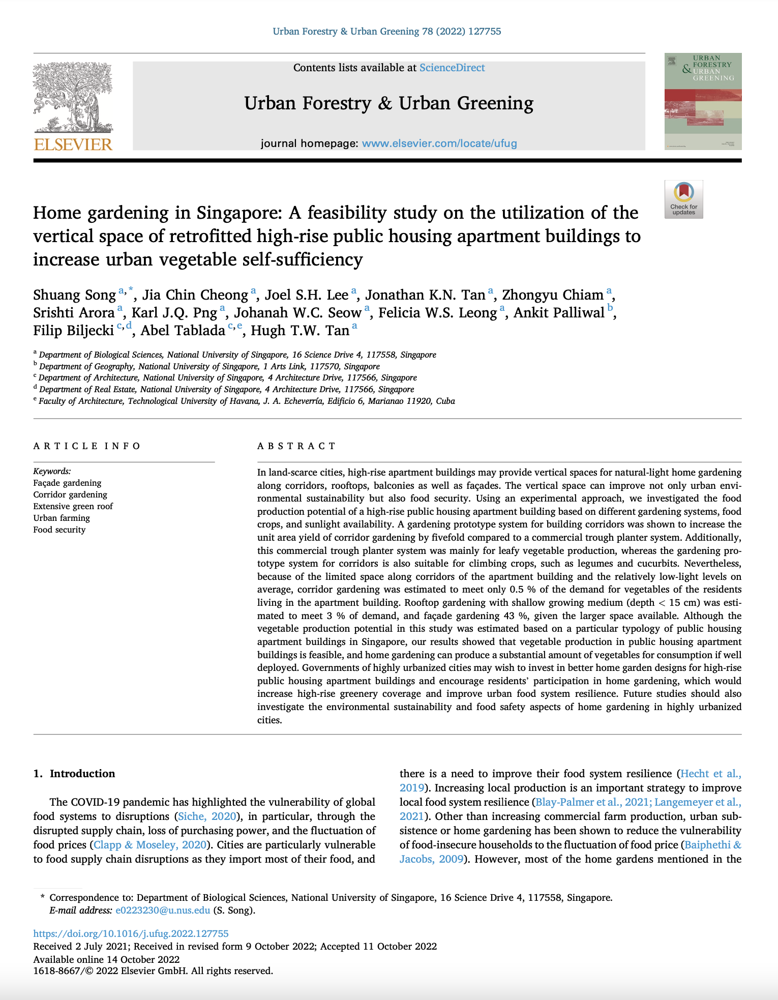

We are glad to share a new collaborative paper in which we were involved:

> Song S, Cheong JC, Lee JSH, Tan JKN, Chiam Z, Arora S, Png KJQ, Seow JWC, Leong FWS, Palliwal A, Biljecki F, Tablada A, Tan HTW (2022): Home gardening in Singapore: A feasibility study on the utilization of the vertical space of retrofitted high-rise public housing apartment buildings to increase urban vegetable self-sufficiency. _Urban Forestry & Urban Greening_, 78: 127755. [<i class="ai ai-doi-square ai"></i> 10.1016/j.ufug.2022.127755](https://doi.org/10.1016/j.ufug.2022.127755) [<i class="far fa-file-pdf"></i> PDF](/publication/2022-ufug-homegardening/2022-ufug-homegardening.pdf)</i> <i class="ai ai-open-access-square ai"></i>

Congratulations to [Dr Song Shuang](https://www.researchgate.net/profile/Shuang-Song-33) from [NUS Biological Sciences](https://www.dbs.nus.edu.sg) for the publication of this forward-looking work, and thanks for this productive and exciting collaboration!

This experimental work, conducted in a high-rise residential building in Singapore, demonstrates that with proper optimisations, about half of the vegetable needs of the residents living in a building of such a typology can be met by food production in the building alone.
In this multidisciplinary work, 3D building models have been used to facilitate the process (based on the work by {} [published in CEUS in 2021](), introducing a new use case of 3D city models in urban farming). 

The work supports [Singapore's '30 by 30' initiative -- aspiring to develop the agri-food industry's capability and capacity to produce 30% of the city-state's nutritional needs locally and sustainably by 2030](https://www.ourfoodfuture.gov.sg/30by30).

This line of work also sets the scene for investigating the use of digital twins in supporting urban farming, which may be especially relevant in land scarce urban areas such as Singapore (and many others), and against the backdrop of supply chain disruptions that may impede food security. 

Until 2022-12-09, the article is available for free via [this link](https://authors.elsevier.com/c/1fy7f5m5d7vrWj).


### Abstract

The abstract follows.

> In land-scarce cities, high-rise apartment buildings may provide vertical spaces for natural-light home gardening along corridors, rooftops, balconies as well as façades. The vertical space can improve not only urban environmental sustainability but also food security. Using an experimental approach, we investigated the food production potential of a high-rise public housing apartment building based on different gardening systems, food crops, and sunlight availability. A gardening prototype system for building corridors was shown to increase the unit area yield of corridor gardening by fivefold compared to a commercial trough planter system. Additionally, this commercial trough planter system was mainly for leafy vegetable production, whereas the gardening prototype system for corridors is also suitable for climbing crops, such as legumes and cucurbits. Nevertheless, because of the limited space along corridors of the apartment building and the relatively low-light levels on average, corridor gardening was estimated to meet only 0.5 % of the demand for vegetables of the residents living in the apartment building. Rooftop gardening with shallow growing medium (depth < 15 cm) was estimated to meet 3 % of demand, and façade gardening 43 %, given the larger space available. Although the vegetable production potential in this study was estimated based on a particular typology of public housing apartment buildings in Singapore, our results showed that vegetable production in public housing apartment buildings is feasible, and home gardening can produce a substantial amount of vegetables for consumption if well deployed. Governments of highly urbanized cities may wish to invest in better home garden designs for high-rise public housing apartment buildings and encourage residents’ participation in home gardening, which would increase high-rise greenery coverage and improve urban food system resilience. Future studies should also investigate the environmental sustainability and food safety aspects of home gardening in highly urbanized cities.

### Paper 

For more information, please see the [paper](/publication/2022-ufug-homegardening/).

[](/publication/2022-ufug-homegardening/)

BibTeX citation:
```bibtex
@article{2022_ufug_homegardening,
  title = {Home gardening in Singapore: A feasibility study on the utilization of the vertical space of retrofitted high-rise public housing apartment buildings to increase urban vegetable self-sufficiency},
  author = {Shuang Song and Jia Chin Cheong and Joel S.H. Lee and Jonathan K.N. Tan and Zhongyu Chiam and Srishti Arora and Karl J.Q. Png and Johanah W.C. Seow and Felicia W.S. Leong and Ankit Palliwal and Filip Biljecki and Abel Tablada and Hugh T.W. Tan},
  journal = {Urban Forestry \& Urban Greening},
  year = {2022},
  volume = {78},
  pages = {127755},
  doi = {10.1016/j.ufug.2022.127755}
}
```


