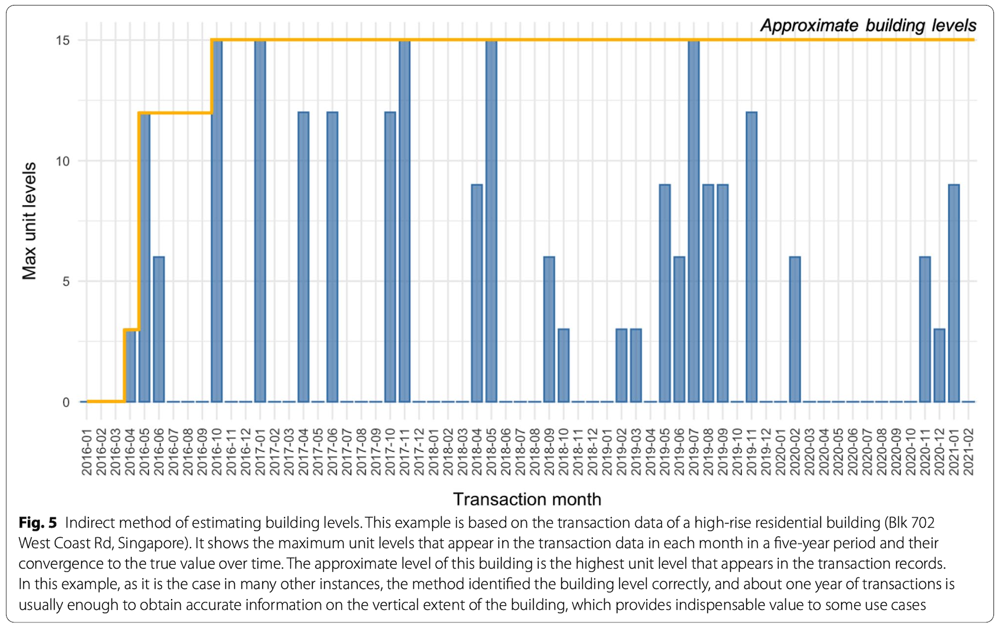
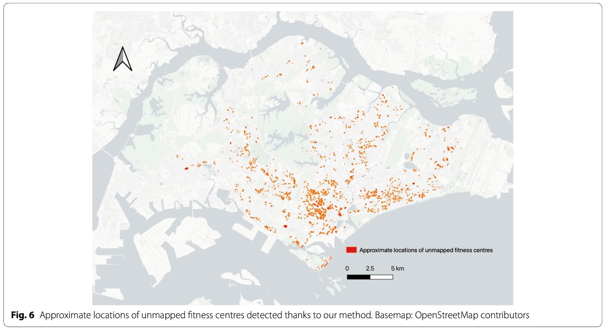
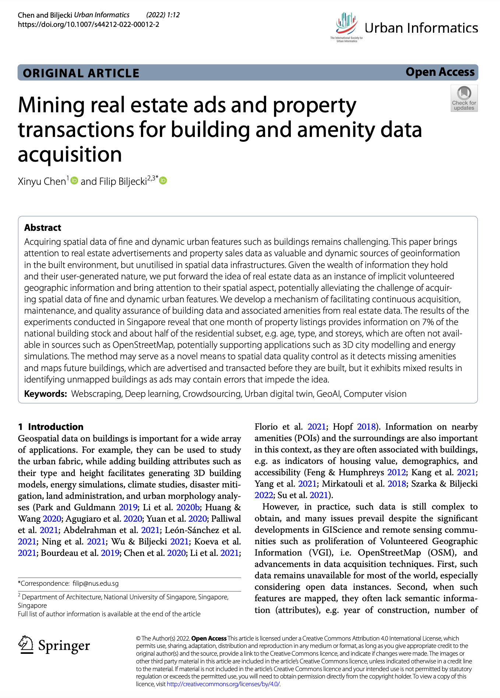

We are glad to share our new paper:

> Chen X, Biljecki F (2022): Mining real estate ads and property transactions for building and amenity data acquisition. _Urban Informatics_ 1: 12. [<i class="ai ai-doi-square ai"></i> 10.1007/s44212-022-00012-2](https://doi.org/10.1007/s44212-022-00012-2) [<i class="far fa-file-pdf"></i> PDF](/publication/2022-ui-real-estate-mining/2022-ui-real-estate-mining.pdf)</i> <i class="ai ai-open-access-square ai"></i>

This research was led by {}.
Congratulations on her first journal paper! :raised_hands: :clap:





The journal is founded and managed by the [International Society for Urban Informatics](http://isocui.org/).

### Abstract

The abstract follows.

> Acquiring spatial data of fine and dynamic urban features such as buildings remains challenging. This paper brings attention to real estate advertisements and property sales data as valuable and dynamic sources of geoinformation in the built environment, but unutilised in spatial data infrastructures. Given the wealth of information they hold and their user-generated nature, we put forward the idea of real estate data as an instance of implicit volunteered geographic information and bring attention to their spatial aspect, potentially alleviating the challenge of acquiring spatial data of fine and dynamic urban features. We develop a mechanism of facilitating continuous acquisition, maintenance, and quality assurance of building data and associated amenities from real estate data. The results of the experiments conducted in Singapore reveal that one month of property listings provides information on 7% of the national building stock and about half of the residential subset, e.g. age, type, and storeys, which are often not available in sources such as OpenStreetMap, potentially supporting applications such as 3D city modelling and energy simulations. The method may serve as a novel means to spatial data quality control as it detects missing amenities and maps future buildings, which are advertised and transacted before they are built, but it exhibits mixed results in identifying unmapped buildings as ads may contain errors that impede the idea.nted water view imagery, and it is intended to support future studies.

### Paper 

For more information, please see the [paper](/publication/2022-ui-real-estate-mining/), published open access. <i class="ai ai-open-access-square ai"></i>

[](/publication/2022-ui-real-estate-mining/)

BibTeX citation:
```bibtex
@article{2022_ui_real_estate_mining, 
  year = {2022}, 
  title = {{Mining real estate ads and property transactions for building and amenity data acquisition}}, 
  author = {Chen, Xinyu and Biljecki, Filip}, 
  journal = {Urban Informatics}, 
  doi = {10.1007/s44212-022-00012-2}, 
  pages = {12}, 
  volume = {1}
}
```
