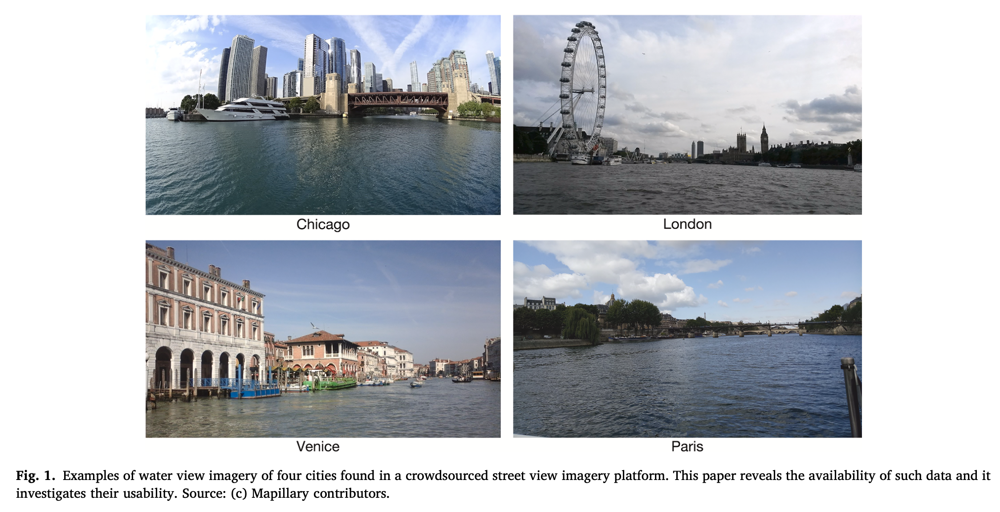
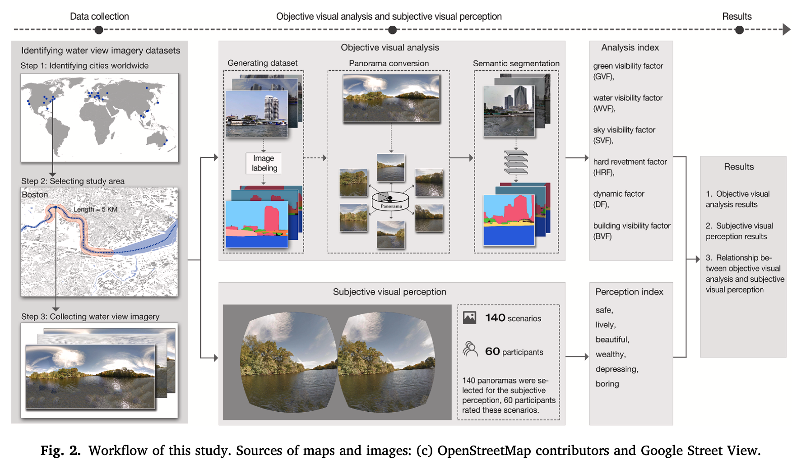
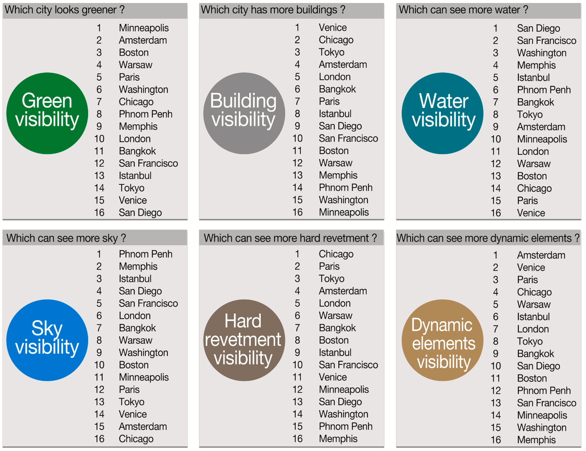
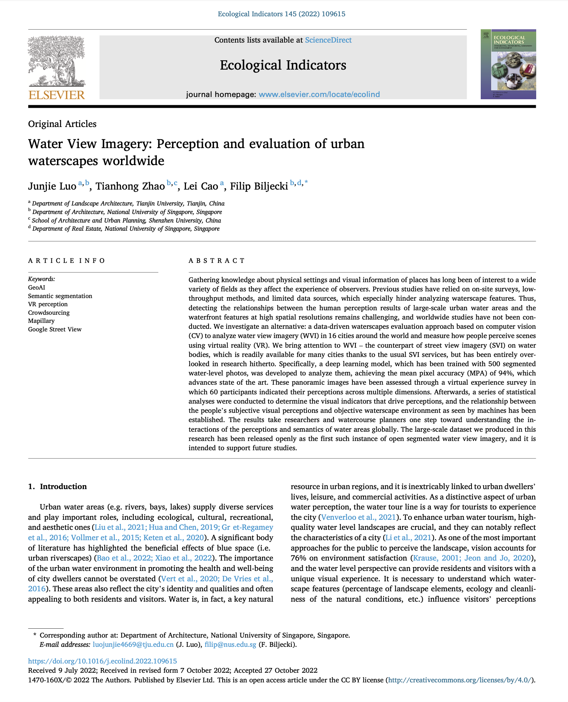

We are glad to share our new paper:

> Luo J, Zhao T, Cao L, Biljecki F (2022): Water View Imagery: Perception and evaluation of urban waterscapes worldwide. _Ecological Indicators_ 145: 109615. [<i class="ai ai-doi-square ai"></i> 10.1016/j.ecolind.2022.109615](https://doi.org/10.1016/j.ecolind.2022.109615) [<i class="far fa-file-pdf"></i> PDF](/publication/2022-ei-water-view-imagery/2022-ei-water-view-imagery.pdf)</i> <i class="ai ai-open-access-square ai"></i>

This research was led by {}.
Congratulations on another journal paper in our Lab during the one-year research visit, great job! :raised_hands: :clap:

The work resulted in an open dataset: [Water View Imagery](https://github.com/ualsg/Water-View-Imagery-dataset).




### Highlights

+ Investigating the concept and usability of water-level imagery.
+ Comparative analysis of waterscapes in 16 cities from water-level imagery.
+ A comprehensive perception study of multiple dimensions of waterfronts.
+ An extensible and scalable large-scale evaluation index system of urban waterscapes.
+ Open dataset supporting future studies, suited for computer vision.



### Abstract

The abstract follows.

> Gathering knowledge about physical settings and visual information of places has long been of interest to a wide variety of fields as they affect the experience of observers. Previous studies have relied on on-site surveys, low-throughput methods, and limited data sources, which especially hinder analyzing waterscape features. Thus, detecting the relationships between the human perception results of large-scale urban water areas and the waterfront features at high spatial resolutions remains challenging, and worldwide studies have not been conducted. We investigate an alternative: a data-driven waterscapes evaluation approach based on computer vision (CV) to analyze water view imagery (WVI) in 16 cities around the world and measure how people perceive scenes using virtual reality (VR). We bring attention to WVI – the counterpart of street view imagery (SVI) on water bodies, which is readily available for many cities thanks to the usual SVI services, but has been entirely overlooked in research hitherto. Specifically, a deep learning model, which has been trained with 500 segmented water-level photos, was developed to analyze them, achieving the mean pixel accuracy (MPA) of 94%, which advances state of the art. These panoramic images have been assessed through a virtual experience survey in which 60 participants indicated their perceptions across multiple dimensions. Afterwards, a series of statistical analyses were conducted to determine the visual indicators that drive perceptions, and the relationship between the people’s subjective visual perceptions and objective waterscape environment as seen by machines has been established. The results take researchers and watercourse planners one step toward understanding the interactions of the perceptions and semantics of water areas globally. The large-scale dataset we produced in this research has been released openly as the first such instance of open segmented water view imagery, and it is intended to support future studies.



### Paper 

For more information, please see the [paper](/publication/2022-ei-water-view-imagery/), published open access. <i class="ai ai-open-access-square ai"></i>

[](/publication/2022-ei-water-view-imagery/)

BibTeX citation:
```bibtex
@article{2022_ei_water_view_imagery,
  author = {Luo, Junjie and Zhao, Tianhong and Cao, Lei and Biljecki, Filip},
  doi = {10.1016/j.ecolind.2022.109615},
  journal = {Ecological Indicators},
  pages = {109615},
  title = {Water View Imagery: Perception and evaluation of urban waterscapes worldwide},
  volume = {145},
  year = {2022}
}
```
