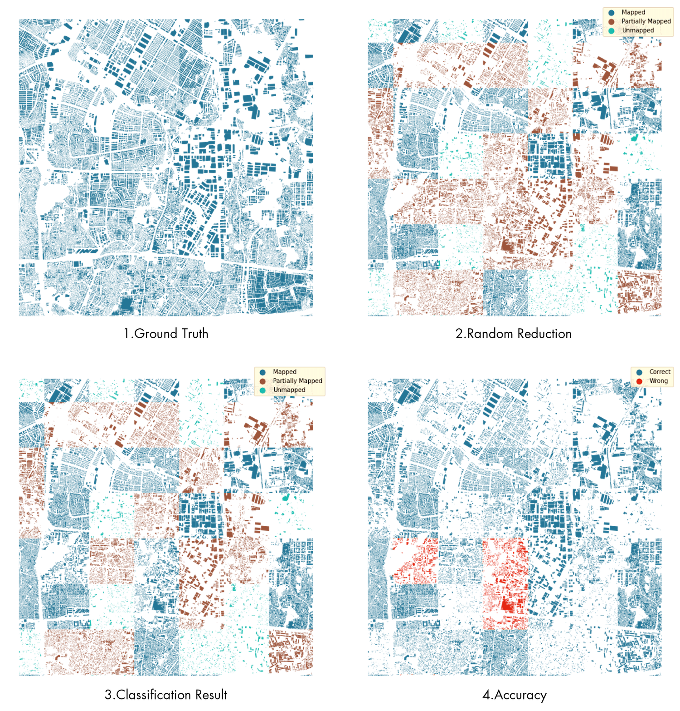
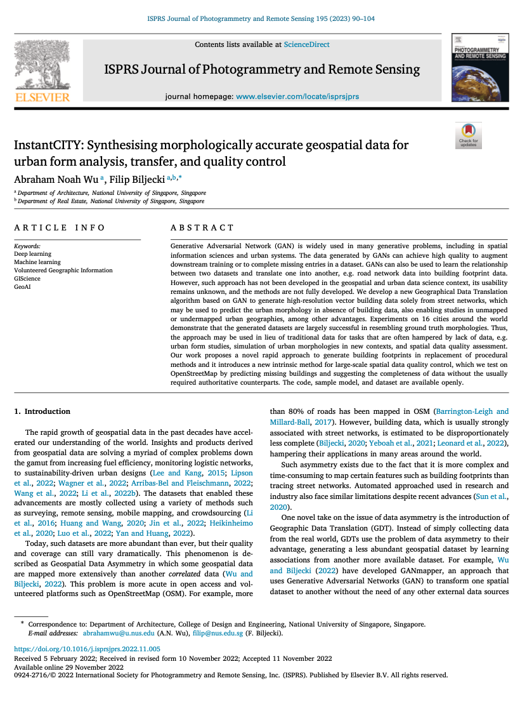

We are glad to share our new paper:

> Wu AN, Biljecki F (2023): InstantCITY: Synthesising morphologically accurate geospatial data for urban form analysis, transfer, and quality control. _ISPRS Journal of Photogrammetry and Remote Sensing_ 195: 90-104. [<i class="ai ai-doi-square ai"></i> 10.1016/j.isprsjprs.2022.11.005](https://doi.org/10.1016/j.isprsjprs.2022.11.005) [<i class="far fa-file-pdf"></i> PDF](/publication/2023-ijprs-instantcity/2023-ijprs-instantcity.pdf)</i>

This research was led by {}.
Congratulations on his continued successes and great work! :raised_hands: :clap:

This work considerably builds on our previous work on [GANmapper -- Geographical Data Translation](/publication/2022-ijgis-ganmapper/) (published in [IJGIS](https://doi.org/10.1080/13658816.2022.2041643)).
We present an intrinsic mapping method and demonstrate that it is possible to map one feature from another, i.e. in this case we generate building footprints solely from road networks.

The work has several use cases, for example:
+ Generating geospatial data where there is no data available or it is of poor completeness, but where there is good data of another _correlated_ phenomena available (e.g. roads to buildings).
+ A new intrinsic method for spatial data quality control (we present a case with OpenStreetMap -- we use road networks to predict how many buildings should be in an area and compare it with the content of OSM, and flag areas with a substantial mismatch indicating poor completeness).

The implementation has been released as open-source software at [our Github](https://github.com/ualsg/InstantCity).

Until 2023-01-18, the article is available for free via [this link](https://authors.elsevier.com/a/1gACQ3I9x1j9Zf).




### Abstract

The abstract follows.

> Generative Adversarial Network (GAN) is widely used in many generative problems, including in spatial information sciences and urban systems. The data generated by GANs can achieve high quality to augment downstream training or to complete missing entries in a dataset. GANs can also be used to learn the relationship between two datasets and translate one into another, e.g. road network data into building footprint data. However, such approach has not been developed in the geospatial and urban data science context, its usability remains unknown, and the methods are not fully developed. We develop a new Geographical Data Translation algorithm based on GAN to generate high-resolution vector building data solely from street networks, which may be used to predict the urban morphology in absence of building data, also enabling studies in unmapped or undermapped urban geographies, among other advantages. Experiments on 16 cities around the world demonstrate that the generated datasets are largely successful in resembling ground truth morphologies. Thus, the approach may be used in lieu of traditional data for tasks that are often hampered by lack of data, e.g. urban form studies, simulation of urban morphologies in new contexts, and spatial data quality assessment. Our work proposes a novel rapid approach to generate building footprints in replacement of procedural methods and it introduces a new intrinsic method for large-scale spatial data quality control, which we test on OpenStreetMap by predicting missing buildings and suggesting the completeness of data without the usually required authoritative counterparts. The code, sample model, and dataset are available openly.

### Paper 

For more information, please see the [paper](/publication/2023-ijprs-instantcity/).

[](/publication/2023-ijprs-instantcity/)

BibTeX citation:
```bibtex
@article{2023_ijprs_instantcity,
  author = {Wu, Abraham Noah and Biljecki, Filip},
  doi = {10.1016/j.isprsjprs.2022.11.005},
  journal = {ISPRS Journal of Photogrammetry and Remote Sensing},
  pages = {90-104},
  title = {InstantCITY: Synthesising morphologically accurate geospatial data for urban form analysis, transfer, and quality control},
  volume = {195},
  year = {2023}
}
```
